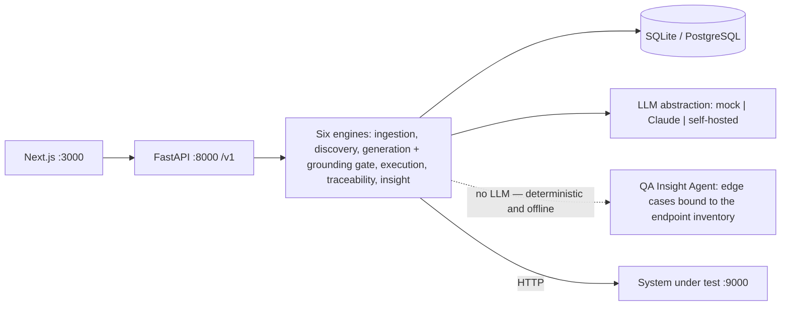

# Traceo (TADQEEQ)

**AI test design & traceability platform.**
Traceo turns a requirements document into an executable, requirement-linked API test suite — grounded in an endpoint inventory discovered from an OpenAPI spec, a Postman collection, a HAR capture or an Insomnia export, gated by human review, and backed by a live traceability matrix that exports as contractual and audit evidence.
**The model proposes, the system verifies** — a hard grounding gate guarantees zero fabricated identifiers (BO-07).

The product ships in **English only**, left to right. There is no runtime language mechanism: no dictionaries, no language switcher, no per-project language.



**Six engines:** ingestion, discovery, generation (+ grounding gate), execution, traceability — and the **QA Insight Agent**, which proposes edge cases across nine canonical categories (boundary surprises, exotic input, control characters, idempotency, state corruption, permission edges, timing/DST, resource exhaustion, downstream failures). The insight engine is **100% deterministic, makes zero LLM calls and runs fully offline**, and every case it emits passes the same grounding gate before it is persisted: every path, method and field is derived from the discovered endpoint inventory, never invented (BO-07). It is opt-in through its own endpoints (`GET /v1/projects/{id}/insights`, `POST /v1/projects/{id}/insights/generate`) and changes no existing flow.

## Supported API import formats

The endpoint inventory is discovered by uploading an API document — a file or a URL — to a single endpoint, `POST /v1/projects/{id}/api-specs`. The format is **detected deterministically** from the document itself; there is no per-format route and no format picker in the UI, so importing a Postman collection is the same action as importing an OpenAPI spec.

| Format | Detected by | `format` | `Endpoint.source` |
|---|---|---|---|
| OpenAPI 3.x | `openapi: 3.x` | `openapi3` | `spec` |
| Swagger 2.0 | `swagger: "2.0"` | `swagger2` | `spec` |
| Postman Collection v2.0 / v2.1 | `info.schema` contains `getpostman.com/json/collection/v2` | `postman2` | `postman` |
| HAR 1.2 | top-level `log` object with `entries` | `har` | `traffic` |
| Insomnia v4 export | `"_type": "export"` with `resources` | `insomnia4` | `postman` |

A document matching none of them is refused with `422 {code: "invalid_spec"}`, and the `errors` list names the formats that *would* be accepted.

**Conversion is deterministic — no model is involved.** Postman `:param` segments and concrete ids in captures become `{param}`; `{{variable}}` references resolve from collection/environment variables; the base URL is stripped so paths are server-relative; query parameters come from `url.query` / `queryString`; a request body's JSON example yields an inferred JSON Schema whose fields are the body's own (nothing invented, non-JSON bodies record media type and field names only); observed response status codes are recorded; identical `method + path` requests are merged.

Re-imports are governed by a **fidelity ladder — `spec > traffic > dom > postman`**: a later, higher-fidelity import wins for the endpoints it describes and never deletes the ones it does not.

**A runnable environment, derived from the document.** The base URL is *in* the document, so importing one should not end at an empty environment picker. As part of the same deterministic conversion (no model involved), the importer derives a base URL — the collection/environment variable named `baseUrl` / `base_url` / `url` / `host` (case-insensitive, first match wins), else the most frequent `scheme://host[/common-prefix]` across the request URLs; `servers[0].url` for OpenAPI 3, `schemes` + `host` + `basePath` for Swagger 2, the most frequent origin for HAR and Insomnia. Any path prefix stripped from the endpoint paths stays on the base URL, so **`base_url` + an endpoint path reconstructs the original URL exactly**. If no base URL can be derived, none is invented.

If — and only if — the project has **zero environments** and a base URL was derived, the import creates one: name `"<document title> (imported)"` (falling back to `"Imported environment"`), `auth_type: "none"`, `tls_strict: true`, and the document's other variables as its variables map. **A variable whose name looks like a credential** (`token`, `secret`, `key`, `password`, `auth`, `bearer`, `apikey` — case-insensitive substring) is carried as a **key with an empty value** for you to fill: its example value is never copied and never logged. An environment that already exists is never touched or overwritten, so this only ever fills a genuine void, and the action is recorded in the audit log as `environment.autocreated`. The api-specs response reports the outcome on `environment_created` — `null`, or `{id, name, base_url}` — and the endpoints page confirms it with a link to the environments page.

**Optional AI enrichment.** On a project whose `automation` is `auto`, a successful import additionally asks the model for a one-line description, a resource group and a criticality hint (`high | medium | low`) per endpoint — and nothing else. Every returned item is matched against the deterministic inventory by exact `method + path`; anything referencing an unknown endpoint is discarded and counted (`enriched` / `enrichment_discarded` on the response). **Enrichment may never create, rename or delete an endpoint, nor alter a path, a parameter or a field name** — it is annotation-only, which is what makes it safe to let a model near the inventory at all. If the model fails or returns nothing usable, the import still succeeds with zero enrichment. Under the default deterministic mock provider the whole flow runs offline.

## Prerequisites

- **Python 3.11+**
- **Node 20+**

## Quickstart

### 1) Backend (`:8000`)

```bash
cd backend
python3 -m venv .venv
.venv/bin/pip install -r requirements.txt
.venv/bin/python -m uvicorn app.main:app --reload --port 8000
```

### 2) Demo SUT (`:9000`)

```bash
cd demo/sut && ../../backend/.venv/bin/python -m uvicorn main:app --port 9000
```

### 3) Frontend (`:3000`)

```bash
cd frontend
npm install
npm run dev
```

### 4) Demo seed

After the backend and the SUT are running (requires `httpx` — use the virtualenv python):

```bash
backend/.venv/bin/python demo/seed_demo.py
```

> The plain `python3 demo/seed_demo.py` also works if `httpx` is installed system-wide.

**Demo account:** `demo@traceo.sa` / `Demo1234!`

### 5) Tests — the release gates

The grounding suite (adversarial fabrication probes) and the tenant-isolation suite; a failure in either blocks the release:

```bash
cd backend && .venv/bin/python -m pytest
```

#### E2E UI suite — Playwright

Requires the full stack to be running (the quickstart above, or `docker compose --profile go --profile e2e up -d --wait`):

```bash
cd e2e
npm install
npx playwright install chromium
npx playwright test
```

PR fast lane (the fast tags without the heavy specs):

```bash
npx playwright test --grep "@smoke|@critical|@permission|@a11y" --grep-invert "@regression"
```

Full details (architecture, tags, flakiness quarantine policy) in [docs/TEST_AUTOMATION_ARCHITECTURE.md](docs/TEST_AUTOMATION_ARCHITECTURE.md).

## Environment variables

| Variable | Default | Description |
|---|---|---|
| `TRACEO_LLM_PROVIDER` | `auto` | `mock` (deterministic, offline) \| `anthropic` \| `auto` (anthropic when a key is present, otherwise mock) |
| `ANTHROPIC_API_KEY` | — | Claude API key, used by the `anthropic` provider |
| `TRACEO_DATABASE_URL` | `sqlite:///backend/traceo.db` | Database URL (PostgreSQL in production) |
| `TRACEO_SEED_DEMO` | `1` | Seed the demo organisation on startup; must be `0` in production (startup refuses otherwise) |

Every setting lives in `backend/app/config.py` and is configurable through environment variables (NFR-POR-03).

## Repository layout

```
traceo/
├── backend/
│   ├── app/                # FastAPI: main, config, db, models, security, deps, jobs, llm/, modules/
│   ├── tests/              # release gates: grounding + tenant isolation (pytest)
│   ├── requirements.txt
│   └── API_CONTRACT.md     # backend API contract
├── backend-go/             # Go parity port (Gin + GORM) — route-for-route identical
├── frontend/               # Next.js 15 (App Router) + TypeScript — English, LTR
│   └── FRONTEND_CONTRACT.md
├── e2e/                    # Playwright suite (specs, page objects, API repositories, fixtures)
│   └── test-data/          # reference seeds: sample_requirements_en.md, sample_openapi.yaml,
│                           #   calendar-api.postman_collection.json (a real 300KB v2.1 collection)
├── demo/
│   ├── sut/                # Orders Platform — demo SUT with deliberate defects to discover
│   └── seed_demo.py        # end-to-end demo provisioning
└── docs/                   # documentation
```

## Documentation

- [Architecture](docs/ARCHITECTURE.md)
- [User journey](docs/USER_JOURNEY.md)
- [Test automation architecture](docs/TEST_AUTOMATION_ARCHITECTURE.md)
- [Testid registry](docs/TESTID_REGISTRY.md)
- `docs/PITCH_INVESTORS_AR.html` — legacy Arabic-language investor deck, kept for reference only; it predates the English-only pivot and is not part of the shipped product.

---

**TADQEEQ project — Confidential.** Proprietary; this repository and its documentation belong to the Traceo (TADQEEQ) project and must not be distributed outside the team.
