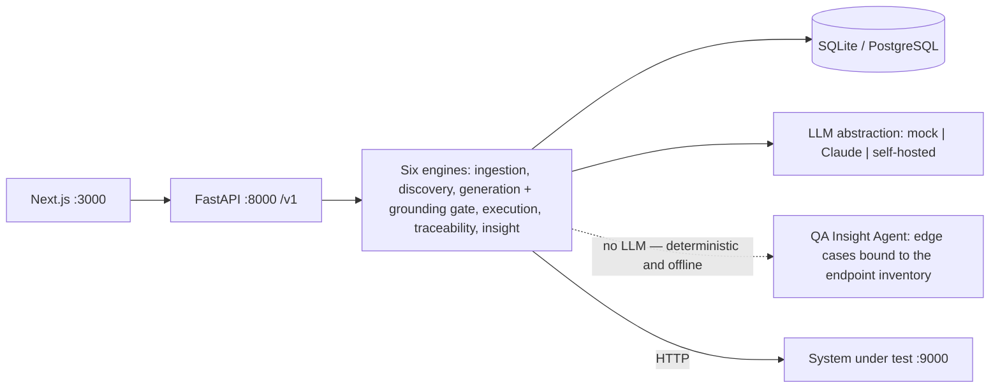

# Traceo (TADQEEQ)

**AI test design & traceability platform.**
Traceo turns a requirements document into an executable, requirement-linked API test suite — grounded in an endpoint inventory discovered from an OpenAPI spec, gated by human review, and backed by a live traceability matrix that exports as contractual and audit evidence.
**The model proposes, the system verifies** — a hard grounding gate guarantees zero fabricated identifiers (BO-07).

The product ships in **English only**, left to right. There is no runtime language mechanism: no dictionaries, no language switcher, no per-project language.



**Six engines:** ingestion, discovery, generation (+ grounding gate), execution, traceability — and the **QA Insight Agent**, which proposes edge cases across nine canonical categories (boundary surprises, exotic input, control characters, idempotency, state corruption, permission edges, timing/DST, resource exhaustion, downstream failures). The insight engine is **100% deterministic, makes zero LLM calls and runs fully offline**, and every case it emits passes the same grounding gate before it is persisted: every path, method and field is derived from the discovered endpoint inventory, never invented (BO-07). It is opt-in through its own endpoints (`GET /v1/projects/{id}/insights`, `POST /v1/projects/{id}/insights/generate`) and changes no existing flow.

## Prerequisites

- **Python 3.11+**
- **Node 20+**

## Quickstart

### 1) Backend (`:8000`)

```bash
cd backend
python3 -m venv .venv
.venv/bin/pip install -r requirements.txt
.venv/bin/python -m uvicorn app.main:app --reload --port 8000
```

### 2) Demo SUT (`:9000`)

```bash
cd demo/sut && ../../backend/.venv/bin/python -m uvicorn main:app --port 9000
```

### 3) Frontend (`:3000`)

```bash
cd frontend
npm install
npm run dev
```

### 4) Demo seed

After the backend and the SUT are running (requires `httpx` — use the virtualenv python):

```bash
backend/.venv/bin/python demo/seed_demo.py
```

> The plain `python3 demo/seed_demo.py` also works if `httpx` is installed system-wide.

**Demo account:** `demo@traceo.sa` / `Demo1234!`

### 5) Tests — the release gates

The grounding suite (adversarial fabrication probes) and the tenant-isolation suite; a failure in either blocks the release:

```bash
cd backend && .venv/bin/python -m pytest
```

#### E2E UI suite — Playwright

Requires the full stack to be running (the quickstart above, or `docker compose --profile go --profile e2e up -d --wait`):

```bash
cd e2e
npm install
npx playwright install chromium
npx playwright test
```

PR fast lane (the fast tags without the heavy specs):

```bash
npx playwright test --grep "@smoke|@critical|@permission|@a11y" --grep-invert "@regression"
```

Full details (architecture, tags, flakiness quarantine policy) in [docs/TEST_AUTOMATION_ARCHITECTURE.md](docs/TEST_AUTOMATION_ARCHITECTURE.md).

## Environment variables

| Variable | Default | Description |
|---|---|---|
| `TRACEO_LLM_PROVIDER` | `auto` | `mock` (deterministic, offline) \| `anthropic` \| `auto` (anthropic when a key is present, otherwise mock) |
| `ANTHROPIC_API_KEY` | — | Claude API key, used by the `anthropic` provider |
| `TRACEO_DATABASE_URL` | `sqlite:///backend/traceo.db` | Database URL (PostgreSQL in production) |
| `TRACEO_SEED_DEMO` | `1` | Seed the demo organisation on startup; must be `0` in production (startup refuses otherwise) |

Every setting lives in `backend/app/config.py` and is configurable through environment variables (NFR-POR-03).

## Repository layout

```
traceo/
├── backend/
│   ├── app/                # FastAPI: main, config, db, models, security, deps, jobs, llm/, modules/
│   ├── tests/              # release gates: grounding + tenant isolation (pytest)
│   ├── requirements.txt
│   └── API_CONTRACT.md     # backend API contract
├── backend-go/             # Go parity port (Gin + GORM) — route-for-route identical
├── frontend/               # Next.js 15 (App Router) + TypeScript — English, LTR
│   └── FRONTEND_CONTRACT.md
├── e2e/                    # Playwright suite (specs, page objects, API repositories, fixtures)
│   └── test-data/          # reference seeds: sample_requirements_en.md, sample_openapi.yaml
├── demo/
│   ├── sut/                # Orders Platform — demo SUT with deliberate defects to discover
│   └── seed_demo.py        # end-to-end demo provisioning
└── docs/                   # documentation
```

## Documentation

- [Architecture](docs/ARCHITECTURE.md)
- [User journey](docs/USER_JOURNEY.md)
- [Test automation architecture](docs/TEST_AUTOMATION_ARCHITECTURE.md)
- [Testid registry](docs/TESTID_REGISTRY.md)
- `docs/PITCH_INVESTORS_AR.html` — legacy Arabic-language investor deck, kept for reference only; it predates the English-only pivot and is not part of the shipped product.

---

**TADQEEQ project — Confidential.** Proprietary; this repository and its documentation belong to the Traceo (TADQEEQ) project and must not be distributed outside the team.
