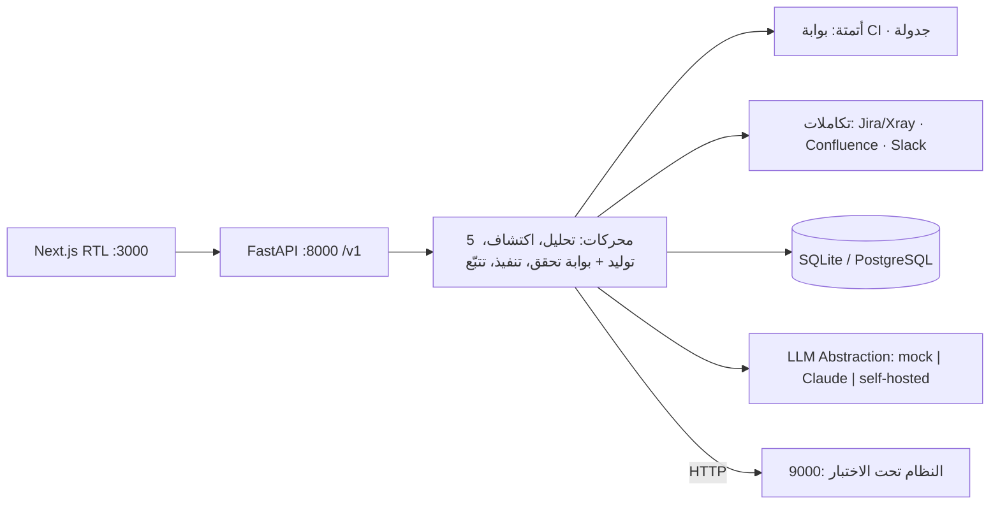

# Traceo · تدقيق (TADQEEQ)

**منصة تصميم الاختبارات والتتبّع بالذكاء الاصطناعي — السوق السعودي.**
تحوّل Traceo وثيقة المتطلبات — بالعربية أو الإنجليزية — إلى حزمة اختبارات API قابلة للتنفيذ، مرتبطة بكل متطلب على حدة ومقيّدة بجرد واجهات مكتشف من مواصفة OpenAPI، مع مراجعة بشرية ومصفوفة تتبّع حيّة تُصدَّر كدليل تعاقدي وتدقيقي.
**النموذج يقترح، والنظام يتحقق** — بوابة تأسيس (Grounding) صلبة: صفر معرّفات مختلَقة (BO-07).



**الحالة:** كل الميزات الـ37 في [مرجع الميزات](Traceov2/docs/02-Feature-Reference.md) منفَّذة ومغطّاة باختبارات.

## المتطلبات — Prerequisites

- **Python 3.11+**
- **Node 20+**

## التشغيل السريع — Quickstart

### 1) الخادم الخلفي — Backend (`:8000`)

```bash
cd backend
python3 -m venv .venv
.venv/bin/pip install -r requirements.txt
.venv/bin/python -m uvicorn app.main:app --reload --port 8000
```

### 2) النظام تحت الاختبار التجريبي — Demo SUT (`:9000`)

```bash
cd demo/sut && ../../backend/.venv/bin/python -m uvicorn main:app --port 9000
```

### 3) الواجهة الأمامية — Frontend (`:3000`)

```bash
cd frontend
npm install
npm run dev
```

### 4) بيانات الديمو — Demo seed

بعد تشغيل الخادم والـ SUT (يتطلب `httpx` — استخدم بايثون البيئة الافتراضية):

```bash
backend/.venv/bin/python demo/seed_demo.py
```

> الأمر الأصلي `python3 demo/seed_demo.py` يعمل أيضاً إذا كان `httpx` مثبتاً على النظام.

**حساب الديمو:** `demo@traceo.sa` / `Demo1234!`

### 5) الاختبارات — بوابتا الإطلاق (Release Gates)

حزمة التأسيس Grounding (عينات اختلاق عدائية) وحزمة عزل المستأجرين — فشل أيٍّ منهما يمنع الإصدار:

```bash
cd backend && .venv/bin/python -m pytest
```

## متغيرات البيئة الرئيسية — Environment Variables

| المتغير | الافتراضي | الوصف |
|---|---|---|
| `TRACEO_LLM_PROVIDER` | `auto` | `mock` (حتمي، دون اتصال) \| `anthropic` \| `auto` (anthropic إن وُجد مفتاح، وإلا mock) |
| `ANTHROPIC_API_KEY` | — | مفتاح Claude API عند استخدام مزوّد `anthropic` |
| `TRACEO_DATABASE_URL` | `sqlite:///backend/traceo.db` | رابط قاعدة البيانات (PostgreSQL في الإنتاج) |
| `TRACEO_ON_PREMISE` | `0` | وضع داخل شبكة العميل: يفرض المزوّد دون اتصال ويرفض أي اتصال خارجي غير مُصرَّح (FR-081) |
| `TRACEO_EGRESS_ALLOWLIST` | — | مضيفون مسموح بالاتصال بهم في وضع on-premise، مفصولون بفواصل |
| `TRACEO_TELEMETRY` | `0` | القياس عن بُعد — مُعطَّل افتراضياً ولا يُفعَّل إلا بإجراء صريح من المسؤول |
| `TRACEO_SCHEDULER` | `1` | خيط الجدولة داخل العملية (FR-060) |
| `TRACEO_RUN_CONCURRENCY_MAX` | `32` | سقف التزامن لكل تشغيل (FR-040) |
| `TRACEO_AUDIT_RETENTION_DAYS` | `90` | مدة الاحتفاظ الافتراضية بسجل التدقيق (FR-082) |
| `TRACEO_DECISION_TABLE_MAX_COMBOS` | `8` | سقف تركيبات جدول القرار — بعده يُطبَّق التخفيض الثنائي (pairwise) ويُفصح عنه (FR-032) |

كامل الإعدادات في `backend/app/config.py` — كلها قابلة للتهيئة عبر متغيرات البيئة (NFR-POR-03).

> **ترقية قاعدة بيانات قائمة:** لا حاجة لأي أداة ترحيل — عند الإقلاع يضيف `db.sync_schema()` أي جداول
> أو أعمدة جديدة تلقائياً. الإصدارات تضيف أعمدة فقط ولا تحذفها، فتبقى قاعدة بيانات العميل صالحة.

## بوابة التسليم في خط الأنابيب — CI gate (FR-061)

أنشئ رمز وصول من **الإعدادات ← رموز الوصول**، ثم في خطوة الـ CI:

```bash
RUN=$(curl -sf -X POST "$TRACEO_URL/v1/projects/$PROJECT/ci/runs" \
  -H "Authorization: Bearer $TRACEO_TOKEN" -H "Content-Type: application/json" \
  -d "{\"environment_id\":\"$ENV\",\"branch\":\"$BRANCH\"}" | jq -r .run_id)

until [ "$(curl -sf "$TRACEO_URL/v1/runs/$RUN" \
  -H "Authorization: Bearer $TRACEO_TOKEN" | jq -r .state)" != "running" ]; do sleep 5; done

curl -sf "$TRACEO_URL/v1/runs/$RUN/gate" -H "Authorization: Bearer $TRACEO_TOKEN" \
  | tee gate.json | jq -e '.passed' >/dev/null || { jq -r '.breaches[].message' gate.json; exit 1; }
```

الخطوة تخرج بقيمة غير صفرية عند خرق السياسة، وتطبع **المتطلب** الذي تسبّب في الخرق بمعرّفه.

## شجرة المستودع — Repository Layout

```
traceo/
├── backend/
│   ├── app/                # FastAPI: main, config, db, models, security, deps, jobs, crawler, llm/, modules/
│   │   └── modules/        # identity, projects, ingestion, discovery, capture, generation,
│   │                       # review, execution, traceability, reporting, automation, integrations
│   ├── tests/              # بوابتا الإطلاق (grounding + عزل) + تغطية كل الميزات الجديدة
│   ├── requirements.txt
│   └── API_CONTRACT.md     # عقد الواجهات الخلفية
├── frontend/               # Next.js 15 (App Router) + TypeScript — عربي أولاً، RTL كامل
│   └── FRONTEND_CONTRACT.md
├── demo/
│   ├── sut/                # منصة الطلبات — SUT تجريبي بعيوب مقصودة للاكتشاف
│   └── seed_demo.py        # تهيئة الديمو من طرف إلى طرف
└── docs/                   # الوثائق
```

## الوثائق — Documentation

- [عرض المستثمرين (عربي)](docs/PITCH_INVESTORS_AR.html) — `docs/PITCH_INVESTORS_AR.html`
- [المعمارية — Architecture](docs/ARCHITECTURE.md)
- [رحلة المستخدم — User Journey](docs/USER_JOURNEY.md)

---

# English

**Traceo (TADQEEQ)** — AI test design & traceability platform for the Saudi market.
It turns a requirements document — Arabic or English — into an executable, requirement-linked API test suite grounded in an endpoint inventory discovered from an OpenAPI spec, with human review and a live traceability matrix exportable as contractual/audit evidence. **The model proposes, the system verifies** — a hard grounding gate guarantees zero fabricated identifiers (BO-07).

**Prerequisites:** Python 3.11+, Node 20+.

**Quickstart:**

```bash
# Backend (:8000)
cd backend && python3 -m venv .venv && .venv/bin/pip install -r requirements.txt
.venv/bin/python -m uvicorn app.main:app --reload --port 8000

# Demo SUT (:9000)
cd demo/sut && ../../backend/.venv/bin/python -m uvicorn main:app --port 9000

# Frontend (:3000)
cd frontend && npm install && npm run dev

# Demo data (requires httpx — use the backend venv python)
backend/.venv/bin/python demo/seed_demo.py
# Demo account: demo@traceo.sa / Demo1234!

# Tests — the two release gates (grounding + tenant isolation)
cd backend && .venv/bin/python -m pytest
```

**Key env vars:** `TRACEO_LLM_PROVIDER=mock|anthropic|auto`, `ANTHROPIC_API_KEY`, `TRACEO_DATABASE_URL`, `TRACEO_ON_PREMISE`, `TRACEO_EGRESS_ALLOWLIST`, `TRACEO_SCHEDULER`, `TRACEO_AUDIT_RETENTION_DAYS`. See `backend/app/config.py`.

**Status:** all 37 features in the [Feature Reference](Traceov2/docs/02-Feature-Reference.md) are implemented and covered by tests. An existing database upgrades itself on startup — no migration tool needed.

**CI gate:** create a token in Settings → API tokens, then `POST /v1/projects/{id}/ci/runs` and poll `GET /v1/runs/{run}/gate` — it returns an exit code and names the breaching requirement (see the Arabic section above for the full snippet).

**Docs:** [Investor pitch (AR)](docs/PITCH_INVESTORS_AR.html) · [Architecture](docs/ARCHITECTURE.md) · [User journey](docs/USER_JOURNEY.md)

---

**مشروع TADQEEQ — سري.** جميع الحقوق محفوظة؛ هذا المستودع ووثائقه ملكية خاصة بمشروع Traceo (TADQEEQ) ولا يجوز تداوله خارج الفريق. — *TADQEEQ project — Confidential. Proprietary; do not distribute.*
