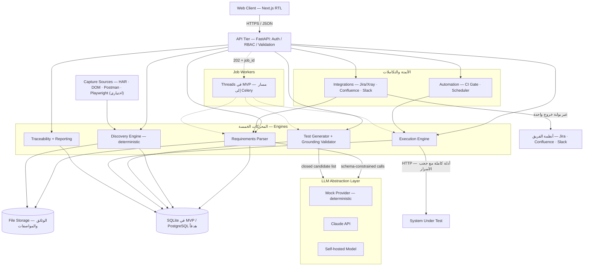
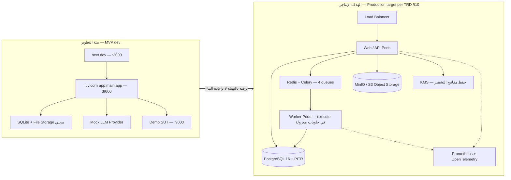
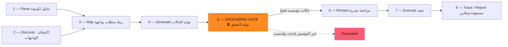
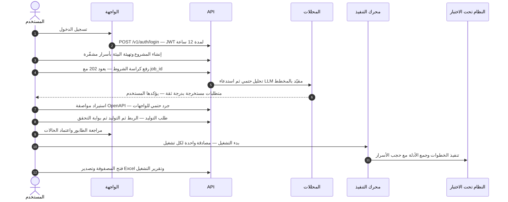
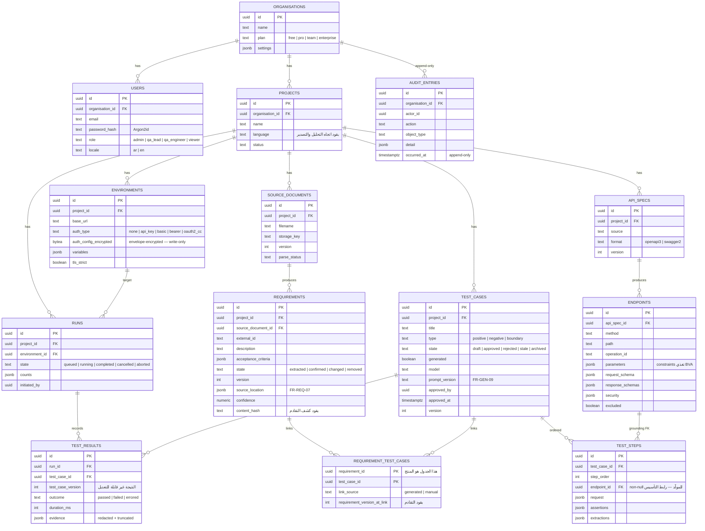
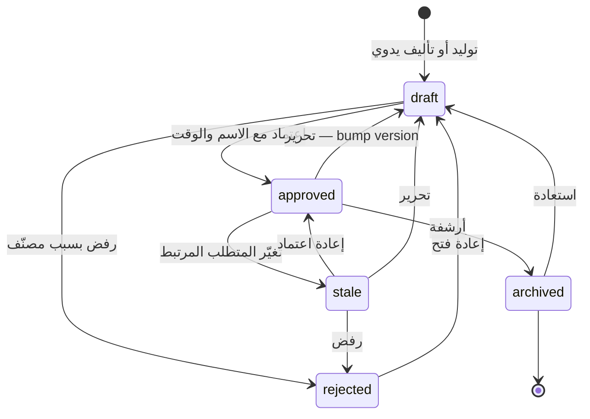
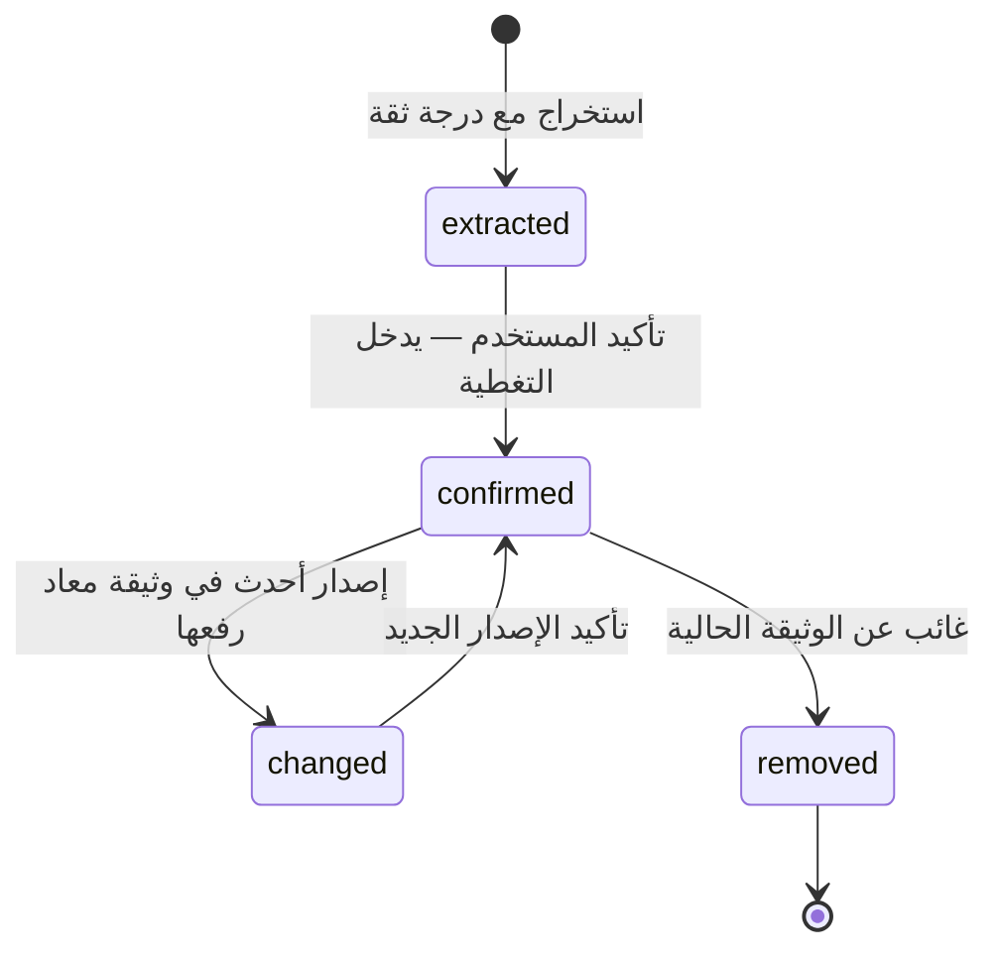
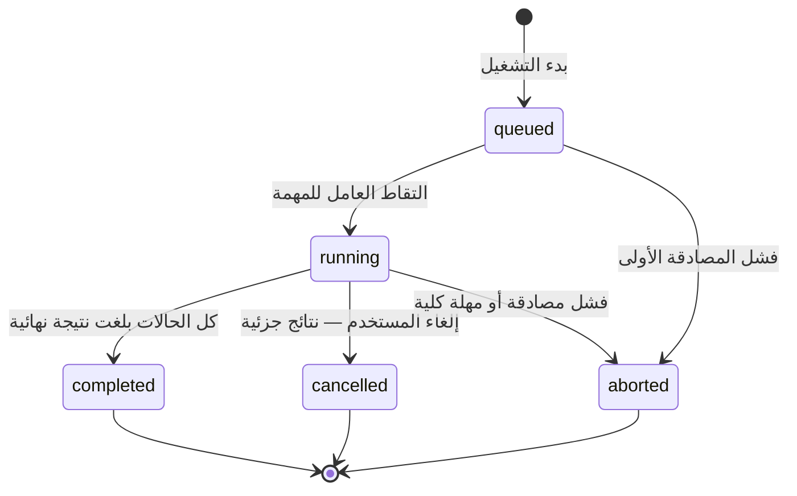
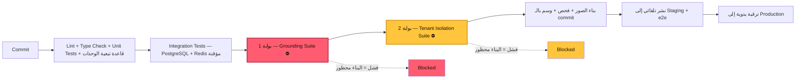

# معمارية Traceo (TADQEEQ) — Architecture

> منصة تصميم الاختبارات والتتبّع بالذكاء الاصطناعي — **النموذج يقترح، والنظام يتحقق**.
> هذه الوثيقة تصف معمارية الـ MVP كما بُنيت فعلاً، والمسار الإنتاجي المستهدف كما حدده الـ TRD.

---

## 1. البنية العامة للنظام — System Architecture

النظام **Modular Monolith** على طبقة التطبيق: عميل ويب Next.js بواجهة RTL كاملة، يخاطب طبقة API مبنية على FastAPI تتولى Auth/RBAC/Validation، وتوزّع العمل على خمسة محركات متخصصة. المهام الطويلة (الاستخراج، التوليد، التنفيذ، التصدير) تعمل كـ Job Workers غير متزامنة — Threads في الـ MVP مع مسار جاهز إلى Celery. طبقة LLM Abstraction تعزل أي مزوّد نموذج خلف واجهة واحدة مقيّدة بـ JSON Schema، ومحرك التنفيذ هو الوحيد الذي يخرج نحو النظام تحت الاختبار عبر HTTP.



المحرك الوحيد الذي لا يلمس النموذج اللغوي إطلاقاً هو **Discovery Engine** — حتميته هي ما يجعل بوابة التحقق (Grounding) ممكنة أصلاً: الجرد المكتشف هو مرجع الحقيقة الذي تُفحص ضده كل حالة مولَّدة. تعطُّل مزوّد النموذج يعطّل التوليد فقط؛ الاستيعاب والتنفيذ والتتبّع والتقارير تستمر (NFR-REL-03).

### القاعدة الحاكمة — نصفان لا نصف

> «لا توجد حالة اختبار إلا إذا استطاعت أن تسمّي **معيار القبول** الذي اشتُقّت منه و**الواجهة** التي تستهدفها.» (SRS §1)

النصف الثاني هو بوابة التأسيس (Grounding) — مطبَّق ومختبَر منذ البداية. النصف الأول صار مطبَّقاً أيضاً: **التوليد يتكرّر على المعايير لا على المتطلبات**. كل معيار يُربط بالواجهات بمفرده، وكل حالة يُنتجها تخزّن وسم معياره في `RequirementTestCase.criterion_indexes`. ومتطلب بلا معايير لا يُنتج شيئاً ويُعلَّم `needs_criteria` — لأن حالة لا تستطيع قول ما تتحقق منه هي بالضبط ما وُجد هذا المنتج ليمنعه.

الأوسام (`AC1`، `AC2`…) تتبع **الجملة** لا موضعها: إدراج معيار جديد يضيف رقماً تالياً ولا يزحزح الأرقام القائمة، لأن الحالات وصفوف المصفوفة والعيوب المصدَّرة كلها تستشهد بهذه الأوسام. والمعيار المحذوف يتقاعد رقمه نهائياً، والحالة التي اختفى معيارها **تُؤرشَف لا تُحذف** — نتائجها دليل على ما كان صحيحاً وقتها.

**الإسناد يتوسّع مرة واحدة، وعلى دليل:** تُنسب الحالة إلى المعيار الذي أنتج ربطها، **وإلى أي معيار شقيق يذكر الحقل الذي تدور حوله الحالة**. حالة حدّية على `age` دليل حقيقي على «قيمة age أكبر من 120 تُرفض»؛ واعتبار ذلك المعيار غير مغطّى فجوة كاذبة. التوسّع يعتمد على **حقل الموضوع وحده** لا على تشابه لفظي عام — وإلا لادّعى أي معيار أي حالة — والحالة التي لا تدور حول حقل بعينه (طلب إيجابي عادي) لا تدّعي شيئاً.

**حدّ معلَن لا مخفي:** أن يحصل المعيار على حالات أصلاً يتوقف على دقة الرابط (Mapper). جملة غير وظيفية مثل «زمن الاستجابة يُقاس عند بوابة الـ API» قد يختار لها الرابط واجهةً فتُعتبر مغطّاة. جرّبت بوابة لفظية تشترط أن يذكر المعيار حقول الواجهة **وأزلتها**: كانت تُسقط بصمت معايير مشروعة لا تذكر أي حقل مثل «يُرفض الطلب غير المصادَق». فقدان تغطية حقيقية لتحسين رقم هو الخطأ الأسوأ. بوابة المراجعة البشرية — لا تُحتسب حالة قبل اعتمادها — هي الضابط المصمَّم لهذا، و`MIN_MAP_CONFIDENCE` هو الضابط القابل للضبط.

### سطح واحد من مصادر متعددة — One surface, many sources

المواصفة ليست المصدر الوحيد للجرد. `modules/capture.py` يبني السطح نفسه من التقاط حركة المرور (HAR) ومن نماذج الـ DOM ومن مجموعات Postman، ويدمجها بقاعدة أولوية واحدة:

```
openapi  >  traffic  >  dom  >  postman        (لكل خاصية)
```

المصدر الأعلى دقةً يملك «الإعلان»، لكن **عدّاد الرصد يتراكم دائماً** من كل المصادر. ومسار مرصود يُطابَق بنيوياً على نقطة مُعلَنة بنفس الشكل، فلا يتفرّع `‎/customers/{customerId}` عن `‎/customers/{id}`. لهذا يبقى إعادة استيراد المواصفة آمناً: يستبدل الشريحة المُعلَنة فقط، وما ساهمت به المصادر الأخرى — وعدّادات رصده — يبقى.

التقاط حركة المرور يُنقّح بيانات الاعتماد **عند نقطة الالتقاط**؛ والأجسام تُختزل إلى أسماء الحقول وأنواعها المستنتَجة، فلا تُخزَّن قيمة ملتقَطة أصلاً.

### الأتمتة والتكاملات

`modules/automation.py` يضيف بوابة تسليم تُقيَّم بعد انتهاء التشغيل وتُرجع رمز خروج يفهمه خط الأنابيب، ومجدولاً بصيغة cron يعمل كخيط داخل العملية. المسارات الثلاثة لبدء التشغيل — يدوي، CI، مجدول — تمرّ كلها عبر `start_run(...)` نفسه، فيستحيل أن يسلك تشغيل CI مساراً مختلفاً عن اليدوي.

`modules/integrations.py` هو **المخرج الوحيد** إلى أنظمة الفريق: كل نداء خارجي يمرّ عبر `_request` التي تفرض قائمة السماح في وضع on-premise (FR-081)، وهي أيضاً نقطة الاستبدال الوحيدة في الاختبارات.

---

## 2. مخطط النشر — Deployment

بيئة تطوير الـ MVP تعمل بالكامل على جهاز واحد بلا أي اعتماد خارجي: uvicorn وnext dev وSUT تجريبي وSQLite وMock LLM. الهدف الإنتاجي (TRD §10) يستبدل كل مكوّن ببديله القابل للتوسّع دون تغيير معماري — وكل بديل قابل للاستضافة الذاتية حفاظاً على مسار النشر داخل بنية العميل (NFR-POR-02).



طوابير Celery الأربعة في الهدف الإنتاجي: `ingest` (تحليل الوثائق)، `generate` (التوليد، مسقوف لكل منظمة)، `execute` (التنفيذ، حد تزامن لكل بيئة حتى لا نُغرق staging العميل)، `report` (التصدير). العمال عديمو الحالة ويتوسعون أفقياً باستقلال عن طبقة الويب (NFR-SCA-02).

---

## 3. خط الأنابيب ذو المراحل الثماني — Processing Pipeline

هذا هو المسار الكامل من الوثيقة إلى التقرير. المرحلة الخامسة — بوابة التحقق — ليست معالجة لاحقة اختيارية بل **بوابة صلبة**: أي حالة تشير إلى واجهة أو مُعامل أو حقل غير موجود في الجرد تُحذف ولا تُصلَّح ولا تُعرض على المستخدم أبداً، وتُحتسب ضمن عدّاد المحذوف.



> **القاعدة الصلبة BO-07: صفر معرّفات مختلَقة.** نسبة الحالات المحفوظة التي تحتوي معرّفاً غائباً عن جرد الواجهات يجب أن تساوي صفراً (NFR-REL-04, FR-GEN-06) — واختبارات هذه البوابة شرط إطلاق لأي إصدار (NFR-MNT-04).

---

## 4. رحلة UC-01 كاملة — Sequence Diagram

التسلسل التالي هو حالة الاستخدام الأساسية في الـ SRS: من تسجيل الدخول إلى تصدير Excel في اثنتي عشرة خطوة، بهدف زمني إجمالي ≤ 15 دقيقة لمستخدم جديد (NFR-USE-02).



الخطوات الطويلة (4، 8، 10) كلها غير متزامنة: تعود فوراً بـ `202 + job_id` وتُتابَع بالاستطلاع عبر `GET /v1/jobs/{id}` مع شريط تقدّم في الواجهة — لا عملية طويلة تحجب الواجهة أبداً (NFR-PERF-06).

---

## 5. نموذج البيانات — ER Diagram

أربعة عشر جدولاً، كلها تحمل `id` (UUID) و`created_at` و`updated_at`، والجداول الخاصة بالمستأجرين تحمل `organisation_id` وتُعزل على مستوى الاستعلام في كل مسار وصول (NFR-SEC-04). جدول `requirement_test_cases` — علاقة متطلب↔اختبار كجدول من الدرجة الأولى — **هو المنتج نفسه**، وهو سبب اختيار قاعدة علائقية أصلاً.



`test_steps.endpoint_id` مفروض غير فارغ لكل خطوة مولَّدة — هذا هو رابط التأسيس Grounding على مستوى قاعدة البيانات نفسها، لا على مستوى منطق التطبيق فقط. نتائج التشغيل تربط بإصدار الحالة المنفَّذ بالضبط (`test_case_version`) وتبقى غير قابلة للتعديل بعد الكتابة (NFR-REL-06).

---

## 6. نماذج الحالات — State Models

دورة حياة حالة الاختبار هي قلب سلطة المراجعة البشرية: لا حالة تُنفَّذ ولا تُحتسب في التغطية قبل الاعتماد، وأي تغيير جوهري في المتطلب المرتبط يعيد الحالة المعتمدة إلى الطابور بوسم Stale تلقائياً (FR-TRC-04).



المتطلب المستخرَج لا يدخل التوليد ولا نسبة التغطية قبل تأكيده؛ وعند إعادة رفع وثيقة محدَّثة يُطابَق بالمعرّف الخارجي ثم بتشابه النص، فيُوسم المتغيّر `changed` والغائب `removed`.



التشغيل يميّز بوضوح بين الإلغاء اليدوي (نتائج جزئية محفوظة) والإجهاض النظامي (فشل مصادقة SUT أو تجاوز المهلة الكلية — تشخيص واحد واضح بدل مئة فشل زائف، FR-EXE-04).



---

## 7. خط CI/CD وبوابتا الإطلاق — Release Gates

خط النشر (TRD §10.2) يحتوي بوابتين لا يمرّ بناءٌ بدونهما: **حزمة التأسيس Grounding** بعينات اختلاق عدائية (معرّف مختلَق واحد يصل قاعدة البيانات = البناء لا يُشحن)، و**حزمة عزل المستأجرين** التي تهاجم كل واجهة عبر منظمتين مختلفتين. الترقية إلى الإنتاج يدوية، والهجرات forward-only متوافقة مع الإصدار السابق للسماح بالتراجع.



في هذا المستودع تعيش البوابتان في `backend/tests/test_grounding.py` و`backend/tests/test_isolation.py` وتعملان بـ pytest — انظر README لأمر التشغيل.

---

## 8. واجهات الـ API — Endpoints

كل الواجهات تحت البادئة `/v1`، الاستجابات JSON بأسماء snake_case، التواريخ ISO 8601 UTC، والمعرّفات UUID. العمليات الطويلة تعود بـ `202 {job_id}` وتُتابَع عبر `GET /v1/jobs/{id}`. المصدر: `backend/API_CONTRACT.md`.

### Identity — الهوية والصلاحيات (`modules/identity.py`)

| Method | Path | الوصف |
|---|---|---|
| POST | `/auth/register` | إنشاء منظمة + مدير (org_name, name, email, password) |
| POST | `/auth/login` | دخول — يعيد token + بيانات المستخدم |
| GET / PATCH | `/me` | الملف الشخصي؛ تعديل الاسم واللغة |
| GET | `/members` | قائمة الأعضاء |
| POST | `/members/invite` | دعوة عضو بدور محدد (manage_members) |
| PATCH / DELETE | `/members/{id}` | تغيير دور / إزالة عضو |
| GET | `/audit` | سجل التدقيق، الأحدث أولاً (view_audit_log) |
| GET / PUT | `/audit/retention` | مدة الاحتفاظ (افتراضياً 90 يوماً) — التعديل للمدير (FR-082) |
| POST | `/audit/purge` | مسار الحذف الوحيد، ولا يمسّ سجلاً قبل تاريخ احتفاظه |
| GET | `/audit/export.csv` | تصدير السجل كاملاً للمدقّق |

### Projects — المشاريع والبيئات (`modules/projects.py`)

| Method | Path | الوصف |
|---|---|---|
| CRUD | `/projects` | إنشاء / تسمية / أرشفة / حذف |
| GET | `/projects/{id}/dashboard` | العدادات والتغطية والاتجاه ومراقبة الانحدار — فلاتر `branch`/`environment_id` وعتبة الهبوط (FR-PRJ-07، FR-054، FR-062) |
| CRUD | `/projects/{id}/environments` | البيئات — الأسرار write-only، تُعاد `auth_config_masked` + `secret_rotated_at` فقط (FR-PRJ-04). الحقل `fixtures` يعرّف دورة حياة بيانات الاختبار (FR-043) |
| POST | `/projects/{id}/environments/{eid}/check` | فحص اتصال ومصادقة دون كشف السر (FR-PRJ-06) |

### Ingestion — استيعاب المتطلبات (`modules/ingestion.py`)

| Method | Path | الوصف |
|---|---|---|
| POST | `/projects/{id}/documents` | رفع وثيقة (pdf/docx/xlsx/md/txt ≤ 50MB) → `202 {job_id, document_id}` |
| POST | `/projects/{id}/requirements/paste` | لصق نص المتطلبات مباشرة — مخرج الحالة الفارغة (FR-010) |
| GET | `/projects/{id}/documents` | الوثائق وإصداراتها وحالة التحليل |
| GET | `/projects/{id}/requirements` | قائمة المتطلبات — فلاتر state/type/priority/q، الأقل ثقة أولاً |
| PATCH | `/requirements/{rid}` | تحرير أو تأكيد؛ تحرير المؤكد يرفع الإصدار ويوسم الحالات Stale |
| POST / DELETE | `/requirements` | إضافة يدوية / حذف |
| POST | `/projects/{id}/requirements/confirm_all` | تأكيد جماعي للمستخرَج |

### Discovery — اكتشاف الواجهات (`modules/discovery.py`)

| Method | Path | الوصف |
|---|---|---|
| POST | `/projects/{id}/api-specs` | استيراد OpenAPI 3.x / Swagger 2.0 ملفاً أو رابطاً — تحليل متزامن مع `warnings`، وحارس SSRF على الجلب |
| GET | `/projects/{id}/endpoints` | جرد الواجهات المطبَّع — مع `discovery_source` و`times_seen` و`declared_never_seen` |
| PATCH | `/endpoints/{eid}` | استبعاد/تضمين واجهة من التوليد (FR-DSC-05) |

### Capture — مصادر الاكتشاف الأخرى (`modules/capture.py`)

| Method | Path | الوصف |
|---|---|---|
| POST | `/projects/{id}/discovery/traffic` | التقاط HAR — تعميم المسارات، عدّ الرصد، تنقيح الاعتماد عند الالتقاط (FR-021) |
| POST | `/projects/{id}/discovery/dom` | نماذج الـ DOM — الحقول وقيود التحقق وحاويات RTL (FR-022) |
| POST | `/projects/{id}/discovery/postman` | مجموعة v2.1 — المجلدات وسوم، والمتغيرات غير المحلولة تُبلَّغ لا تُخمَّن (FR-023) |
| POST | `/projects/{id}/discovery/crawl` | قيادة التطبيق بمتصفح مخفي (Playwright اختياري — 501 مع تعليمات التثبيت عند غيابه) |
| POST | `/projects/{id}/discovery/reset` | إسقاط مساهمة مصدر غير المواصفة |

### Generation — الربط والتوليد والتحقق (`modules/generation.py`)

| Method | Path | الوصف |
|---|---|---|
| POST | `/projects/{id}/generate` | توليد لمتطلبات مختارة أو الكل، بعمق smoke/standard/exhaustive → `202 {job_id}`؛ الناتج `{generated, discarded, unmappable, refreshed, preserved_manual_edits, changed_cases}`. الحالات المحرَّرة يدوياً محميّة من إعادة التوليد (FR-036) |

### Review — المراجعة والاعتماد (`modules/review.py`)

| Method | Path | الوصف |
|---|---|---|
| GET | `/projects/{id}/test-cases` | القائمة مع روابط المتطلبات — فلاتر state/requirement_id/type/q |
| GET / PATCH | `/test-cases/{id}` | التفاصيل الكاملة / تحرير كامل (يوسم user_modified ويعيد إلى draft) |
| POST | `/test-cases/{id}/approve` | اعتماد مع approved_by/at + تدقيق (FR-REV-05) |
| POST | `/test-cases/{id}/reject` | رفض بـ reason_code + نص حر (FR-REV-06) |
| POST | `/test-cases/bulk` | اعتماد/رفض جماعي (FR-REV-04) |
| POST | `/projects/{id}/test-cases` | تأليف يدوي — روابط متطلبات إلزامية (FR-REV-07) |
| POST / DELETE | `/test-cases/{id}/links` | إضافة/إزالة رابط متطلب يدوياً (FR-TRC-05) |

### Execution — التنفيذ (`modules/execution.py`)

| Method | Path | الوصف |
|---|---|---|
| POST | `/projects/{id}/runs` | بدء تشغيل على بيئة (مع `branch` و`concurrency` 1..32) → `202 {job_id, run_id}`؛ نتائج جزئية تتدفق أثناء التنفيذ. بيانات الاختبار تُنشأ قبل الحزمة وتُحذف في `finally` — عند النجاح والفشل والإلغاء (FR-043) |
| GET | `/runs/{id}` | الحالة والعدادات |
| GET | `/runs/{id}/results` | نتائج كل حالة مع الأدلة (فلتر outcome) |
| POST | `/runs/{id}/cancel` | إلغاء مع حفظ الجزئي (FR-EXE-10) |
| GET | `/projects/{id}/runs` | سجل التشغيلات |

### Traceability — التتبّع (`modules/traceability.py`)

| Method | Path | الوصف |
|---|---|---|
| GET | `/projects/{id}/traceability` | المصفوفة + `coverage_pct` + قائمة الفجوات بأسبابها |
| GET | `/requirements/{id}/history` | تاريخ التشغيلات المؤثرة على حالات المتطلب (FR-TRC-07) |

### Reporting — التقارير والتصدير (`modules/reporting.py`)

| Method | Path | الوصف |
|---|---|---|
| GET | `/projects/{id}/exports/matrix.xlsx` | تصدير Excel بست أوراق (تشمل الفجوات والإخفاقات) — `lang=en\|ar\|both`، وختم هوية التشغيل في تذييل كل صفحة (FR-071) |
| GET | `/runs/{id}/report` | ملخص JSON بصيغة تقرير عيوب (FR-RPT-01/02/03) |
| GET | `/runs/{id}/report.html` | تقرير HTML مكتفٍ ذاتياً قابل للطباعة — `lang=en\|ar\|both` (FR-RPT-05، FR-071) |
| GET | `/runs/{id}/compare/{other_id}` | مقارنة تشغيلين — newly_failing / newly_passing (FR-RPT-06) |

### Automation — البوابة والجدولة (`modules/automation.py`)

| Method | Path | الوصف |
|---|---|---|
| GET / PUT | `/projects/{id}/gate` | سياسة بوابة التسليم: أدنى تغطية، أقصى إخفاقات جديدة، سبب المنع (FR-061) |
| GET | `/runs/{id}/gate` | الحكم: `passed`، `exit_code`، و`breaches` تسمّي المتطلب المخروق. المقارنة داخل الفرع نفسه |
| POST | `/projects/{id}/ci/runs` | بدء تشغيل موسوم `source=ci`؛ 409 إذا كانت البيئة مشغولة |
| GET/POST/DELETE | `/tokens` | رموز مشغّلات CI — يُخزَّن الهاش فقط، وتُعرض القيمة مرة واحدة (manage_tokens) |
| CRUD | `/projects/{id}/schedules` | جدولة cron لكل بيئة، بتوقيت السعودية افتراضياً؛ المتداخل يُؤجَّل لا يُنفَّذ بالتوازي (FR-060) |

### Integrations — التكاملات (`modules/integrations.py`)

| Method | Path | الوصف |
|---|---|---|
| CRUD | `/integrations` | Jira / Xray / Confluence / Slack — السر write-only، ويُعاد `secret_set` و`secret_rotated_at` فقط |
| POST | `/integrations/{id}/check` | فحص الاتصال وبيانات الاعتماد |
| POST | `/runs/{rid}/results/{id}/export` | تصدير عيب إلى Jira؛ إعادة التصدير **تُحدِّث** التذكرة نفسها (FR-070) |
| POST | `/runs/{rid}/xray/sync` | إنشاء تنفيذ اختبار في Xray ومزامنة الأحكام |
| POST | `/runs/{rid}/notify` | ملخص إلى Slack — يُطلق تلقائياً عند اكتمال التشغيل حسب مستوى التنبيه |
| GET | `/integrations/{id}/confluence/pages` | صفحات الفضاء للاختيار |
| POST | `/projects/{id}/confluence/import` | استيراد الصفحات عبر خط الاستيعاب نفسه — إعادة الاستيراد ترفع الإصدار وتوسم الحالات (FR-011) |

### Jobs — المهام

| Method | Path | الوصف |
|---|---|---|
| GET | `/jobs/{id}` | استطلاع حالة مهمة طويلة (تُستطلع كل ثانية من الواجهة) |

---

## 9. المعمارية الأمنية — Security Architecture

- **عزل المنظمات على كل استعلام**: كل جدول مستأجر يحمل `organisation_id`، وكل استعلام يفلتر عليه من الجلسة الموثّقة — لا من أي مُعامل يرسله العميل. المورد خارج منظمة المستخدم يعود `404` لا `403` (لا تسريب وجود). حزمة عزل المستأجرين بوابة إطلاق (NFR-SEC-04, AC-11).
- **كلمات المرور بـ Argon2id** — خوارزمية تكيّفية حديثة (FR-USR-01).
- **جلسات JWT بمدة 12 ساعة** قابلة للتهيئة (`TRACEO_TOKEN_TTL_HOURS`, NFR-SEC-07).
- **أسرار البيئات envelope-encrypted وwrite-only**: تُقبل عند الكتابة، تُخزَّن مشفّرة، ولا تعيدها أي واجهة أبداً — القراءة تعيد مؤشر قناع فقط. التحديث استبدال كامل (FR-PRJ-04, NFR-SEC-02).
- **حرّاس SSRF على جلب المواصفات**: حجب النطاقات الخاصة وlink-local ونقاط cloud metadata، بروتوكولا https/http فقط، سقف 5MB ومهلة 10 ثوانٍ، وعمق تحويلات محدود.
- **الحجب عند الالتقاط لا عند العرض** (Redaction-at-capture): الأسرار تُحجب من أدلة الطلبات **قبل** الحفظ — لا توجد نسخة غير محجوبة على القرص إطلاقاً، والتصدير يمر عبر مسار الحجب نفسه: لا يوجد مسار برمجي يوصل سراً إلى تقرير (NFR-SEC-03).
- **سجل تدقيق append-only**: أحداث المصادقة وتحرير المتطلبات والاعتماد/الرفض وتغيير البيئات وبدء التشغيل — بالفاعل والوقت والكائن، بلا صلاحية تعديل أو حذف عبر التطبيق (FR-USR-06, NFR-SEC-08).
- **توكن مصادقة التشغيل في الذاكرة فقط** — يُكتسب مرة لكل تشغيل ولا يُخزَّن أبداً (FR-EXE-04).
- **تصدير RTL صحيح**: Excel بورقة `rightToLeft` وHTML بـ `dir=rtl` عندما تكون لغة المشروع العربية — التقرير المسلَّم للجهة الحكومية يجب أن يُقرأ صحيحاً (FR-RPT-07, NFR-USE-03).

---

## 10. قرارات مبسّطة في الـ MVP مقابل الهدف الإنتاجي

كل تبسيط أدناه واعٍ ومحصور خلف واجهة تسمح بالاستبدال بالتهيئة لا بإعادة البناء (NFR-POR):

| المكوّن | الـ MVP الحالي | الهدف الإنتاجي (TRD) |
|---|---|---|
| قاعدة البيانات | SQLite ملف واحد | PostgreSQL 16 + Row-Level Security على `organisation_id` + PITR |
| المهام الخلفية | Threads داخل العملية (`jobs.py`) | Celery + Redis بأربعة طوابير (ingest / generate / execute / report) |
| تخزين الملفات | مجلد محلي (`TRACEO_STORAGE_DIR`) | MinIO / S3 مع إصدارات للكائنات |
| حفظ مفاتيح التشفير | مفتاح مشتق sha256 من `TRACEO_SECRET_KEY` (envelope) | KMS للاستضافة / HSM أو ملف محمي للنشر الداخلي — AES-256-GCM |
| مزوّد النموذج | Mock حتمي (يعمل دون اتصال) | Claude API أو نموذج ذاتي الاستضافة — تبديل بالتهيئة (`TRACEO_LLM_PROVIDER`) |

---

*وثيقة داخلية — مشروع TADQEEQ · Traceo. انظر أيضاً: [رحلة المستخدم](USER_JOURNEY.md) · [عرض المستثمرين](PITCH_INVESTORS_AR.html).*
