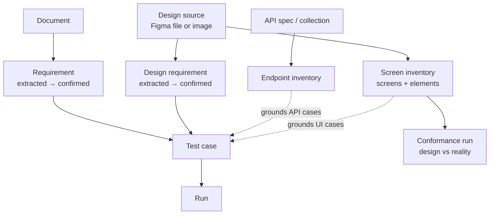

# The design is a requirement source

> Architecture for making a UI design a first-class specification in Traceo — extracted, confirmed, traced and tested exactly like a written requirement.
>
> Status: proposal. The deterministic extraction layer exists (`backend/app/modules/design.py::design_facts`); the data model, routes and UI below are not built yet.

## The gap this closes

Traceo today accepts two kinds of input:

| Input | Produces | Grounds |
|---|---|---|
| A document | `Requirement` | *what* the system must do |
| An OpenAPI/Postman/HAR file | `Endpoint` | *where* it does it |

And a test case must reference both, which is what makes BO-07 enforceable.

But a written document is a **partial** specification, and everyone in the room knows it. A BRD carries the business rules — "a reset link expires after 30 minutes", "we never reveal whether an email exists". It does not carry the fifty other facts the product also has to satisfy, because nobody writes them down:

- the screen has an email field, and a primary action labelled *Send reset link*
- there is a *Back to sign in* link, and it is the only secondary action
- the error message appears under the field, not above it
- there are four surface colours, and the brand orange is used for exactly one thing
- the card is centred, the field and the button share a left edge, the rhythm is 24/16/32

**All of that is written down — in the design.** It is simply written in Figma rather than in Word. Today Traceo cannot read it, so those facts are untested, and the coverage number quietly excludes them: a project can show 100% traceability while most of what the product visibly promises has never been checked.

The proposal is small to state and large in effect: **treat a design as a source document.** Same lifecycle, same confirmation step, same traceability, same grounding gate.

---

## 1. Shape



The symmetry is the whole design. A **screen element** is to a UI case what an **endpoint** is to an API case: the grounded unit it must reference. A UI case that targets a button the design does not contain is discarded before it is saved — the same sentence as today's grounding gate, applied to a different inventory.

---

## 2. What a design states, and how much of it is knowable

Not all design facts are equally recoverable, and pretending otherwise is how these tools lose trust. Two extraction paths, with an honest ceiling on each:

### Path A — the Figma file (preferred)

The Figma REST API and MCP server expose the design as **data**: named nodes, their geometry, fills, strokes, corner radii, effects, text content, font family/size/weight/spacing, component and variant names, and the variable collections behind the tokens.

That yields facts with **meaning**, which is what makes them requirements rather than measurements:

| Fact | Becomes the requirement |
|---|---|
| node `Button/Primary` with text `Send reset link` | The screen shall present a primary action labelled "Send reset link". |
| node `Input/Email` with `required=true` | The email field shall be required. |
| variant `Input/Email:error` with helper text | The screen shall show an inline error under the email field on invalid input. |
| variable `color/brand/600 = #F0903F` | The primary action shall use the brand colour #F0903F. |
| frame `Forgot password — empty` | The screen shall have an empty state. |

Variants are the richest and most neglected source: a designer who drew `default / hover / focus / disabled / error / loading` has specified six behaviours, and typically **none** of them appear in the written requirements.

### Path B — an exported image (fallback)

When only a PNG is available, extraction is limited to what a raster can support — but that part is exact, and it is already implemented (`design_facts`). Run on a real 1770×1446 design export it produced **48 facts**:

| Kind | Count | Example |
|---|---|---|
| `surface` | 5 | `#1B1A20` covers 26.92% of the screen |
| `element` | 27 | an element of `#F0903F` occupies 708×116 at (479,917) |
| `contrast` | 6 | `#F2EFF6` on `#1B1A20` is 15.18:1 |
| `alignment` | 7 | 4 elements share a left edge at 479px |
| `spacing` | 2 | the column rhythm is [24, 16, 32]px |

What Path B **cannot** produce is meaning: it can prove an orange rectangle 708×116 exists at (479,917), never that it is the submit button. So Path B facts are structural — they catch drift, regressions and contrast defects — while Path A facts are semantic and can drive real UI test cases.

**Recommendation: Path A for anything you intend to generate cases from; Path B for conformance and for teams who can only hand over a PNG.** Never blur the two in the UI — a fact's source must be visible, because "the design says the button is labelled X" and "there is an orange rectangle here" carry very different authority.

---

## 3. Design requirements

Extracted facts are **not** requirements yet. They enter as `extracted` and a human confirms them, exactly like document-derived requirements — and for the same reason: extraction is mechanical, and a mechanical reading of a design contains scaffolding, placeholder copy and things the designer had not decided yet.

```
DesignSource (figma_file | figma_frame | image)
  └─ DesignFact        (kind, subject, statement, value, evidence box)
      └─ Requirement   state: extracted → confirmed | changed | removed
```

Reusing `Requirement` rather than inventing a parallel entity is deliberate: the traceability matrix, the coverage number, the gate and the exports all keep working, and a design-derived requirement sits in the matrix beside a document-derived one with a `source_kind` telling them apart. The alternative — a second requirement type — would fork every report in the product.

**Change detection matters more here than for documents.** A design moves weekly. Re-importing a frame must diff facts against the confirmed set and mark the affected requirements `changed`, which cascades to `stale` on the test cases that trace to them. That machinery already exists for documents; it just needs the design source wired into it.

---

## 4. Screen and element inventory

The grounding inventory for UI cases:

```
Screen   (path?, frame, viewport, actor role, platform)
  └─ Element (name from the design node, role, box, tokens, states[])
```

An element carries what the design knows about it: its node name, its box, its fill/typography tokens, and the states the designer drew. Mapping an element to the real DOM is the one thing that must be **declared, not guessed** — a `data-design-node` attribute, or a name convention agreed once. Guessing that mapping is where every design-diff tool becomes unreliable, and a wrong mapping produces confident nonsense.

---

## 5. Generating UI test cases

The generator gains a UI track that mirrors the API one: deterministic builders over the element inventory, every case grounded in an element that exists.

| Technique | Case it builds |
|---|---|
| presence | every element the design declares is present on the screen |
| label | its text equals the design's text, exactly |
| token | its computed colour/typography equals the design's token |
| geometry | its box matches within the stated tolerance |
| state | each drawn variant is reachable and renders as drawn (hover, focus, disabled, error) |
| a11y | its contrast meets AA, with the failing pairs and their fixes |
| flow | required fields, primary action, and the destination the design implies |

These are cheap, exhaustive and boring — which is exactly right. They are the tests nobody writes by hand and everybody wishes existed when a token rename silently changes forty screens.

---

## 6. Matching design to reality

A **conformance run**, alongside the existing API run:

1. Capture the implementation at the design's viewport (or accept an uploaded screenshot — the engine needs no browser).
2. Compare structurally, never as raw pixels: palette conformance, element boxes, alignment, spacing, contrast. §11 of `VISUAL_UI_TESTING_PLAN.md` explains why a pixel diff of a design export against a browser render is noise — one antialiased edge of an *identical* design differs on 25% of its pixels.
3. Report per element: matched / moved by N px / recoloured to X / missing / extra.
4. Every failure carries its evidence box and, for contrast, the passing colour (`nearest_accessible` already computes it — the brand green in one real screenshot needed a ΔE of 1.1 to clear AA).

---

## 7. API surface

No new concepts on the wire, same async job pattern:

```
POST   /v1/projects/{id}/design-sources          202 — import a Figma file/frame or an image
GET    /v1/projects/{id}/design-sources
GET    /v1/design-sources/{id}/facts             extracted facts with evidence
POST   /v1/design-sources/{id}/confirm_all       facts → confirmed requirements
GET    /v1/projects/{id}/screens                 screen + element inventory
POST   /v1/projects/{id}/design-runs             202 — conformance run
GET    /v1/design-runs/{id}/results              per-element verdicts
```

Go parity is mandatory, as for every route.

---

## 8. UI

- **Design** (Workspace group, beside Requirements): sources, the extracted facts with their evidence boxes highlighted on the design, and the confirm action.
- **Screens** (Analysis group): the element inventory, each with its design box, tokens and drawn states.
- **Conformance report**: design and implementation side by side, per-element verdicts, and the suggested fix for every contrast failure.

---

## 9. Phases

| Phase | Deliverable | State |
|---|---|---|
| **D0** | Deterministic fact extraction from an image | **done** — `design_facts`, 48 facts on a real export |
| **D1** | `DesignSource` + facts + confirm → requirements; image path end to end | next |
| **D2** | Figma file import: named nodes, text, tokens, variants → semantic facts | needs a Figma token; the MCP server already exposes what is required |
| **D3** | Screen/element inventory + `data-design-node` mapping | after D2 |
| **D4** | UI case generation grounded in elements | after D3 |
| **D5** | Conformance runs + gate | after D3 |

D1 is worth shipping alone: it makes design-derived facts visible in the matrix, and the coverage number stops overstating how much of the product is actually specified.

---

## 10. The honest limits

- **A design is not a behaviour.** It shows what a screen looks like, not what happens on submit. Business rules still come from documents, and that is the correct division — this plan does not replace the document track, it fills the half that was missing.
- **Path B cannot name things.** Structural facts catch drift; they cannot tell you the button is mislabelled. Teams that only supply PNGs get real but narrower value, and the product should say so rather than let them assume otherwise.
- **The design-to-DOM mapping is a human decision.** One annotation per component, once. Every attempt to infer it is where these tools start being confidently wrong.
- **Designs change under you.** Without the `changed`/`stale` cascade, a design source becomes a stale baseline within a sprint and the suite starts defending last month's product.
