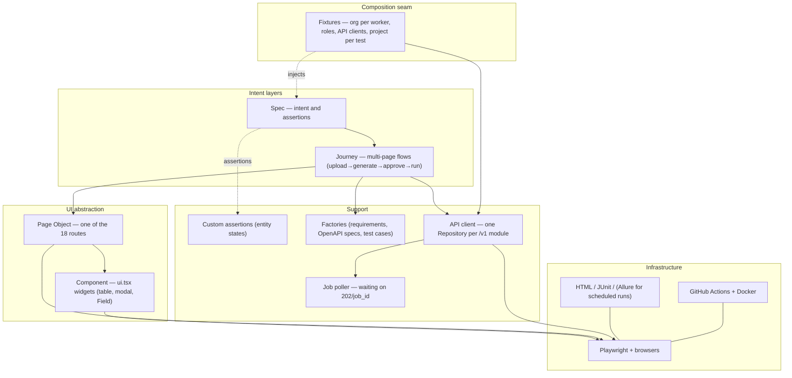

# Test Automation Architecture

> Internal design document for the **Traceo (TADQEEQ)** platform. It defines the UI and integration test layer (Playwright + TypeScript) that *complements* the two existing release gates (grounding and tenant isolation, in pytest/Go) — it does not replace them.
>
> Playwright latest stable · TypeScript 5.x · Node 20+ · GitHub Actions · Docker.
> Author role: Principal QA Automation Architect. Audience: the Traceo team.

## Context (grounded in this repo — not assumptions)

This document is founded on the actual facts of the repository, replacing an earlier version written against an empty context:

- **Domain:** Traceo itself — a test generation and traceability platform. The central entity moves through real states defined in `backend/app/models.py`:
  - `Requirement.state`: `extracted → confirmed | changed | removed`
  - `TestCase.state`: `draft → approved | rejected | stale | archived`
  - `Run.state`: `queued → running → completed | cancelled | aborted`
- **Surfaces under test:** a Next.js 15 App Router frontend (**English only, LTR** — see the language note below), a REST API on `/v1` (72 routes, contract documented in `backend/API_CONTRACT.md`), and a demo SUT on `:9000` that runs target. **No DB layer in the framework** — the database is an internal SQLite file, and everything that needs proving is exposed over the API (including the audit log, `GET /v1/audit`).
- **Roles:** `admin · qa_lead · qa_engineer · viewer` (single source: `backend/app/security.py`) + Anonymous + the synthetic `X-API-Key` actor (with `qa_engineer` capabilities).
- **Async model:** long operations (document upload, generation, run) return `202 {job_id}` and are polled through `GET /v1/jobs/{id}` — the framework must own a first-class job-waiting mechanism, never `waitForTimeout`.
- **Determinism seam:** `TRACEO_LLM_PROVIDER=mock` makes generation deterministic and offline (NFR-REL-03). Every E2E run uses mock — exclusively.
- **Known risks specific to this app:** the JWT lives in `localStorage`, not in cookies — sessions are composed programmatically through `storageState.origins`; job polling is the first expected source of flakiness.

### Language note — the product is English-only

Traceo used to ship a runtime bilingual UI (Arabic/English) driven by a `traceo_lang` localStorage key, plus a per-project `language` column that the autopilot auto-detected. **All of that is gone.** The product is English, LTR, with no switcher and no dictionaries. For this suite that means:

- there is no `@i18n` lane, no language-variant storage state and no dictionary resolver;
- `config/resolve.ts` has no `lang` field and `global/auth.setup.ts` pins no language key;
- a project payload has no `language`, so the factory and the specs never set one;
- the document contract (`<html lang="en" dir="ltr">`) is asserted once, in the navigation smoke spec, so the pivot stays enforced rather than assumed.

Text-based locators remain near-forbidden (§5), but for the ordinary reason: visible copy is product wording and changes freely, while `data-state` does not.

> **Note:** the mention of Playwright in `docs/PLAN_2.0_CLOSEOUT_AR.md` refers to a **product feature** (endpoint discovery from traffic capture — FR-021), a completely separate use from this document, which is about **testing Traceo itself**. They share no code and no decisions.

---

## 1. High-level architecture

The framework is built so that *intent* lives at the top and *mechanism* at the bottom, with dependencies pointing downward only. A spec reads as a description of business behaviour; the Playwright engine is touched only through the abstractions.



**Dependency rule (stated once, enforced everywhere):** nothing above the Page Object layer touches the Playwright API directly — no `page.locator`, no `expect(page...)` in a journey or a spec. Pages and components own the locators; the API client owns `request`; everything else goes *through* those abstractions. Calling `page.click` inside a journey is an architectural violation, not a shortcut.

Communication paths: **UI path**: spec → journey → page → component → Playwright. **API path**: spec/journey → Repository → Playwright `request` → `/v1`. **Async jobs**: any Repository returning `202` goes through `JobPoller` — the single waiting point in the framework. **Determinism seed**: `TRACEO_LLM_PROVIDER=mock` and the demo SUT on `:9000` — no real external service is ever called from a test.

```
Decision: strictly descending layers, with the engine hidden under Page Objects.
Alternatives: flat specs calling page.* directly; or a god "base test" that aggregates everything.
Why: the highest expected maintenance cost here is DOM churn — confining locators to one
layer makes testid changes a local edit instead of a suite-wide sweep.
```

---

## 2. Folder structure

A tree at the repository root, a sibling of `frontend/` and `backend/` (the repo is a monorepo):

```
e2e/
├── tests/            # specs only — intent + assertions, grouped by feature/role
├── pages/            # Page Objects — one file per frontend/app route (18 of them)
├── components/       # reusable ui.tsx widgets (DataTable, Modal, Field)
├── journeys/         # multi-page business flows (upload→generate→approve→run)
├── fixtures/         # typed fixtures — the DI seam (org, roles, clients, per-test project)
├── helpers/          # pure functions (paths, polling predicates, fresh-org provisioning)
├── assertions/       # expect.extend — domain matchers (toBeInState, toTraceTo)
├── api/              # one Repository per backend module (auth, projects, review, runs, …)
├── test-data/        # factories (faker) + static samples (requirements .md, OpenAPI .yaml)
├── config/           # configuration resolution — one module, one frozen object
├── constants/        # roles, states, routes, timeouts — shared inert values
├── reports/          # HTML/JUnit output — gitignored
├── artifacts/        # traces/videos/screenshots — gitignored
└── global/           # setup project (composes storage states over the API)
```

No `db/` folder: the database is an internal SQLite file, and every state that needs proving is exposed over `/v1` (including `GET /v1/audit` for the append-only log). A DB layer here would have been a back door around the very contract under test.

`constants/` holds inert values (the four roles, state vocabularies, page routes), `helpers/` holds pure domain functions, and there is no `utils/` junk drawer.

---

## 3. Framework layers

Per layer: its responsibility, what it may do, and an example using real Traceo entities. (The hierarchy is in §1 and is not repeated here.)

### Test / spec
- **Responsibility:** declaring intent in domain language; owning every assertion.
- **May:** use journeys, pages (sparingly), fixtures, custom assertions, data factories.
- **May not:** touch Playwright locators; hold setup logic that belongs in a fixture.
- **Anti-pattern:** assertions buried in page objects, which leave the spec an opaque list of actions.
```typescript
test('qa_lead approves a generated test case', async ({ asQaLead, generatedCase }) => {
  const review = new ReviewPage(asQaLead);
  await review.goto(generatedCase.projectId);
  await review.approve(generatedCase.id);
  await expect(review.stateOf(generatedCase.id)).toHaveAttribute('data-state', 'approved');
});
```

### Journey
- **Responsibility:** orchestrating several pages into one business flow under a single intent name. The reference journey here is the full production line: upload a document → confirm requirements → import OpenAPI → generate → approve → run — the UI counterpart of `backend/tests/test_flow.py`.
- **May not:** assert business outcomes (that is the spec's job) or hold locators.
```typescript
export class GenerationJourney {
  constructor(private reqs: RequirementsPage, private gen: GeneratePage, private review: ReviewPage) {}
  async generateAndApproveAll(projectId: string) {
    await this.reqs.goto(projectId);
    await this.reqs.confirmAll();
    await this.gen.goto(projectId);
    await this.gen.start();            // the page itself waits on the job through its own surface
    await this.review.goto(projectId);
    await this.review.approveAll();
  }
}
```

### Page Object
- **Responsibility:** modelling one route; intent-named actions; `private` locators; state exposed as read-only queries.
- **May not:** assert outcomes; know the internals of other pages; expose locators.
```typescript
export class ReviewPage {
  constructor(private readonly page: Page) {}
  private readonly approveBtn = (id: string) =>
    this.page.getByTestId(`review-case-${id}-approve-button`);
  stateOf(id: string) { return this.page.getByTestId(`review-case-${id}-state-badge`); }
  async goto(projectId: string) { await this.page.goto(`/projects/${projectId}/review`); }
  async approve(id: string) { await this.approveBtn(id).click(); }
}
```

### Component
- **Responsibility:** modelling a widget from `frontend/components/ui.tsx` (527 lines are the entire widget library), scoped to its root — Field, Modal and the tables repeat across all 18 pages, so their locators have exactly one source.
```typescript
export class DataTable {
  constructor(private readonly root: Locator) {}
  rowByText(text: string) { return this.root.getByRole('row').filter({ hasText: text }); }
}
```

### Fixtures — the DI seam
Detailed in §9. No assertions and no business logic inside them.

### Support
Repositories (§11), factories (§8), custom matchers (§6) and the job-waiting layer — all stateless wherever possible.

### Infrastructure
Playwright, the browsers, the reporters and GitHub Actions — configured in `playwright.config.ts` and never imported from a test.

---

## 4. Design patterns

Every pattern is judged against *this* project:

| Pattern | When | Why here specifically |
|---|---|---|
| Page Object | Always, for each of the 18 routes | Confines testid churn to one place |
| Page-Component | The repeated `ui.tsx` widgets | The widget library is already a single file — its locators must not be copied |
| Factory | Default requirements/specs/test cases + overrides | Hard constraint: creating a test case manually requires a non-empty `requirement_ids` (422 `missing_requirements`) — the factory guarantees it |
| Builder | Projects with branching environment/auth setups (`auth_type`: 5 values) | A fluent builder beats positional arguments |
| Strategy | Authentication per actor: JWT via storageState / `X-API-Key` | Swaps the implementation without branching at the call sites |
| DI (fixtures) | Always — Playwright's native DI | Typed per-test/per-worker lifetimes with no globals |
| Facade | `GenerationJourney` over three pages | Keeps specs declarative |
| Repository | All API access — one repository per backend module (11 of them) | A typed boundary over `request` that understands `202/job_id` and the `{detail:{code,message}}` error shape |

### Singleton — evaluated and rejected (for shared mutable state)

A singleton holding a session or seeded identifiers across the suite is an **anti-pattern under worker parallelism** — each worker is a separate process, so "the one instance" becomes one-per-worker at best, and if it stores mutable state it becomes cross-test leakage and order-dependent flakiness.

**The safe alternative — stronger in Traceo than usual:** tenant isolation is already proven in `test_isolation.py`, which means **one org per worker** yields *server-enforced* isolation (cross-tenant reads answer 404), not mere framework discipline. A worker-scoped fixture registers the org and provisions the roles once; a per-test fixture creates a project per test.

```
Decision: no shared mutable singletons; org-per-worker through fixtures with correct lifetimes.
Alternatives: a singleton session/cache spanning tests; one shared org for the whole suite.
Why: safe parallelism here is nearly free — renting an org is one API call, and the server itself enforces isolation.
```

---

## 5. Locator strategy

Best to worst:

`data-testid` → ARIA role (`getByRole`) → label → placeholder → **text (last resort)** → CSS → XPath (forbidden).

Text is ranked so low for one reason: visible copy is product wording. It is reviewed, reworded and shortened without any behavioural change, and a suite that asserts on it turns every copy edit into a red build. Entity state is the opposite — it comes from `backend/app/models.py` and changes only when the model changes. So: **locate by testid, assert state through `data-state`, and let the copy move freely.**

(Historically this section carried a second, sharper reason — the UI was bilingual and its text swapped at runtime from `localStorage`. That mechanism has been deleted; the product is English-only. The ranking above stands on its own merit.)

**Naming convention:** `domain-component-element-state` — examples matching the real application pages:

```
login-form-email-input              # /login
projects-list-create-button         # /projects — the primary header action
projects-empty-create-button        # /projects — the empty-state call to action (same modal)
requirements-toolbar-confirm-all-button
review-case-{id}-approve-button     # /projects/[id]/review
review-case-{id}-state-badge        # carries data-state="draft|approved|rejected|stale|archived"
runs-row-{id}-state-badge           # queued|running|completed|cancelled|aborted
matrix-table-root                   # /projects/[id]/matrix
```

The values in `data-state` are copied verbatim from `backend/app/models.py` — no parallel vocabulary. The full index lives in `docs/TESTID_REGISTRY.md`.

```
Decision: data-testid first + state badges carrying data-state with literal model values; text locators near-banned.
Alternatives: role-first (no application change); text locators.
Why: testids are the only selector that survives both DOM restructuring and copy edits.
getByRole stays the immediate fallback, which keeps a11y first-class (the app is still light on aria-labels — an adjacent improvement).
```

---

## 6. Assertion strategy

Assertions live in specs and in the custom-matcher module — never inside page objects.

- **UI:** web-first exclusively (`toBeVisible`, `toHaveAttribute('data-state', …)`). Assert *state* through `data-state`, not through rendered text.
- **Document contract:** `<html lang="en" dir="ltr">` is asserted once, in the navigation smoke spec, after the page root has settled — so a client-side override would be caught rather than missed. This is the guard that keeps the English-only pivot from silently regressing.
- **API:** status and typed body through a Repository; the uniform error shape `{"detail":{"code","message"}}` is unpacked centrally — specs assert on `code` (`forbidden`, `missing_requirements`), never on the message text.
- **Async jobs:** `expect.poll` over `GET /v1/jobs/{id}` until `completed|failed` with an explicit timeout — never `waitForTimeout`. A timeout failure prints the job's last state in the failure message.
- **Custom:** domain matchers via `expect.extend`, so failures read in Traceo's vocabulary.

```typescript
expect.extend({
  toBeInState(received: TestCase, state: TestCaseState) {
    const pass = received.state === state;
    return { pass, message: () => `expected test case ${received.id} to be ${state}, got ${received.state}` };
  },
  toTraceTo(received: TestCase, requirementId: string) {
    const pass = received.requirement_ids.includes(requirementId);
    return { pass, message: () => `test case ${received.id} does not trace to ${requirementId} (BO-07)` };
  },
});
```

**Soft vs hard:** hard is the default. `expect.soft` is a legitimate exception for verifying independent facets of one displayed state (e.g. the cells of a single traceability-matrix row). Across sequential steps it is a mistake — continuing after a failure produces noise, not signal.

---

## 7. Page Object & Component standards

1. **Components compose into pages.** A page holds component instances; it does not re-declare table locators owned by `DataTable` — all the more so because the widget library is one file (`ui.tsx`).
2. **Locators are private.** `private readonly`. State is exposed as read-only getters named *after the state*, not the element (`stateOf(id)`, not `stateBadge(id)`).
3. **Actions are intent-named.** `approve(id)`, `confirmAll()` — Traceo business verbs; the click is an implementation detail.
4. **No assertions in page objects.** A page that calls `expect` is doing the spec's job.

(The full `ReviewPage` example is in §3 and is not repeated.)

---

## 8. Test data strategy

Sources, in order of preference for *this* project:

1. **API-generated (the default).** The real sequence the framework drives — the same one exercised by `backend/tests/test_flow.py` and `demo/seed_demo.py`:
   ```
   POST /v1/auth/register                        → org + admin (per worker)
   POST /v1/members/invite (+login per role)     → qa_lead, qa_engineer, viewer
   POST /v1/projects                             → one project per test
   POST /v1/projects/{id}/documents  (202)       → poll /v1/jobs/{job_id}
   POST /v1/projects/{id}/requirements/confirm_all
   POST /v1/projects/{id}/api-specs              → endpoint inventory
   POST /v1/projects/{id}/generate   (202)       → poll → draft cases
   POST /v1/test-cases/bulk                      → approve what needs approving
   POST /v1/projects/{id}/runs       (202)       → against the demo SUT :9000
   ```
2. **Static seeds.** The requirements and OpenAPI samples live in `e2e/test-data/` alongside their counterparts `demo/sample_requirements_en.md` and `demo/sample_openapi.yaml` — reference data, never mutated by a test. A third seed joined them for the collection importer: `calendar-api.postman_collection.json`, a **real** 300KB Postman v2.1 collection (37 requests, `:param` segments, `{{baseUrl}}`/`{{calendarId}}` variables, 35 distinct query params, 19 raw bodies, no auth block). It is deliberately *not* a hand-written minimal fixture — the defect it exists to prevent was a real upload being refused, and a synthetic collection would not have reproduced it (see the collection-import addendum). A fourth, tiny seed accompanies it: `not-an-api-document.json`, valid JSON that is none of the five supported formats — the input that isolates the detector's `invalid_spec` refusal from the earlier `parse_error` one.
3. **Dynamic (faker).** Only for field values that need uniqueness/validity, composed with creation over the API.
4. **Deterministic LLM.** `TRACEO_LLM_PROVIDER=mock` always in E2E — generation is deterministic and network-free. (Warning from `backend/API_CONTRACT.md`: MockProvider's inferences depend on specific prompt markers — changing the contract requires updating the samples.)
5. **No DB seeding and no mocking of external services.** There is nothing to mock: Jira/Xray are file exports, and webhooks are tested against a local receiver.

**Isolation rule:** one org per worker (server-enforced — NFR-SEC-04), and one project per test inside it. No delete-based cleanup is needed: CI is ephemeral (SQLite inside a disposable container), and locally the test data stays inside the isolated test org. `TRACEO_SEED_DEMO=0` in the test environment — demo data is not test data.

**One deliberate exception:** the empty-state spec on `/projects` registers its **own fresh org** (`helpers/fresh-org.ts`) and composes that admin's storage state, because the worker org's project list is never empty while specs run in parallel. It is the same API-first provisioning, just at a different scope.

```
Decision: data over the API + org/worker + project/test; mock LLM always; no DB layer.
Alternatives: seeding SQLite directly; a shared dataset; setup through the UI.
Why: every state is creatable and provable through /v1 (which itself exercises the contract under test).
Tenant isolation is guaranteed by the server rather than by framework discipline — the strongest available basis for parallelism.
```

---

## 9. Fixtures strategy

The cornerstone here **differs from the standard pattern** because JWT authentication lives in `localStorage`, not cookies: instead of a browser login per role, **storage-state files are built programmatically over the API** — `POST /v1/auth/login` returns `{token, user}`, and from those a `storageState.origins[].localStorage` entry is composed with the exact keys the frontend reads (`traceo_token`, `traceo_user` in `frontend/lib/api.ts`). No browser is involved in setup at all, and the UI login flow stays covered by its own `@smoke` specs.

```typescript
// global/auth.setup.ts — composes each role's state over the API, no browser
import { test as setup, request } from '@playwright/test';
import { config } from '../config/resolve';
import { registerWorkerOrg } from '../api/auth.helpers';   // register + invite the four roles

setup('provision org and role states', async () => {
  const api = await request.newContext({ baseURL: config.apiUrl });
  const org = await registerWorkerOrg(api);                 // admin + qa_lead + qa_engineer + viewer
  for (const { role, token, user } of org.actors) {
    await writeStorageState(`.auth/${role}.json`, {
      cookies: [],
      origins: [{
        origin: config.baseUrl,
        localStorage: [
          { name: 'traceo_token', value: token },
          { name: 'traceo_user', value: JSON.stringify(user) },
        ],
      }],
    });
  }
});
```

There is no third key: the deleted `traceo_lang` entry pinned the UI language, and the product no longer has one.

```typescript
// fixtures/index.ts
type Fixtures = {
  api: ApiClient;              // qa_engineer token — the fast setup path
  asQaLead: Page;              // a page authenticated as qa_lead
  asViewer: Page;
  project: Project;            // a project owned by this test alone
  generatedCase: TestCase;     // a draft case produced by the full pipeline (mock LLM)
};

export const test = base.extend<Fixtures>({
  api: [async ({}, use) => { await use(await ApiClient.forWorkerOrg()); }, { scope: 'worker' }],
  asQaLead: async ({ browser }, use) => {
    const ctx = await browser.newContext({ storageState: '.auth/qa_lead.json' });
    await use(await ctx.newPage());
    await ctx.close();
  },
  project: async ({ api }, use) => {
    await use(await api.projects.create(projectFactory()));   // no teardown — the org is isolated and disposable
  },
  generatedCase: async ({ api, project }, use) => {
    await api.ingestion.uploadAndConfirm(project.id, sample('sample_requirements_en.md'));
    await api.discovery.importSpec(project.id, sample('sample_openapi.yaml'));
    const cases = await api.generation.generateAndWait(project.id);
    await use(cases[0]);
  },
});
```

Lifetimes: `api` and the org are **worker-scoped** (the safe alternative to a singleton, §4); `project`, `generatedCase` and the role pages are **per-test**. The `setup` project in `playwright.config.ts` is a `dependencies` prerequisite of the browser project, so an authentication failure aborts the run early instead of producing hundreds of opaque failures.

---

## 10. Environment management

There are three real environments, not seven: **Local** (developer — backend `:8000` + frontend `:3000` + SUT `:9000`) · **CI** (docker compose inside GitHub Actions, a disposable container) · **Staging** when it exists. No production is tested today; when it exists, read-only smokes exclusively — and `assert_production_safe` in `backend/app/config.py` already refuses to boot with demo seeding on.

**One configuration-resolution strategy:** a single module resolves in order (1) an explicit environment variable, (2) the named environment file, (3) a typed default — and returns one frozen, validated object; everything else imports *that object*, never `process.env` directly.

```typescript
// config/resolve.ts
const envName = (process.env.TEST_ENV ?? 'local') as EnvName;
const fileCfg = require(`./envs/${envName}.json`) as EnvConfig;
export const config: Readonly<EnvConfig> = Object.freeze({
  baseUrl: process.env.BASE_URL ?? fileCfg.baseUrl,        // http://localhost:3000
  apiUrl:  process.env.API_URL  ?? fileCfg.apiUrl,         // http://localhost:8000/v1
  sutUrl:  process.env.SUT_URL  ?? fileCfg.sutUrl,         // http://localhost:9000
});
```

Three keys, no fourth: the former `lang` field (and its `TEST_LANG` override) was removed with the bilingual mechanism.

**Secrets:** GitHub Actions **secrets** exclusively in CI; a `.env` outside version control locally. Note that the E2E environment is nearly secret-free by design: accounts are registered on the fly over the API, and the LLM is a mock, so there is no `ANTHROPIC_API_KEY` — the only two plausible secrets are `TRACEO_SECRET_KEY` for the container and future staging keys.

```
Decision: one frozen config object; three real environments; secrets through GitHub secrets only.
Alternatives: scattered process.env reads; simulating seven environments that do not exist.
Why: an invented environment is maintenance cost with no coverage; one resolution path fails early on misconfiguration.
```

---

## 11. API testing layer

The client is built as a **Repository** over `request` — one repository per backend module (identity, projects, ingestion, discovery, generation, review, execution, traceability, integrations, insight), with three properties the Traceo contract imposes:

1. **It understands `202/job_id`:** every long operation returns `202 {job_id}` — the repository offers both shapes: `generate()` (returns the job id) and `generateAndWait()` (polls `GET /v1/jobs/{id}` until `completed`, throwing with the last state on `failed` or timeout). Polling lives in one place — `api/job-poller.ts` — not in every spec.
2. **The uniform error shape:** `{"detail":{"code","message"}}` is unpacked into an `ApiError` carrying `code` and `status` — and negative specs assert on `code` (`forbidden`, `missing_requirements`, `validation_error`).
3. **Centralised authentication as a Strategy:** JWT bearer for human actors, and `X-API-Key: trc_…` for the public CI-gate tests (`GET /v1/projects/{id}/gate`).

```typescript
// api/review.repository.ts
export class ReviewRepository {
  constructor(private readonly http: TraceoHttp) {}

  async createManual(projectId: string, body: NewTestCase): Promise<TestCase> {
    // the contract requires a non-empty requirement_ids — 422 missing_requirements otherwise
    return this.http.post(`/projects/${projectId}/test-cases`, body);
  }
  async approve(id: string): Promise<TestCase> { return this.http.post(`/test-cases/${id}/approve`); }
  async bulk(action: 'approve' | 'reject', ids: string[]) {
    return this.http.post(`/test-cases/bulk`, { action, ids });
  }
}

// api/generation.repository.ts
export class GenerationRepository {
  constructor(private readonly http: TraceoHttp, private readonly jobs: JobPoller) {}
  async generateAndWait(projectId: string): Promise<TestCase[]> {
    const { job_id } = await this.http.post(`/projects/${projectId}/generate`, { depth: 'standard' }); // 202
    await this.jobs.waitFor(job_id);                       // expect.poll until completed | throws on failed
    return this.http.get(`/projects/${projectId}/test-cases`);
  }
}
```

Bounded retries apply to idempotent actions only (GET). The client is the only thing that builds API requests — specs and journeys go through repositories, never raw `request`.

---

## 12. Test categories & pipeline mapping

Selection is by **tags/grep**, not by folder layout — a test's category is a property of what it verifies, and one spec may carry several tags. (Load testing is out of scope — a separate tool if ever needed.)

| Category | Tag | Frequency | GitHub Actions |
|---|---|---|---|
| Smoke (login, project creation, opening the pages, the `lang="en" dir="ltr"` document guard) | `@smoke` | Every PR | job `e2e` |
| Critical path (full UI pipeline) | `@critical` | Every PR | job `e2e` |
| Permission (four roles × capabilities) | `@permission` | Every PR — security-sensitive | job `e2e` |
| Accessibility (axe) | `@a11y` | Every PR | job `e2e` |
| API contract (through repositories) | `@api` | Every PR | job `e2e-api` |
| Negative / validation | `@negative` `@validation` | Regression | scheduled + push to main |
| Extended happy path | `@happy` | Regression | scheduled + push to main |
| Full E2E (upload→…→run→export) | `@e2e` | Regression | scheduled |

There is **no `@i18n` lane.** It existed to run the smokes in both UI languages; with a single language there is no second variant to run, so the tag, its spec (`tests/i18n.spec.ts`) and its helpers were deleted rather than left as a lane that runs the same thing twice. The one durable thing it asserted — the document's `lang`/`dir` — moved into the navigation `@smoke` spec, where it costs nothing and still fails loudly if the pivot regresses.

`@permission` tests derive their matrix from `PERMISSIONS` in `backend/app/security.py` — 12 capabilities × 4 roles, with the negative cases asserting `403 {code: forbidden}`. Selection examples: `npx playwright test --grep "@smoke|@critical|@permission|@a11y" --grep-invert "@regression"` for the PR lane; the full ungrepped run on main and on the schedule (sharding deferred — §13).

```
Decision: tag-based selection; folders organised by feature (mirroring the backend modules), not by run category.
Alternatives: a folder per category.
Why: one test is frequently smoke and permission at once; folders would force a false single home.
```

---

## 13. Parallel execution

Full isolation is the non-negotiable foundation — and in Traceo it is **server-enforced, not discipline-enforced**: every worker owns its own org, and tenant isolation (the `test_isolation.py` gate) guarantees cross-boundary reads answer 404. Every test owns its project, and authentication comes from pre-built states.

- **Workers:** `fullyParallel: true`; core-count locally, pinned per job in CI.
- **Sharding:** when the regression suite grows, a GitHub Actions matrix with `--shard=${{ matrix.shard }}/${{ strategy.job-total }}`. At the current size one shard suffices — sharding is a deferred decision ready to enable, not a cost paid before it is needed.
- **Genuinely shared resources:** the server scheduler (a 60-second tick, 15-minute minimum interval) and the webhook tests — isolated in a small serial project if contention appears, without serialising the whole suite for their sake.

```
Decision: fullyParallel + org-per-worker; sharding deferred until suite size justifies it.
Alternatives: serialising "just in case"; or parallelism over a shared org.
Why: server-enforced isolation makes parallelism safe from day one, and premature sharding is CI complexity with no return.
```

---

## 14. Reporting & observability

- **Always:** the HTML report (human triage) + JUnit XML (attached to the job summary and feeding analytics).
- **Allure:** for scheduled runs only, when history/trends justify the cost; not on the PR lane.
- **Trace / video / screenshot:** `trace: 'on-first-retry'`, `video: 'on-first-retry'`, `screenshot: 'only-on-failure'`.
- **Destinations:** output is uploaded as GitHub Actions artifacts; the structured test log (§15) rides along.

| Artifact | Captured when | Retention (actions/upload-artifact retention-days) |
|---|---|---|
| HTML report | Every run | 14 days (PR), 90 (scheduled) |
| JUnit XML | Every run | 90 days |
| Trace | First retry | 14 days |
| Video | First retry | 7 days |
| Screenshot | On failure | 14 days |

```
Decision: HTML+JUnit always; trace/video on first retry; tiered retention.
Alternatives: always-on tracing "for diagnostic completeness".
Why: permanent tracing doubles storage and time for data discarded the moment the suite is green; on-first-retry captures exactly what gets diagnosed.
```

---

## 15. Logging

Structured **JSON** logs, one event stream per test, with a correlation id that travels through UI and API:

- **A correlation id per test:** generated in a fixture, attached to every log line, and passed as a header on every API request. Traceo has a ready counterpart: the **append-only audit log** (`AuditEntry`, `GET /v1/audit`) — an opaque failure can be matched line-for-line against the server's own record for the same time window, and because the test org is isolated its audit log is free of outside noise.
- **Events logged:** test start/end (id, title, tags), every API call (method, path, status, duration — never bodies carrying tokens), job polling cycles (job_id and last state — the single most valuable diagnostic trace in this application), and failures with the captured error.

```typescript
log.info({ evt: 'api.call', corrId, method: 'POST', path: '/v1/projects/p1/generate', status: 202, ms: 61 });
log.info({ evt: 'job.poll',  corrId, jobId, state: 'running', attempt: 4 });
log.error({ evt: 'test.fail', corrId, error: err.message });
```

---

## 16. Error handling & flakiness

The failure modes expected *here* are handled explicitly, and unexplained flakiness is a defect to quarantine — not something to retry until it goes quiet.

- **Job timeouts:** the first expected source of flakiness. `JobPoller` carries an explicit timeout per job kind (parse is shorter than generate), and a failure prints the job id and last state — making it immediately clear whether it was infrastructure slowness or a product hang.
- **UI readiness:** web-first auto-retry; never `waitForTimeout`.
- **Authentication failure:** the setup project (§9) aborts the whole run early if an org or role cannot be provisioned.
- **Browser crash:** the worker is restarted; isolation (§13) means no test can spoil another.

**Quarantine policy (a policy, not a mood):**

1. A test that fails and then passes on retry is tagged `@flaky` automatically and its correlation id is recorded.
2. `@flaky` is **excluded from the quality gates** (§18) — it neither blocks a merge nor flatters one.
3. Every quarantined test has a tracked defect with an owner and a fix-or-delete deadline.
4. No permanent quarantine: past the deadline it is deleted — a permanently quarantined test provides no signal.

The default retry count is **low (1)**, and retries are a flakiness *detection* tool (the pass-after-fail signal), not a green-manufacturing device. Blanket high retries are forbidden — they hide intermittent product defects. (Fittingly, this is literally Traceo's own stance as a product — "the model proposes, the system verifies" — so it would be unbecoming for its test framework to flatter its own signal.)

```
Decision: low retries (1) as a detector; quarantine and track-to-closure; explicit per-kind job timeouts.
Alternatives: blanket high retries that keep the pipeline green.
Why: high retries mask intermittent defects and erode trust in the suite; detect-and-quarantine keeps the gate honest.
```

---

## 17. GitHub Actions CI

The current CI (`.github/workflows/ci.yml`) has four jobs: `backend-python`, `backend-go`, `frontend`, `images`. E2E is added as a **fifth job** depending on the image builds, not as a separate workflow — so the merge gate stays singular. Cheap-and-fast-first is already preserved: lint/typecheck/unit fail before the cost of E2E is paid.

```yaml
# .github/workflows/ci.yml — addition (excerpt)
  e2e:
    runs-on: ubuntu-latest
    needs: [images]
    steps:
      - uses: actions/checkout@v4
      - name: Boot stack (Go backend + frontend + demo SUT)
        run: |
          docker compose --profile go --profile e2e up -d --wait
        env:
          TRACEO_LLM_PROVIDER: mock          # deterministic, no outbound calls
          TRACEO_SEED_DEMO: "0"              # test data comes from the API, never from seeding
      - uses: actions/setup-node@v4
        with: { node-version: 22, cache: npm, cache-dependency-path: e2e/package-lock.json }
      - run: cd e2e && npm ci
      - run: cd e2e && npx playwright install --with-deps chromium
      - name: PR fast lane
        if: github.event_name == 'pull_request'
        run: cd e2e && npx playwright test --grep "@smoke|@critical|@permission|@a11y" --grep-invert "@regression"
      - name: Full run (main + nightly schedule)
        if: github.ref == 'refs/heads/main' || github.event_name == 'schedule'
        run: cd e2e && npx playwright test   # no grep — everything (a strict superset of @regression)
      - uses: actions/upload-artifact@v4
        if: always()
        with: { name: e2e-report, path: e2e/reports, retention-days: 14 }
```

**PR lane vs scheduled:** the PR runs the fast lane (`--grep "@smoke|@critical|@permission|@a11y" --grep-invert "@regression"` — the inversion keeps heavy `@regression`-tagged specs out of PRs even when they also carry a fast tag, e.g. the permission matrix `@permission @regression`) on top of the four existing jobs; the ungrepped full run executes on merges to main and on a nightly schedule (`on: schedule` — `cron: "0 2 * * *"`). Running against the **Docker images built in the same pipeline** kills "works on my machine" and tests literally what will be deployed — including the existing `images` job assertions (migrations, refusal to boot in production without a secret).

**A future dogfooding seed:** Traceo itself has a public CI gate — `GET /v1/projects/{id}/gate` with an `X-API-Key`. When Traceo's own test cases are managed inside Traceo, CI can consume that gate as a verification step — the product guarding its own repository.

```
Decision: a fifth job in the existing workflow, over the built compose images; fast PR lane / scheduled regression.
Alternatives: a separate workflow; running from source instead of images; GitLab CI (an earlier version's assumption — the repo is on GitHub).
Why: one merge gate, and test environment = deployment environment, without paying full regression cost on every PR.
```

---

## 18. Quality gates

Two distinct gates with measurable criteria. **Blocks merge** = the PR lane; **blocks release** = the scheduled/pre-release run. The existing pytest/Go gates (grounding zero-fabrication BO-07, tenant isolation NFR-SEC-04, config guards, migrations) **stay exactly as they are and precede everything below** — the E2E layer adds, it does not replace:

| Gate | Criterion | Blocks merge? | Blocks release? |
|---|---|---|---|
| Existing backend gates (pytest + Go + images) | 100% pass | Yes (already) | Yes |
| E2E smoke (incl. the `lang="en" dir="ltr"` guard) | 100% pass | Yes | Yes |
| E2E critical path | 100% pass* | Yes | Yes |
| Permission matrix | 100% pass | Yes | Yes |
| Accessibility (axe) | No *new* violations against the baseline | Yes | Yes |
| E2E regression | ≥ 95% pass | No | Yes |
| Open critical/blocking defects | Zero | No | Yes |

\* At the current suite size a 95% threshold would permit a failure and a half — meaningless; relative thresholds only become acceptable past a few hundred tests. Until then: 100% or fix it.

Quarantined `@flaky` tests (§16) are excluded from every ratio above — they neither block nor rescue. The a11y gate is baseline-delta (no *new* violations) because the app is still light on aria — the existing backlog does not block every merge, but making it worse does.

```
Decision: a merge gate (fast, critical-only, 100%) separate from a release gate (full regression + defects); the existing backend gates above all.
Alternatives: one gate demanding full regression before merge; relative thresholds on a small suite.
Why: ratios on small samples are statistical theatre, and regression on every PR does not fit the development rhythm.
```

---

## 19. Best practices & anti-patterns (merged)

Grouped by axis; each line pairs the practice with the anti-pattern it prevents. No filler — only what moves the needle in *this* repository.

**Architecture.** Hiding the engine under Page Objects ← prevents DOM/testid churn from becoming a suite-wide sweep. Defining the layer model once (§1) ← prevents reinvented, contradictory layers.

**Maintainability.** A single source per locator through Page-Component (§4) ← prevents `ui.tsx` locators from being copied between specs. Intent-named actions (§7) ← prevents opaque click-list specs.

**Copy independence.** Asserting state through `data-state` rather than rendered text (§5–6) ← prevents a copy edit from turning the suite red. Asserting the document contract once (`lang="en" dir="ltr"`, §6) ← prevents the English-only pivot from silently regressing.

**Performance.** API setup and browserless storage states (§8–9) ← prevents UI setup from dominating wall-clock time. Mock-LLM determinism ← prevents the latency and variance of real model calls.

**Async.** One `JobPoller` with per-kind timeouts (§11, §16) ← prevents scattered `waitForTimeout`, the first expected source of flakiness.

**CI/CD.** A fifth job over the built compose images (§17) ← prevents the test environment from drifting from the deployed one. Cheap-first ← prevents paying for E2E to discover a typecheck error.

**Data.** org/worker + project/test (§8) ← prevents cross-test leakage and cleanup races. `TRACEO_SEED_DEMO=0` ← prevents coupling tests to demo data. Never seed through the UI.

**Security.** Secrets through GitHub secrets only (§10) ← prevents secrets in history. The `@permission` matrix derived from `security.py` (§12) ← prevents the tests from drifting from the single source of truth for authorisation.

**Reviews.** A `page.*` call above the Page Object layer = a blocking review comment ← prevents silent erosion of the dependency rule. Any new pattern/tool requires a decision record ← prevents unjustified architectural drift.

---

## 20. Sample project (reference implementation)

A coherent slice proving the architecture: login + the approval journey (used throughout this document). The key files are **complete**; the rest are **omitted** (their patterns match files already shown).

```
e2e/
├── playwright.config.ts            # complete below
├── global/auth.setup.ts            # shown in §9; omitted here
├── fixtures/index.ts               # shown in §9; omitted here
├── pages/
│   ├── login.page.ts               # omitted (same shape as review.page.ts)
│   └── review.page.ts              # shown in §3; omitted here
├── components/data-table.component.ts   # shown in §3; omitted
├── journeys/generation.journey.ts       # shown in §3; omitted
├── api/
│   ├── generation.repository.ts    # shown in §11; omitted
│   └── review.repository.ts        # shown in §11; omitted
├── test-data/project.factory.ts    # complete below
├── assertions/traceo.matchers.ts   # shown in §6; omitted
└── tests/review-approve.spec.ts    # complete below
```

**`playwright.config.ts`** (complete):
```typescript
import { defineConfig, devices } from '@playwright/test';
import { config as env } from './config/resolve';

export default defineConfig({
  testDir: './tests',
  fullyParallel: true,
  forbidOnly: !!process.env.CI,
  retries: process.env.CI ? 1 : 0,             // a retry is a flakiness DETECTOR (§16)
  workers: process.env.CI ? 4 : undefined,
  timeout: 30_000,
  expect: { timeout: 7_000 },
  reporter: [
    ['html', { outputFolder: 'reports/html', open: 'never' }],
    ['junit', { outputFile: 'reports/junit/results.xml' }],
  ],
  use: {
    baseURL: env.baseUrl,
    trace: 'on-first-retry',
    video: 'on-first-retry',
    screenshot: 'only-on-failure',
    testIdAttribute: 'data-testid',
  },
  projects: [
    { name: 'setup', testMatch: /auth\.setup\.ts/ },
    { name: 'chromium', use: { ...devices['Desktop Chrome'] }, dependencies: ['setup'] },
  ],
});
```

**`project.factory.ts`** (complete):
```typescript
import { faker } from '@faker-js/faker';

// A project has no language — Traceo is English-only. Name + automation is the
// whole creation surface (see the autopilot addendum for why "manual" is pinned).
export interface NewProject { name: string; automation?: 'auto' | 'manual'; }

export const projectFactory = (over: Partial<NewProject> = {}): NewProject => ({
  name: `e2e ${faker.string.alphanumeric(8)}`,
  automation: 'manual',
  ...over,
});

// A manual case — the contract enforces traceability (422 missing_requirements on empty requirement_ids)
export const manualCaseFactory = (requirementIds: string[], over: Partial<NewTestCase> = {}): NewTestCase => ({
  title: faker.lorem.words(4),
  type: 'positive',
  technique: 'manual',
  requirement_ids: requirementIds,
  ...over,
});
```

**`review-approve.spec.ts`** (complete):
```typescript
import { test, expect } from '../fixtures';
import { ReviewPage } from '../pages/review.page';

test.describe('test-case review @smoke @critical', () => {
  test('qa_lead approves a generated draft case', async ({ asQaLead, generatedCase }) => {
    const review = new ReviewPage(asQaLead);
    await review.goto(generatedCase.projectId);

    await test.step('approve the case', async () => {
      await review.approve(generatedCase.id);
    });

    await expect(review.stateOf(generatedCase.id)).toHaveAttribute('data-state', 'approved');
  });

  test('viewer cannot approve @permission', async ({ api, asViewer, generatedCase }) => {
    const review = new ReviewPage(asViewer);
    await review.goto(generatedCase.projectId);
    await expect(review.approveControls(generatedCase.id)).toBeHidden();   // the UI hides it

    const err = await api.as('viewer').review.approve(generatedCase.id).catch(e => e);
    expect(err.code).toBe('forbidden');                                    // and the server refuses — both proven
  });
});
```

Every file above obeys the standards: private `data-testid`-first locators (§5, §7), assertions in the spec alone and on `data-state` rather than text (§6), API-side setup with an isolated project (§8), authentication from composed states with no browser (§9), and retries as a detector rather than a beautifier (§16).

---

## Adoption roadmap (phases ordered by dependency)

0. **Phase 0 — Instrumentation — delivered:** `data-testid` introduced with the §5 convention across `frontend/components/ui.tsx` and the pages, with `data-state` attached to the state badges (full index in `docs/TESTID_REGISTRY.md`).
1. **Phase 1 — Skeleton + smoke — delivered:** the `e2e/` tree stands (fixtures/pages/api/journeys), setup happens over the API (§9), `@smoke` tests are green and the `e2e` job is in CI (§17).
2. **Phase 2 — Critical + permission — delivered:** the full UI pipeline journey (`@e2e @regression`) and the role matrix derived from `security.py` (`@permission @regression`). *(This phase originally also delivered a bilingual `@i18n` lane; that lane was deleted when the product became English-only — see §12.)*
3. **Phase 3 — Regression — delivered:** negative/validation (`@negative @validation @regression`) and a11y (`@a11y`), with the nightly schedule enabled in `.github/workflows/ci.yml` (`schedule: cron "0 2 * * *"`). **Sharding remains deferred by design** (§13) — not enabled until wall-clock time exceeds the comfortable limit; it has not yet.

**Final lane greps (verbatim, as they stand in `.github/workflows/ci.yml`):**

- **PR fast lane:** `npx playwright test --grep "@smoke|@critical|@permission|@a11y" --grep-invert "@regression"` — the four fast tags (§12), excluding heavy `@regression`-tagged specs even when they also carry a fast tag (the full UI journey `@e2e @regression`, the permission matrix `@permission @regression`, `@negative @validation @regression`).
- **main + nightly schedule:** `npx playwright test` with no grep — everything runs, a strict superset of `@regression` and therefore of every tag above.

## Self-review checklist

- **The layer model is defined once and never contradicted** — §1, referenced (not redrawn) in §3, §7 and §9; the dependency rule is a blocking review item in §19. ✓
- **No deprecated Playwright APIs** — `getByTestId`/`getByRole`, `test.step`, fixtures, `dependencies`, `storageState`, `testIdAttribute`. ✓
- **No state setup through the UI where an API path exists** — §8 makes the API the default, and even authentication is composed without a browser (§9); the login UI flow is covered as a test, not used as setup. ✓
- **All secrets outside committed configuration** — §10; and the E2E environment is nearly secret-free by design (on-the-fly registration + mock LLM). ✓
- **Every quality gate has a measurable criterion** — §18, with an explicit rejection of relative thresholds on small suites. ✓
- **Ill-fitting patterns rejected with an alternative** — §4 rejects the shared singleton in favour of org-per-worker; §16 rejects blanket retries in favour of detect-and-quarantine; §13 defers sharding until size justifies it. ✓
- **Every claim about the repository is grounded** — states from `models.py`, roles and capabilities from `security.py`, the error shape and contract from `API_CONTRACT.md`, the localStorage keys from `frontend/lib/api.ts`, and the release gates from `backend/tests/`. ✓

**Pending:** nothing architecturally; phases 0–3 are delivered. The only deferral is sharding (§13) — a deliberate decision, not debt: enabled only when wall-clock time justifies it.

---

## Addendum — Autopilot (automation) and the manual-by-default factory decision

**The autopilot contract (summary — details in `backend/API_CONTRACT_V2_ADDENDUM.md`):**

- `POST /v1/projects` takes `name` and `automation` (`auto`/`manual`, server default `auto`). There is **no `language` field** — the project language column, its validation and the create-dialog select were all removed when the product became English-only.
- **The automatic chain (only when `automation == "auto"`):** after a successful parse — confirm every `extracted` requirement → trigger generation at standard depth if there is at least one included endpoint, at least one confirmed requirement, and no generation job already running (it also fires after a successful api-spec import). **Approval and runs stay manual** — the human gate (BO-07) is a product philosophy: automation stops at drafts ready for review.
- **Every automatic step is recorded as an `AuditEntry`** with an `auto.`-prefixed action — `auto.requirements.confirm_all` and `auto.generate` — attributed to the user whose upload/import started the chain. (The former `auto.language.detect` action was removed with the language-detection step.)
- All existing manual routes (`confirm_all`, `generate`, …) work unchanged — the automation adds defaults and removes nothing.

**Test-layer decision — `projectFactory` pins `automation: "manual"` by default:**

The server's `auto` default is right for the product but **not deterministic for tests**: fixtures arrange state explicitly over the API (§8/§9 — `uploadAndConfirm` then `generate`), and on an `auto` project the autopilot would confirm requirements and trigger generation **in parallel** with those explicit calls — a race that makes the arranged state (case count, who started the job, case timing) unpredictable. Therefore:

- `e2e/test-data/project.factory.ts` builds projects with `automation: "manual"` by default (the reasoning is documented in a comment inside the file); `name` and `automation` are the entire surface, since a project has no language.
- The only consumer of `auto` mode is `e2e/tests/autopilot.spec.ts` (`@critical @regression`): it uploads the requirements document and imports the OpenAPI spec **without any `confirm_all` or `generate`**, then — through `expect.poll`/`JobPoller` (no sleeps, §16) — proves that drafts appear, that the `auto.*` entries are in the audit log, and that the drafts show up on the review page.

---

## Addendum — Sixth-engine coverage: the QA Insight Agent

The sixth engine differs from the generation engine in two ways that the whole coverage strategy is built on: it is **100% deterministic and offline** (zero LLM calls — NFR-D1), and it nevertheless passes the same **grounding gate** before persisting (BO-07). So the spec does not test "did it generate something" but **is what it generated grounded**.

**The API layer — `e2e/api/insight.repository.ts`** (added to `ApiClient` as `api.insights`):

- `getInsights(projectId)` ← `GET /v1/projects/{id}/insights` (capability `view`, no job, deterministic): the coverage map `{categories:[{id, covered_count, suggestable_count, status}], total_cases, total_covered, total_suggestable}`.
- `generate(projectId, {categories, requirement_ids?})` ← `POST /v1/projects/{id}/insights/generate` (capability `generate`) in its raw 202 form; an id outside the taxonomy ⇒ 422 `invalid_category`.
- `generateAndWait(...)` goes through the single waiting point (`JobPoller`, §16 — no sleeps) and returns **the job counters and the case list together**: a second run over the same categories would produce a different (deduplicated) set, so a spec must never assert counters from one run and cases from another.
- The job carries a new kind, `insight` (`jobs.submit("insight", …)`) — added to `JOB_KINDS` and given its own budget in `KIND_TIMEOUTS_MS` alongside `generate`, keeping all waiting inside `JobPoller`.
- The persisted counter is normalised in one place (`createdCount`): the job result calls it `generated` while the `insight.generate` audit entry calls it `created` — the tolerance lives in the repository, not scattered across assertions.

**Vocabulary — `e2e/constants/states.ts`:** `EDGE_CATEGORIES` (the nine canonical ids in order), `TEST_TECHNIQUES` (including the new `edge_case` value) and `INSIGHT_STATUSES` (`covered | gap | n_a`) were added — copied verbatim like every other vocabulary, and serving as one source for both the UI row count and the API assertions.

**The page object — `e2e/pages/insights.page.ts`:** the page polls the job itself and swaps the progress bar for a result card, so `generate()` waits on **the result card** (the page's own surface) rather than a timer. A row is addressed by the canonical id it prints in a monospace cell, and status is read from `data-state` on `insights-category-status-badge` — never from visible copy (§5/§6). The route was added to `constants/routes.ts` and `insights` to `PROJECT_SECTIONS` in `pages/project-shell.page.ts`, which automatically enrolled it in the **navigation** and **a11y** lanes that derive their cases from that list (with the new `project:insights` baseline key in `a11y-baseline.json`) — adding a section to the list covers the new route in both lanes without duplication.

**The spec — `e2e/tests/insight.spec.ts` (`@critical @regression`, plus a `@permission` section):**

| What is proven | How |
|---|---|
| The taxonomy is fixed and its status is a pure function | Compare the response ids to `EDGE_CATEGORIES`, then derive `status` from the two counters per row and assert the match — a category with nothing to ground in (e.g. `timing_dst` with no date-time field) is `n_a`, not an actionable "gap" |
| Generation yields categorised, traceable drafts | One run over two–three `gap` categories, then per case: `state == draft` (the human gate stays closed), `technique == "edge_case"`, `edge_category` among those requested, and `links.length >= 1` (the hard contract) |
| **The adversarial grounding assertion** | The project's included endpoint inventory becomes a set of `METHOD /path` keys; each case's detail is fetched and **every** step is matched **verbatim** (no path normalisation, no ignoring templated segments — any leniency would let a fabricated path pass as "close enough"). `endpoint_id` is likewise checked to belong to this project |
| That the oracle **can fail** | Three controls: an explicitly fabricated key must not match, a right path with the wrong method must not match, and the inspected-step counter must be > 0 with at least one step per case — without these the assertion would pass vacuously |
| The map updates after the run | The generated categories become `covered` with a counter > 0 |
| Well-formed refusal | An illegitimate id ⇒ 422 `invalid_category` through `expectApiError` (on `code`, not on text) |
| The UI drives the engine | Open the page as qa_lead, assert 9 rows and match each row's `data-state` against what the API returned, select a gap category, run it, see the result card, then follow the review link through to the drafts |
| The UI gate | `viewer` does not see `insights-generate-button` and `qa_engineer` does — both directions asserted after settling an anchor that renders for every role (the empty state, after the fetch resolves), otherwise `toBeHidden` would pass against un-hydrated HTML (the same method as `permissions-ui.spec.ts`) |

Arrangement is API-side as usual (§9): the `project` fixture with `automation:"manual"`, then upload and confirm the requirements document and import the OpenAPI sample — the same reference seeds the pipeline fixtures use, so the inventory is real, not synthetic. No mock-specific seam is needed: the engine never calls a model.

**A note on the `exotic_input` category:** its builders probe Unicode handling. They used to send Arabic/RTL payloads; with the English-only pivot they send a general non-ASCII mix instead — emoji, CJK, accented Latin, zero-width characters and NFC-vs-NFD pairs — and the classifier's evidence rule became "any non-ASCII code point" rather than "Arabic script". Unicode coverage is unchanged; the specs assert through the taxonomy ids and the grounding oracle, so they are unaffected by which code points the builders choose.

---

## Addendum — API collection import (Postman / HAR / Insomnia) and its grounding oracle

The discovery engine used to accept OpenAPI 3.x and Swagger 2.0 only; a real Postman collection was answered with `422 invalid_spec`. The importer now **detects the format deterministically** on the same endpoint (`POST /v1/projects/{id}/api-specs`) and converts Postman v2.x, HAR 1.2 and Insomnia v4 into the one internal endpoint inventory, with an optional, gated AI enrichment layer on top. This is what that added to the E2E layer.

### Lane composition — what changed

**One new spec file, no new lane and no new tag.** `e2e/tests/collections.spec.ts` is tagged `@critical @regression`, matching `insight.spec.ts` and `autopilot.spec.ts`: it is a critical-path capability, and it is heavy (a 300KB upload, a 37-endpoint conversion, a generation job and a UI import), so the existing `--grep-invert "@regression"` keeps it out of the PR lane and the ungrepped main/nightly run picks it up. The negative case inside it additionally carries `@negative`, exactly as the insight spec's refusal case does. **The lane greps in `.github/workflows/ci.yml` are unchanged** — the tag choice, not a workflow edit, is what places the spec.

The one lane that *did* change is **`@a11y`**: `tests/a11y.spec.ts` gained a scan of the endpoints page **with an imported inventory**. The section loop scans every project page empty, which is the only state an isolated project gives them — but the inventory table, the format badge and the AI-enrichment columns do not exist in the empty state, so they were unreachable by the gate. The new scan reuses the **existing `project:endpoints` baseline key** rather than introducing a second one: it is the same page, the baseline entry is empty, and one shared key means neither state can accrue new debt silently. `a11y-baseline.json` is unchanged.

### The oracle problem, and how it is solved

Every other grounding assertion in this suite uses the project's **own discovered inventory** as the oracle. That is exactly what cannot be done here: the inventory *is* the thing under test. Asserting the import against the import is circular.

So `e2e/helpers/postman-collection.ts` re-derives the inventory **from the fixture, in the test process**, by walking the collection's item tree — mirroring only the conversion rules the assertions depend on (`:param` → `{param}`, `{{var}}` resolution, base-URL stripping, `url.query`, raw-JSON top-level fields, `method+path` deduplication). The oracle is therefore the *user's document*, and the adversarial assertion is a plain **set diff in both directions**: nothing imported that the file does not declare (no fabrication), nothing declared that the import dropped (no silent loss). Controls prove the oracle is falsifiable — a fabricated key must not match, and a real path with the wrong method must not match.

Two deliberate asymmetries in that helper, both documented in it:

- **`serverRelative(path, basePath)`.** The collection's base URL is `https://www.googleapis.com/calendar/v3` — an origin *plus a path*. Whether `/calendar/v3` belongs to the server or to the path is a spec-level judgement (the OpenAPI importer keeps `paths` verbatim and records the server separately), so the normaliser accepts both renderings and **nothing else**: it removes that one known prefix when present and touches no other character. It is not a fuzzy matcher — no templated segment is stripped, no case folded — so a fabricated path can never normalise into a real one.
- **Disabled query params are kept in the oracle.** The oracle's job is to *bound what the importer may produce*, so it must be a superset of what the file declares. Assertions about params the importer must **keep** name those params explicitly instead of comparing whole sets.

The fixture's own numbers are asserted first, in a separate test: swap the file and that test fails loudly instead of the suite silently weakening. It also pins the one number the brief and the file disagree on — 19 requests carry a `raw` body, but four of those bodies are the literal JSON `null`, so only 15 have fields an inferred schema can be built from.

### What `collections.spec.ts` proves

| What is proven | How |
|---|---|
| Detection is deterministic, on the existing endpoint | `result.format == "postman2"`, and `format` is a member of `SPEC_FORMATS` — the same closed vocabulary both backends serve |
| Conversion is faithful | 37 requests ⇒ 37 endpoints; flat counters (`added`/`updated`/`removed`/`total`) agree with the legacy `diff` lists; every row's `source` is `postman` |
| Path templating | Four known `:param` paths asserted by name, then a blanket guard over every path: no `:`, no unresolved `{{`, no `://`, always rooted |
| Params come from the right place | A query-heavy request keeps `timeMin`/`timeMax`/`singleEvents`/… ; **every** recorded query param is one the file declares (the converter may drop, never add); `calendarId` is a **path** param, not folded into the query |
| Body inference invents nothing | `POST /freeBusy` yields a schema whose top-level fields are exactly the body's own — asserted in **both** directions |
| **The adversarial grounding assertion** | Set diff of imported vs. declared `METHOD /path`, both ways, plus falsifiability controls |
| The gate still holds downstream | Cases generated from the collection-derived inventory are fetched in detail and every step's `METHOD /path` must be in it; `endpoint_id` must belong to the project. Non-vacuity is explicit: if no case reached a step, the run must have **discarded** something — a silent no-op fails |
| Enrichment is annotation-only | **A controlled experiment.** The same file is imported into a `manual` project (deterministic control) and an `auto` project (enriched subject); the two inventories must be **identical by method+path**, and the query params and body fields of sampled endpoints must be unchanged. The control carries no annotations at all, which is what makes the comparison mean something |
| Enrichment counters are a real oracle | Because the mock provider is deterministic and mandated in E2E (§8), these are equalities, not shrugs: the auto project reports `enriched == 37` and `enrichment_discarded == 0`, the manual project reports `0`/`0`, and the counter must equal the number of rows that actually carry an annotation. What is *stored* is separately constrained — `ai_criticality ∈ {high, medium, low}`, `ai_description` non-empty plain text with no markup |
| Fidelity precedence `spec > traffic > dom > postman` | Import the collection, then the OpenAPI sample (disjoint paths by design): spec-sourced rows appear, all 37 collection-sourced rows survive, and the inventory is exactly the union — nothing merged away, nothing duplicated |
| Well-formed, actionable refusal | `test-data/not-an-api-document.json` ⇒ `422 invalid_spec` via `expectApiError` (on `code`, not text), and its `errors` list must **name** the supported formats. The fixture is valid JSON on purpose: a malformed file is refused earlier as `parse_error`, a different contract, so only a parseable non-document isolates the detector's own refusal |
| The UI carries it | qa_lead first uploads the unsupported document and sees the refusal *with its errors list* on screen, then imports the collection — same control, no format picker. The format badge is asserted on `data-format`, the table holds 37 rows, and rows are addressed by templated path (entity data, never copy) |
| The AI columns are data-driven | The UI test runs on an **`auto`** project — the columns cannot be observed on a page that was never given anything to render. Their counts are asserted against the API's own null/non-null tallies rather than a hard-coded number, and criticality is read from `data-state`, never from the printed word |

### Layer changes

- **`api/types.ts`** — `ImportSpecResult` gained `format`, the flat counters `added`/`updated`/`removed`/`total`, and `enriched`/`enrichment_discarded`; the four original keys keep their names and meanings. `Endpoint` gained the three nullable annotations `ai_description`, `ai_group`, `ai_criticality`.
- **`constants/states.ts`** — three vocabularies copied verbatim, as usual: `SPEC_FORMATS`, `ENDPOINT_SOURCES` (the fidelity ladder, highest first) and `AI_CRITICALITIES`.
- **`api/discovery.repository.ts`** — no new method: one document endpoint, one repository call. It gained pure read helpers instead (`endpointKey`, `inventoryKeys`, `queryParamNames`, `requestBodyFields`, `enrichedEndpoints`), following the `createdCount` precedent of `insight.repository.ts` — tolerance and shape-reading live in the repository, not scattered across assertions.
- **`api/errors.ts` + `api/http.ts`** — `ApiError` now preserves the response's `detail` object verbatim (`details`, plus an `errors: string[]` accessor). This is what lets the negative case assert that the refusal is *actionable* — that it names the supported formats — while still asserting `code` first, as §11 requires. Existing negative specs are unaffected: the new constructor argument is optional.
- **`pages/endpoints.page.ts`** — read-only surfaces for the format badge, the two enrichment counters and the three AI columns. `formatBadgeFor(format)` accepts the value either as `data-format` or as the badge's own text; the reasoning is in `docs/TESTID_REGISTRY.md`.

### Why this spec is heavy on purpose

The suite's other specs use small, curated seeds. This one uses a **real 300KB export from a real API** because the defect it prevents was precisely "works on the fixture, fails on the user's file": deep folder nesting, `:param` segments, variables in the host, 126 disabled query entries, saved response examples, and four bodies that are the literal string `null`. A minimal collection reproduces none of that. The cost is a slow test, which is why it lives in the `@regression` lane and not in the PR fast lane.
