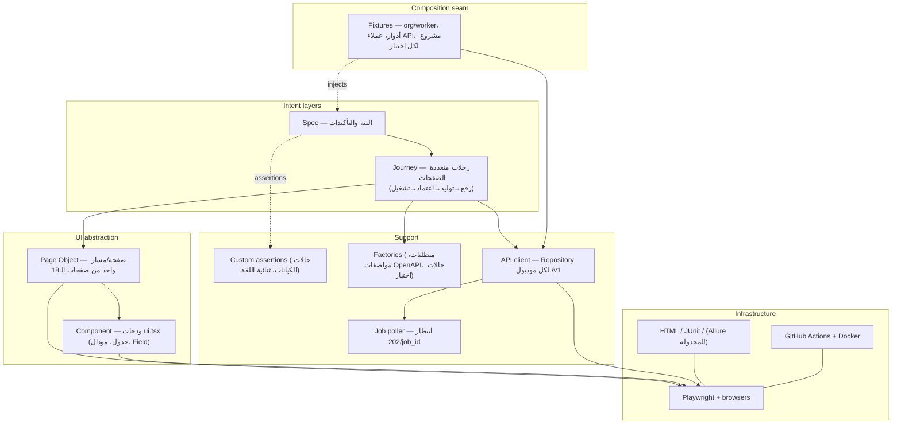

# معمارية أتمتة الاختبارات — Test Automation Architecture

> وثيقة تصميم داخلية لمنصة **Traceo · تدقيق**. تعرّف طبقة اختبارات الواجهة والتكامل (Playwright + TypeScript) التي تكمّل بوابتي الإطلاق الحاليتين (Grounding وTenant-Isolation في pytest/Go) — ولا تستبدلهما.
>
> Playwright latest stable · TypeScript 5.x · Node 20+ · GitHub Actions · Docker.
> Author role: Principal QA Automation Architect. Audience: فريق Traceo.

## Context (grounded in this repo — not assumptions)

هذه النسخة مؤسَّسة على وقائع المستودع الفعلية، بديلاً عن نسخة سابقة كُتبت بسياق فارغ:

- **Domain:** Traceo نفسها — منصة توليد اختبارات وتتبّع. الكيان المحوري يتحرك عبر حالات حقيقية معرّفة في `backend/app/models.py`:
  - `Requirement.state`: `extracted → confirmed | changed | removed`
  - `TestCase.state`: `draft → approved | rejected | stale | archived`
  - `Run.state`: `queued → running → completed | cancelled | aborted`
- **Surfaces under test:** واجهة Next.js 15 App Router (RTL دائماً، ثنائية اللغة وقت التشغيل)، وREST API على `/v1` (72 مساراً، بعقد موثّق في `backend/API_CONTRACT.md`)، وSUT تجريبي على `:9000` هدفاً للتشغيلات. **لا طبقة DB في الإطار** — قاعدة البيانات SQLite داخلية، وكل ما يلزم إثباته مكشوف عبر API (بما فيه سجل التدقيق `GET /v1/audit`).
- **Roles:** `admin · qa_lead · qa_engineer · viewer` (المصدر الوحيد: `backend/app/security.py`) + Anonymous + فاعل `X-API-Key` الاصطناعي (بصلاحيات `qa_engineer`).
- **Scale (honest):** اليوم **صفر** اختبار متصفح وصفر `data-testid`؛ 18 صفحة و72 مساراً؛ 35 اختبار pytest و24 اختبار Go تشكّل بوابات الإطلاق. الهدف الواقعي: ~30 اختبار smoke/critical في المرحلة الأولى، نمو نحو 200–400 اختبار E2E/API. المعمارية أدناه تتحمّل هذا النمو دون أن تتظاهر بحجم ليس موجوداً.
- **Async model:** العمليات الطويلة (رفع مستند، توليد، تشغيل) تعيد `202 {job_id}` ويُستطلع `GET /v1/jobs/{id}` — الإطار يجب أن يملك آلية انتظار مهام من الدرجة الأولى، لا `waitForTimeout`.
- **Determinism seam:** `TRACEO_LLM_PROVIDER=mock` يجعل التوليد حتمياً ودون اتصال خارجي (NFR-REL-03). كل تشغيل E2E يستخدم mock — حصراً.
- **Known risks specific to this app:** نص الواجهة ثنائي اللغة ويتبدّل من `localStorage` (`traceo_lang`) — محددات النص هشّة بطبيعتها هنا؛ التوكن في `localStorage` لا كوكيز — إعداد الجلسات يتم برمجياً عبر `storageState.origins`؛ استطلاع المهام هو مصدر الهشاشة الأول المتوقع.

> **تنويه مهم:** ذكر Playwright في `docs/PLAN_2.0_CLOSEOUT_AR.md` يخص **ميزة منتج** (اكتشاف نقاط النهاية من التقاط الحركة — FR-021)، وهو استخدام منفصل تماماً عن هذه الوثيقة التي تخص **اختبار Traceo ذاتها**. لا يشتركان في كود ولا في قرارات.

---

## 1. High-level architecture

الإطار مُطبَّق بحيث تسكن *النية* في الأعلى و*الآلية* في الأسفل، والاعتماديات تشير نزولاً فقط. المواصفة تُقرأ كوصف سلوك أعمال؛ محرك Playwright لا يُلمس إلا عبر التجريدات.



**Dependency rule (تُذكر مرة وتُفرض في كل مكان):** لا شيء فوق طبقة Page Object يلمس Playwright API مباشرة — لا `page.locator` ولا `expect(page...)` في journey أو spec. صفحات ومكوّنات تملك المحددات؛ عميل API يملك `request`؛ والبقية تصل *عبر* هذه التجريدات. استدعاء `page.click` داخل journey مخالفة معمارية، لا اختصاراً.

مسارات الاتصال: **مسار UI**: spec → journey → page → component → Playwright. **مسار API**: spec/journey → Repository → Playwright `request` → `/v1`. **المهام غير المتزامنة**: أي Repository يعيد `202` يمرّر عبر `JobPoller` — نقطة الانتظار الوحيدة في الإطار. **بذرة الحتمية**: `TRACEO_LLM_PROVIDER=mock` والـ SUT التجريبي `:9000` — لا خدمة خارجية حقيقية تُطلب أبداً في الاختبارات.

```
Decision: طبقات هابطة حصراً والمحرك مخفي تحت Page Objects.
Alternatives: مواصفات مسطحة تستدعي page.* مباشرة؛ أو "base test" إله يجمع كل شيء.
Why: أعلى تكلفة صيانة متوقعة هنا هي غياب data-testid اليوم — أول تغيير DOM سيضرب كل محدد.
حصر المحددات في طبقة واحدة يجعل إدخال testids لاحقاً (والتغييرات بعده) تعديلاً موضعياً.
```

---

## 2. Folder structure

شجرة على جذر المستودع، نظيراً لـ `frontend/` و`backend/` (المستودع monorepo):

```
e2e/
├── tests/            # المواصفات فقط — نية + تأكيدات، مجمّعة بحسب الميزة/الدور
├── pages/            # Page Objects — ملف لكل مسار من مسارات frontend/app الـ18
├── components/       # ودجات ui.tsx القابلة لإعادة الاستخدام (DataTable, Modal, Field)
├── journeys/         # رحلات أعمال متعددة الصفحات (upload→generate→approve→run)
├── fixtures/         # fixtures مُنمّطة — خط DI (org, roles, clients, per-test project)
├── helpers/          # دوال نقية (i18n-text resolver, polling predicates)
├── assertions/       # expect.extend — مطابقات المجال (toBeInState, toTraceTo)
├── api/              # Repository لكل موديول backend (auth, projects, review, runs, …)
├── test-data/        # مصانع (faker) + عينات ثابتة (requirements .md، OpenAPI .yaml)
├── config/           # حلّ الإعدادات — وحدة واحدة، كائن مجمّد
├── constants/        # الأدوار، الحالات، المسارات، المهل — قيم خاملة مشتركة
├── reports/          # مخرجات HTML/JUnit — gitignored
├── artifacts/        # traces/videos/screenshots — gitignored
└── global/           # setup project (بناء storage states عبر API)
```

لا مجلد `db/`: القاعدة SQLite ملف داخلي، وكل حالة يلزم إثباتها مكشوفة عبر `/v1` (بما فيه `GET /v1/audit` للسجل الملحق فقط). طبقة DB هنا كانت ستكون باباً خلفياً حول العقد الذي نختبره.

`constants/` تحمل قيماً خاملة (الأدوار الأربعة، قوائم الحالات، مسارات الصفحات)، `helpers/` دوال مجال نقية، ولا وجود لـ `utils/` درج-الخردة.

---

## 3. Framework layers

لكل طبقة: مسؤوليتها، ما يجوز لها، مثال بكيانات Traceo الحقيقية. (الهرمية في §1 ولا تُعاد هنا.)

### Test / spec
- **المسؤولية:** إعلان النية بلغة المجال؛ ملكية كل التأكيدات.
- **يجوز:** journeys، صفحات (باعتدال)، fixtures، تأكيدات مخصصة، مصانع بيانات.
- **لا يجوز:** لمس محددات Playwright؛ منطق إعداد الأحرى به أن يكون fixture.
- **Anti-pattern:** تأكيدات مدفونة في page objects تُبقي المواصفة قائمة أفعال معتمة.
```typescript
test('qa_lead approves a generated test case', async ({ asQaLead, generatedCase }) => {
  const review = new ReviewPage(asQaLead);
  await review.goto(generatedCase.projectId);
  await review.approve(generatedCase.id);
  await expect(review.stateOf(generatedCase.id)).toHaveAttribute('data-state', 'approved');
});
```

### Journey
- **المسؤولية:** تنسيق صفحات متعددة في تدفق أعمال واحد باسم-نية واحد. الرحلة المرجعية هنا هي خط الإنتاج الكامل: رفع مستند ← تأكيد المتطلبات ← استيراد OpenAPI ← توليد ← اعتماد ← تشغيل — وهي نسخة UI من `backend/tests/test_flow.py`.
- **لا يجوز:** تأكيد نواتج أعمال (شأن المواصفة) أو حمل محددات.
```typescript
export class GenerationJourney {
  constructor(private reqs: RequirementsPage, private gen: GeneratePage, private review: ReviewPage) {}
  async generateAndApproveAll(projectId: string) {
    await this.reqs.goto(projectId);
    await this.reqs.confirmAll();
    await this.gen.goto(projectId);
    await this.gen.start();            // الصفحة نفسها تنتظر job عبر واجهتها
    await this.review.goto(projectId);
    await this.review.approveAll();
  }
}
```

### Page Object
- **المسؤولية:** نمذجة مسار واحد؛ أفعال باسم-النية؛ محددات خاصة `private`؛ الحالة كاستعلامات قراءة فقط.
- **لا يجوز:** تأكيد نواتج؛ معرفة دواخل صفحات أخرى؛ كشف محددات.
```typescript
export class ReviewPage {
  constructor(private readonly page: Page) {}
  private readonly approveBtn = (id: string) =>
    this.page.getByTestId(`review-case-${id}-approve-button`);
  stateOf(id: string) { return this.page.getByTestId(`review-case-${id}-state-badge`); }
  async goto(projectId: string) { await this.page.goto(`/projects/${projectId}/review`); }
  async approve(id: string) { await this.approveBtn(id).click(); }
}
```

### Component
- **المسؤولية:** نمذجة ودجة من `frontend/components/ui.tsx` (527 سطراً هي مكتبة الودجات كلها) مقيّدة بجذرها — Field وModal والجداول تتكرر عبر الصفحات الـ18، فمصدر محدداتها واحد.
```typescript
export class DataTable {
  constructor(private readonly root: Locator) {}
  rowByText(text: string) { return this.root.getByRole('row').filter({ hasText: text }); }
}
```

### Fixtures — خط الـ DI
تفصيلها في §9. لا تأكيدات ولا منطق أعمال داخلها.

### Support
Repositories (§11)، مصانع (§8)، مطابقات مخصصة (§6)، وطبقة انتظار المهام — كلها عديمة الحالة حيث أمكن.

### Infrastructure
Playwright والمتصفحات والمراسلون وGitHub Actions — تُضبط في `playwright.config.ts` ولا تُستورد من الاختبارات.

---

## 4. Design patterns

كل نمط مُقيَّم ضد *هذا* المشروع:

| Pattern | متى | لماذا هنا تحديداً |
|---|---|---|
| Page Object | دائماً لكل مسار من الـ18 | يحصر إدخال testids القادم وتغييراته في مكان واحد |
| Page-Component | ودجات `ui.tsx` المتكررة | مكتبة الودجات واحدة أصلاً — لا تُنسخ محدداتها |
| Factory | متطلبات/مواصفات/حالات اختبار افتراضية + overrides | قيد صلب: إنشاء test case يدوياً يتطلب `requirement_ids` غير فارغة (422 `missing_requirements`) — المصنع يضمنه |
| Builder | مشروع بإعدادات بيئة/مصادقة متشعبة (`auth_type`: 5 قيم) | fluent يتفوق على وسائط موضعية |
| Strategy | مصادقة بحسب الفاعل: JWT عبر storageState / `X-API-Key` | تبديل التنفيذ دون تفريع لدى المستدعين |
| DI (fixtures) | دائماً — DI الأصلي في Playwright | أعمار per-test/per-worker منمّطة بلا globals |
| Facade | `GenerationJourney` فوق ثلاث صفحات | يبقي المواصفات تصريحية |
| Repository | كل وصول API — repository لكل موديول من موديولات الباك الـ11 | حد منمّط فوق `request` يفهم `202/job_id` وشكل الخطأ `{detail:{code,message}}` |

### Singleton — مُقيَّم ومرفوض (للحالة المشتركة القابلة للتغيير)

Singleton يحمل جلسة أو معرّفات مبذورة عبر الحزمة **anti-pattern تحت توازي workers** — كل worker عملية مستقلة، فيصير "الوحيد" واحداً-لكل-worker في أحسن الأحوال، وإن خزّن حالة قابلة للتغيير صار تسريباً بين الاختبارات ينتج هشاشة مرتبطة بالترتيب.

**البديل الآمن — وهو في Traceo أقوى من المعتاد:** عزل المستأجرين المُختبَر أصلاً في `test_isolation.py` يعني أن **org لكل worker** يعطي عزلاً *يفرضه الخادم* (القراءة عبر المستأجرين 404) لا مجرد انضباط في الإطار. worker-scoped fixture يسجّل org ويجهز الأدوار مرة، وper-test fixture ينشئ مشروعاً لكل اختبار.

```
Decision: لا singletons مشتركة قابلة للتغيير؛ org-لكل-worker عبر fixtures بأعمار صحيحة.
Alternatives: جلسة/كاش Singleton عابر للاختبارات؛ org واحد مشترك للحزمة كلها.
Why: التوازي الآمن هنا شبه مجاني — استئجار org استدعاء API واحد، والخادم نفسه يفرض العزل.
```

---

## 5. Locator strategy

الترتيب من الأفضل إلى الأسوأ:

`data-testid` → ARIA role (`getByRole`) → label → placeholder → **النص (خطر مضاعف هنا)** → CSS (ملاذ أخير) → XPath (ممنوع).

سببان يجعلان هذا الترتيب أكثر إلحاحاً في Traceo من أي مشروع عادي:

1. **لا يوجد أي `data-testid` في الواجهة اليوم** (العدّ صفر عبر كل `.tsx`)، والبديل الوحيد المتاح الآن نص أو CSS — وكلاهما الأسوأ.
2. **النص المرئي ثنائي اللغة ويتبدل وقت التشغيل**: `frontend/lib/i18n.ts` يبدّل ar/en من `localStorage` (`traceo_lang`)، وصفحات كثيرة تتجاوز القاموس بثلاثيات `ar ? "…" : "…"` مضمّنة. محدد نصي يعمل بالعربية يفشل بالإنجليزية والعكس.

**بند عمل مُرقّم (Phase 0):** إدخال `data-testid` في `frontend/components/ui.tsx` (تمرير خاصية `testId` من Field/Button/Modal/الجداول) ثم في الصفحات الـ18. هذا شرط مسبق للمرحلة الأولى، وحجمه صغير لأن مكتبة الودجات ملف واحد.

**اصطلاح التسمية:** `domain-component-element-state` — أمثلة مطابقة لصفحات التطبيق الفعلية:

```
login-form-email-input              # /login
projects-list-create-button         # /projects
requirements-toolbar-confirm-all-button
review-case-{id}-approve-button     # /projects/[id]/review
review-case-{id}-state-badge        # يحمل data-state="draft|approved|rejected|stale|archived"
runs-row-{id}-state-badge           # queued|running|completed|cancelled|aborted
matrix-table-root                   # /projects/[id]/matrix
```

قيم الحالة في `data-state` تُنسخ حرفياً من `backend/app/models.py` — لا مفردات موازية.

```
Decision: data-testid أولاً + شارات حالة تحمل data-state بقيم النموذج الحرفية؛ محددات النص شبه محظورة.
Alternatives: role-first (بلا تغيير في التطبيق)؛ محددات نصية.
Why: الواجهة ثنائية اللغة والنص يتبدل من localStorage — النص أهش محدد ممكن في هذا التطبيق تحديداً.
getByRole يبقى البديل الفوري فتظل a11y درجة أولى (والتطبيق شبه خالٍ من aria-labels — تحسين مرافق).
```

---

## 6. Assertion strategy

التأكيدات تسكن المواصفات ووحدة المطابقات المخصصة — لا داخل page objects أبداً.

- **UI:** web-first حصراً (`toBeVisible`, `toHaveAttribute('data-state', …)`). التأكيد على *الحالة* عبر `data-state` لا عبر النص المعروض — فالنص يتبدل بالّلغة، والحالة لا.
- **النص الثنائي حين يلزم اختباره فعلاً:** عبر مُحلّ يقرأ قاموس `frontend/lib/i18n.ts` نفسه (استيراد مباشر — monorepo) فيُشتق النص المتوقع من نفس مصدر الإنتاج، ويُشغَّل smoke بكلتا اللغتين في lane مخصص `@i18n`.
- **API:** الحالة والجسم المُنمّط عبر Repository؛ شكل الخطأ الموحد `{"detail":{"code","message"}}` يُفكك مركزياً — المواصفات تؤكد على `code` (`forbidden`, `missing_requirements`) لا على نص الرسالة.
- **المهام غير المتزامنة:** `expect.poll` على `GET /v1/jobs/{id}` حتى `completed|failed` بمهلة صريحة — أبداً `waitForTimeout`. فشل المهلة يطبع آخر حالة job في رسالة الفشل.
- **Custom:** مطابقات مجال عبر `expect.extend` فتُقرأ الإخفاقات بلغة Traceo.

```typescript
expect.extend({
  toBeInState(received: TestCase, state: TestCaseState) {
    const pass = received.state === state;
    return { pass, message: () => `expected test case ${received.id} to be ${state}, got ${received.state}` };
  },
  toTraceTo(received: TestCase, requirementId: string) {
    const pass = received.requirement_ids.includes(requirementId);
    return { pass, message: () => `test case ${received.id} does not trace to ${requirementId} (BO-07)` };
  },
});
```

**Soft vs hard:** الصلبة هي الافتراضي. `expect.soft` استثناء مشروع لتحقق وجوه مستقلة لحالة واحدة معروضة (مثلاً خانات صف واحد في مصفوفة التتبع). عبر خطوات متتابعة: خطأ — الاستمرار بعد فشل ينتج ضجيجاً لا إشارة.

---

## 7. Page Object & Component standards

1. **المكوّنات تتركب في الصفحات.** الصفحة تحمل نسخ مكوّنات؛ لا تعيد إعلان محددات جدول يملكها `DataTable` — خصوصاً وأن مكتبة الودجات ملف واحد (`ui.tsx`).
2. **المحددات خاصة.** `private readonly`. الحالة تُكشف كـ getters قراءة-فقط *باسم الحالة* لا العنصر (`stateOf(id)` لا `stateBadge(id)`).
3. **الأفعال باسم-النية.** `approve(id)` و`confirmAll()` — أفعال أعمال Traceo، والنقرة تفصيل تنفيذ.
4. **لا تأكيدات في page objects.** صفحة تستدعي `expect` تقوم بعمل المواصفة.

(مثال `ReviewPage` الكامل في §3؛ لا يُعاد.)

---

## 8. Test data strategy

المصادر بترتيب الأفضلية *لهذا* المشروع:

1. **API-generated (الافتراضي).** التسلسل الحقيقي الذي يستدعيه الإطار — نفسه الذي يمارسه `backend/tests/test_flow.py` و`demo/seed_demo.py`:
   ```
   POST /v1/auth/register                        → org + admin (لكل worker)
   POST /v1/members/invite (+login لكل دور)      → qa_lead, qa_engineer, viewer
   POST /v1/projects                             → مشروع لكل اختبار
   POST /v1/projects/{id}/documents  (202)       → poll /v1/jobs/{job_id}
   POST /v1/projects/{id}/requirements/confirm_all
   POST /v1/projects/{id}/api-specs              → جرد نقاط النهاية
   POST /v1/projects/{id}/generate   (202)       → poll → حالات draft
   POST /v1/test-cases/bulk                      → اعتماد ما يلزم اعتماده
   POST /v1/projects/{id}/runs       (202)       → ضد الـ SUT التجريبي :9000
   ```
2. **Static seed.** عينات المتطلبات والمواصفات تعيش في `e2e/test-data/` بجوار نظيراتها `demo/sample_requirements_ar.md` و`demo/sample_openapi.yaml` — مرجعية لا تُعدَّل من الاختبارات.
3. **Dynamic (faker).** لقيم الحقول التي يلزمها التفرد/الصلاحية فقط، مركّبة مع الإنشاء عبر API.
4. **Deterministic LLM.** `TRACEO_LLM_PROVIDER=mock` دائماً في E2E — التوليد حتمي ودون شبكة. (تحذير من `backend/API_CONTRACT.md`: استدلالات MockProvider تعتمد على علامات prompt محددة — تغيير العقد يستلزم تحديث العينات.)
5. **لا DB seeding ولا mocking لخدمات خارجية.** لا يوجد ما يُحاكى: Jira/Xray تصدير ملفات فقط، والـ webhooks تُختبر بمستقبِل محلي.

**قاعدة العزل:** org لكل worker (يفرضه الخادم — NFR-SEC-04)، ومشروع لكل اختبار داخله. لا حاجة لتنظيف بالحذف أصلاً: بيئة CI مؤقتة (SQLite داخل حاوية تُرمى)، ومحلياً تُترك بيانات الاختبار في org الاختبار المعزول. `TRACEO_SEED_DEMO=0` في بيئة الاختبار — بيانات الديمو ليست بيانات اختبار.

```
Decision: بيانات عبر API + org/worker + مشروع/اختبار؛ mock LLM دائماً؛ لا طبقة DB.
Alternatives: بذر SQLite مباشرة؛ dataset مشترك؛ إعداد عبر الواجهة.
Why: كل حالة قابلة للإنشاء والإثبات عبر /v1 (وهذا بحد ذاته يمارس العقد المُختبَر).
عزل المستأجرين مضمون بالخادم لا بانضباط الإطار — أمتن أساس توازٍ متاح.
```

---

## 9. Fixtures strategy

الركيزة هنا **تختلف عن النمط القياسي** لأن المصادقة JWT في `localStorage` لا كوكيز: بدل تسجيل دخول عبر المتصفح لكل دور، **تُبنى ملفات storage state برمجياً عبر API** — `POST /v1/auth/login` يعيد `{token, user}`، ويُركّب منهما `storageState.origins[].localStorage` بالمفاتيح التي تقرؤها الواجهة فعلاً (`traceo_token`, `traceo_user` في `frontend/lib/api.ts`). لا متصفح في الإعداد إطلاقاً، وتدفق تسجيل الدخول عبر الواجهة يبقى مغطى باختبارات `@smoke` مخصصة له.

```typescript
// global/auth.setup.ts — يبني حالة كل دور عبر API، بلا متصفح
import { test as setup, request } from '@playwright/test';
import { config } from '../config/resolve';
import { registerWorkerOrg } from '../api/auth.helpers';   // register + invite للأدوار الأربعة

setup('provision org and role states', async () => {
  const api = await request.newContext({ baseURL: config.apiUrl });
  const org = await registerWorkerOrg(api);                 // admin + qa_lead + qa_engineer + viewer
  for (const { role, token, user } of org.actors) {
    await writeStorageState(`.auth/${role}.json`, {
      cookies: [],
      origins: [{
        origin: config.baseUrl,
        localStorage: [
          { name: 'traceo_token', value: token },
          { name: 'traceo_user', value: JSON.stringify(user) },
          { name: 'traceo_lang', value: config.lang },      // تثبيت اللغة — لا اعتماد على الافتراضي
        ],
      }],
    });
  }
});
```

```typescript
// fixtures/index.ts
type Fixtures = {
  api: ApiClient;              // بتوكن qa_engineer — مسار الإعداد السريع
  asQaLead: Page;              // صفحة مصادَقة بدور qa_lead
  asViewer: Page;
  project: Project;            // مشروع يملكه هذا الاختبار وحده
  generatedCase: TestCase;     // حالة draft جاهزة عبر خط الأنابيب الكامل (mock LLM)
};

export const test = base.extend<Fixtures>({
  api: [async ({}, use) => { await use(await ApiClient.forWorkerOrg()); }, { scope: 'worker' }],
  asQaLead: async ({ browser }, use) => {
    const ctx = await browser.newContext({ storageState: '.auth/qa_lead.json' });
    await use(await ctx.newPage());
    await ctx.close();
  },
  project: async ({ api }, use) => {
    await use(await api.projects.create(projectFactory()));   // لا teardown — الـ org معزول ومؤقت
  },
  generatedCase: async ({ api, project }, use) => {
    await api.ingestion.uploadAndConfirm(project.id, sample('requirements_ar.md'));
    await api.discovery.importSpec(project.id, sample('openapi.yaml'));
    const cases = await api.generation.generateAndWait(project.id);
    await use(cases[0]);
  },
});
```

الأعمار: `api` والـ org **worker-scoped** (البديل الآمن للـ singleton، §4)؛ `project` و`generatedCase` والصفحات **per-test**. مشروع `setup` في `playwright.config.ts` يعتمد عليه مشروع المتصفح عبر `dependencies` — ففشل المصادقة يُسقط التشغيل مبكراً بدل مئات الإخفاقات المبهمة.

---

## 10. Environment management

البيئات الحقيقية ثلاث لا سبع: **Local** (المطور — backend `:8000` + frontend `:3000` + SUT `:9000`) · **CI** (docker compose داخل GitHub Actions، حاوية تُرمى) · **Staging** حين يوجد لاحقاً. لا إنتاج مُختبَر اليوم؛ حين يصبح موجوداً فقراءة-فقط smoke حصراً — و`assert_production_safe` في `backend/app/config.py` أصلاً يرفض الإقلاع ببذر الديمو.

**استراتيجية حلّ إعدادات واحدة:** وحدة واحدة تحلّ بالترتيب (1) متغير بيئة صريح، (2) ملف البيئة المسماة، (3) افتراضي منمّط — وتعيد كائناً مجمّداً مُتحققاً منه؛ البقية تستورد *ذاك الكائن*، لا `process.env` مباشرة.

```typescript
// config/resolve.ts
const envName = (process.env.TEST_ENV ?? 'local') as EnvName;
const fileCfg = require(`./envs/${envName}.json`) as EnvConfig;
export const config: Readonly<EnvConfig> = Object.freeze({
  baseUrl: process.env.BASE_URL ?? fileCfg.baseUrl,        // http://localhost:3000
  apiUrl:  process.env.API_URL  ?? fileCfg.apiUrl,         // http://localhost:8000/v1
  sutUrl:  process.env.SUT_URL  ?? fileCfg.sutUrl,         // http://localhost:9000
  lang:    (process.env.TEST_LANG ?? 'ar') as 'ar' | 'en',
});
```

**الأسرار:** GitHub Actions **secrets** حصراً في CI؛ محلياً `.env` غير متتبع. علماً أن بيئة E2E شبه خالية من الأسرار أصلاً: الحسابات تُسجَّل لحظياً عبر API، والـ LLM هو mock فلا `ANTHROPIC_API_KEY` — السرّان الوحيدان المحتملان `TRACEO_SECRET_KEY` للحاوية ومفاتيح staging لاحقاً.

```
Decision: كائن إعدادات واحد مجمّد؛ ثلاث بيئات حقيقية؛ أسرار عبر GitHub secrets فقط.
Alternatives: قراءة process.env المبعثرة؛ محاكاة سبع بيئات لا وجود لها.
Why: البيئة المُختلقة تكلفة صيانة بلا تغطية؛ والخط الواحد يفشل مبكراً عند سوء الضبط.
```

---

## 11. API testing layer

عميل مبني كـ **Repository** فوق `request` — repository لكل موديول باك (identity, projects, ingestion, discovery, generation, review, execution, traceability, integrations)، بثلاث خصائص يفرضها عقد Traceo:

1. **فهم `202/job_id`:** أي عملية طويلة تعيد `202 {job_id}` — الـ repository يقدّم الصيغتين: `generate()` (يعيد job_id) و`generateAndWait()` (يستطلع `GET /v1/jobs/{id}` حتى `completed`، ويرمي بآخر حالة عند `failed` أو المهلة). الاستطلاع في مكان واحد — `api/job-poller.ts` — لا في كل مواصفة.
2. **شكل الخطأ الموحد:** `{"detail":{"code","message"}}` يُفكّك إلى `ApiError` يحمل `code` و`status` — والمواصفات السلبية تؤكد على `code` (`forbidden`, `missing_requirements`, `validation_error`).
3. **مصادقة مركزية بنمط Strategy:** JWT bearer للفاعلين البشر، و`X-API-Key: trc_…` لاختبارات مسار CI العمومي (`GET /v1/projects/{id}/gate`).

```typescript
// api/review.repository.ts
export class ReviewRepository {
  constructor(private readonly http: TraceoHttp) {}

  async createManual(projectId: string, body: NewTestCase): Promise<TestCase> {
    // العقد يفرض requirement_ids غير فارغة — 422 missing_requirements وإلا
    return this.http.post(`/projects/${projectId}/test-cases`, body);
  }
  async approve(id: string): Promise<TestCase> { return this.http.post(`/test-cases/${id}/approve`); }
  async bulk(action: 'approve' | 'reject', ids: string[]) {
    return this.http.post(`/test-cases/bulk`, { action, ids });
  }
}

// api/generation.repository.ts
export class GenerationRepository {
  constructor(private readonly http: TraceoHttp, private readonly jobs: JobPoller) {}
  async generateAndWait(projectId: string): Promise<TestCase[]> {
    const { job_id } = await this.http.post(`/projects/${projectId}/generate`, { depth: 'standard' }); // 202
    await this.jobs.waitFor(job_id);                       // expect.poll حتى completed | يرمي عند failed
    return this.http.get(`/projects/${projectId}/test-cases`);
  }
}
```

إعادة المحاولة المحدودة للأفعال idempotent فقط (GET). العميل هو الوحيد الذي يبني طلبات API — المواصفات والرحلات تمر عبر repositories، لا `request` خام أبداً.

---

## 12. Test categories & pipeline mapping

الاختيار عبر **tags/grep** لا عبر تخطيط المجلدات — تصنيف الاختبار خاصية لما يتحقق منه، ومواصفة واحدة قد تحمل عدة وسوم. (اختبار الحمل خارج النطاق — أداة منفصلة إن لزم.)

| Category | Tag | التكرار | GitHub Actions |
|---|---|---|---|
| Smoke (login، إنشاء مشروع، فتح الصفحات) | `@smoke` | كل PR | job `e2e` |
| Critical-path (خط الأنابيب الكامل UI) | `@critical` | كل PR | job `e2e` |
| Permission (الأدوار الأربعة × القدرات) | `@permission` | كل PR — حساس أمنياً | job `e2e` |
| i18n/RTL (smoke بكلتا اللغتين) | `@i18n` | كل PR | job `e2e` |
| Accessibility (axe) | `@a11y` | كل PR | job `e2e` |
| API contract (عبر repositories) | `@api` | كل PR | job `e2e-api` |
| Negative / validation | `@negative` `@validation` | Regression | مجدول + push إلى main |
| Happy-path الموسع | `@happy` | Regression | مجدول + push إلى main |
| E2E الكامل (رفع→…→تشغيل→تصدير) | `@e2e` | Regression | مجدول |

اختبارات `@permission` تستمد مصفوفتها من `PERMISSIONS` في `backend/app/security.py` — 12 قدرة × 4 أدوار، والحالات السلبية تؤكد `403 {code: forbidden}`. أمثلة الاختيار: `npx playwright test --grep "@smoke|@critical|@permission|@i18n|@a11y" --grep-invert "@regression"` لممر الـ PR؛ التشغيل الكامل بلا grep على main والمجدول (sharding مؤجل — §13).

```
Decision: اختيار بالوسوم؛ المجلدات تنظم بالميزة (مطابقةً لموديولات الباك) لا بفئة التشغيل.
Alternatives: مجلد لكل فئة.
Why: الاختبار الواحد كثيراً ما يكون smoke وpermission وi18n معاً؛ المجلدات تفرض موطناً واحداً زائفاً.
```

---

## 13. Parallel execution

العزل الكامل هو الأساس غير القابل للتفاوض — وهو في Traceo **مفروض من الخادم لا من الانضباط**: كل worker يملك org خاصاً، وعزل المستأجرين (البوابة `test_isolation.py`) يضمن أن القراءة عبر الحدود 404. كل اختبار يملك مشروعه، والمصادقة من حالات مبنية سلفاً.

- **Workers:** `fullyParallel: true`؛ محلياً بعدد الأنوية، وفي CI مثبت لكل job.
- **Sharding:** حين تنمو حزمة regression، مصفوفة GitHub Actions `--shard=${{ matrix.shard }}/${{ strategy.job-total }}`. في المرحلة الأولى (~30 اختباراً) shard واحد يكفي — الـ sharding قرار مؤجل جاهز التفعيل، لا يُدفع ثمنه قبل الحاجة.
- **الموارد المشتركة فعلاً:** جدولة الخادم (تكة كل 60 ثانية، حد أدنى 15 دقيقة للفواصل) واختبارات الـ webhooks — تُعزل في project تسلسلي صغير إن ظهر تنافس، ولا تُسلسل الحزمة كلها لأجلها.

```
Decision: fullyParallel + org-لكل-worker؛ sharding مؤجل حتى يبرره حجم الحزمة.
Alternatives: تسلسل "احتياطاً"؛ أو توازٍ فوق org مشترك.
Why: العزل الذي يفرضه الخادم يجعل التوازي آمناً من اليوم الأول؛ وsharding قبل الحاجة تعقيد CI بلا عائد.
```

---

## 14. Reporting & observability

- **دائماً:** تقرير HTML (فرز بشري) + JUnit XML (يُلحق بملخص الـ job ويغذي التحليلات).
- **Allure:** للتشغيلات المجدولة فقط حين يبرر التاريخ/الاتجاهات كلفته؛ ليس لممر الـ PR.
- **Trace / video / screenshot:** `trace: 'on-first-retry'`, `video: 'on-first-retry'`, `screenshot: 'only-on-failure'`.
- **الوجهات:** المخرجات تُرفع كـ GitHub Actions artifacts؛ سجل الاختبار المهيكل (§15) ضمنها.

| Artifact | متى يُلتقط | الاحتفاظ (actions/upload-artifact retention-days) |
|---|---|---|
| HTML report | كل تشغيل | 14 يوماً (PR)، 90 (مجدول) |
| JUnit XML | كل تشغيل | 90 يوماً |
| Trace | أول إعادة | 14 يوماً |
| Video | أول إعادة | 7 أيام |
| Screenshot | عند الفشل | 14 يوماً |

```
Decision: HTML+JUnit دائماً؛ trace/video على أول إعادة؛ احتفاظ متدرج.
Alternatives: trace دائم "لاكتمال التشخيص".
Why: الـ trace الدائم يضاعف التخزين والزمن لبيانات تُرمى عند الاخضرار؛ on-first-retry يلتقط تحديداً ما يُشخَّص.
```

---

## 15. Logging

سجلات **JSON** مهيكلة، تيار أحداث لكل اختبار، بمعرّف ارتباط يمر عبر UI وAPI:

- **Correlation id لكل اختبار:** يُولَّد في fixture، يُلحق بكل سطر سجل، ويُمرر ترويسةً على كل طلب API. ولدى Traceo طرف مقابل جاهز: **سجل التدقيق الملحق-فقط** (`AuditEntry`, `GET /v1/audit`) — فشل غامض يُقابَل سجل الإطار فيه بسجل الخادم لنفس النافذة الزمنية، ولأن org الاختبار معزول فسجل تدقيقه نظيف من أي ضجيج خارجي.
- **الأحداث المسجلة:** بدء/انتهاء الاختبار (id، العنوان، الوسوم)، كل نداء API (method، path، status، المدة — دون أجسام تحمل توكنات)، دورات استطلاع المهام (job_id وآخر حالة — أهم أثر تشخيصي في هذا التطبيق)، والإخفاقات مع الخطأ الملتقط.

```typescript
log.info({ evt: 'api.call', corrId, method: 'POST', path: '/v1/projects/p1/generate', status: 202, ms: 61 });
log.info({ evt: 'job.poll',  corrId, jobId, state: 'running', attempt: 4 });
log.error({ evt: 'test.fail', corrId, error: err.message });
```

---

## 16. Error handling & flakiness

أنماط الفشل المتوقعة *هنا* تُعالج صراحة، والهشاشة غير المفسرة عيب يُحجر — لا يُعاد حتى يصمت.

- **مهل المهام:** المصدر الأول المتوقع للهشاشة. `JobPoller` بمهلة صريحة لكل نوع مهمة (parse أقصر من generate)، وفشله يطبع job_id وآخر حالة — فيتضح فوراً أهو بطء بنية أم تعليق منتج.
- **جاهزية UI:** web-first auto-retry؛ لا `waitForTimeout` إطلاقاً.
- **فشل المصادقة:** مشروع الإعداد (§9) يُسقط التشغيل كله مبكراً إن تعذر تجهيز org أو دور.
- **انهيار المتصفح:** الـ worker يُعاد؛ العزل (§13) يعني ألا اختبار يفسد غيره.

**سياسة الحجر (سياسة لا مزاجاً):**

1. اختبار يفشل ثم ينجح عند الإعادة يوسم آلياً `@flaky` ويسجَّل معرّف ارتباطه.
2. `@flaky` **يُستثنى من بوابات الجودة** (§18) — لا يحجب دمجاً ولا يجمّله.
3. لكل محجور عيب متتبع بمالك ومهلة إصلاح أو حذف.
4. لا حجر دائم: بعد المهلة يُحذف — المحجور الدائم لا يقدم إشارة.

عدّاد الإعادة الافتراضي **منخفض (1)** والإعادة أداة *كشف* هشاشة (إشارة النجاح-بعد-فشل)، لا صناعة اخضرار. الإعادات العالية الشاملة ممنوعة — تخفي عيوب منتج متقطعة. (وللمفارقة: هذا حرفياً موقف Traceo كمنتج — "النموذج يقترح والنظام يتحقق" — فلا يليق بإطار اختبارها أن يجمّل إشارته.)

```
Decision: إعادة منخفضة (1) كاشفاً؛ حجر وتتبع-حتى-الإغلاق؛ مهل job صريحة لكل نوع.
Alternatives: إعادات عالية شاملة تبقي الخط أخضر.
Why: الإعادات العالية تقنّع عيوباً متقطعة وتُبلي الثقة بالحزمة؛ الكشف-والحجر يبقي البوابة صادقة.
```

---

## 17. GitHub Actions CI

الـ CI الحالي (`.github/workflows/ci.yml`) فيه أربعة jobs: `backend-python`, `backend-go`, `frontend`, `images`. تُضاف E2E كـ **job خامس** يعتمد على بناء الصور، لا كـ workflow منفصل — فتبقى بوابة الدمج واحدة. الرخيص-السريع أولاً محفوظ أصلاً: lint/typecheck/unit تفشل قبل أن يُدفع ثمن E2E.

```yaml
# .github/workflows/ci.yml — إضافة (مقتطف)
  e2e:
    runs-on: ubuntu-latest
    needs: [images]
    steps:
      - uses: actions/checkout@v4
      - name: Boot stack (Go backend + frontend + demo SUT)
        run: |
          docker compose --profile go up -d --wait
        env:
          TRACEO_LLM_PROVIDER: mock          # حتمي، دون اتصال خارجي
          TRACEO_SEED_DEMO: "0"              # بيانات الاختبار تُنشأ عبر API لا بالبذر
      - uses: actions/setup-node@v4
        with: { node-version: 22, cache: npm, cache-dependency-path: e2e/package-lock.json }
      - run: cd e2e && npm ci
      - run: cd e2e && npx playwright install --with-deps chromium
      - name: PR fast lane
        if: github.event_name == 'pull_request'
        run: cd e2e && npx playwright test --grep "@smoke|@critical|@permission|@i18n|@a11y" --grep-invert "@regression"
      - name: Full run (main + nightly schedule)
        if: github.ref == 'refs/heads/main' || github.event_name == 'schedule'
        run: cd e2e && npx playwright test   # بلا grep — كل شيء (مجموعة أعلى من @regression)
      - uses: actions/upload-artifact@v4
        if: always()
        with: { name: e2e-report, path: e2e/reports, retention-days: 14 }
```

**ممر الـ PR مقابل المجدول:** الـ PR يشغّل الممر السريع (`--grep "@smoke|@critical|@permission|@i18n|@a11y" --grep-invert "@regression"` — الاستثناء يُبقي المواصفات الثقيلة الموسومة `@regression` خارج الـ PR حتى لو حملت وسماً سريعاً كمصفوفة `@permission @regression`) فوق الـ jobs الأربعة الحالية؛ التشغيل الكامل بلا grep يعمل على الدمج في main وعلى جدول ليلي (`on: schedule` — `cron: "0 2 * * *"`). التشغيل ضد **صور Docker المبنية في نفس الـ pipeline** يقتل «يعمل على جهازي» ويختبر ما سيُنشر حرفياً — بما فيه تأكيدات job الـ `images` الحالية (الهجرات، رفض إقلاع الإنتاج بلا سر).

**بذرة دمج مستقبلية (dogfooding):** لدى Traceo نفسها بوابة CI عمومية — `GET /v1/projects/{id}/gate` بمفتاح `X-API-Key`. حين تُدار حالات اختبار Traceo داخل Traceo، يستهلك الـ CI هذه البوابة كخطوة تحقق — المنتج يحرس مستودعه.

```
Decision: job خامس في الـ workflow الحالي فوق صور compose المبنية؛ ممر PR سريع/ regression مجدول.
Alternatives: workflow منفصل؛ تشغيل من source بدل الصور؛ GitLab CI (افتراض النسخة السابقة — المستودع على GitHub).
Why: بوابة دمج واحدة، وبيئة اختبار = بيئة نشر، دون كلفة regression كاملة على كل PR.
```

---

## 18. Quality gates

بوابتان متمايزتان بمعايير قابلة للقياس. **تحجب الدمج** = ممر الـ PR؛ **تحجب الإصدار** = التشغيل المجدول/قبل-الإصدار. بوابات pytest/Go الحالية (Grounding صفر-اختلاق BO-07، عزل المستأجرين NFR-SEC-04، حراس الإعداد، الهجرات) **تبقى كما هي وتسبق كل ما يلي** — طبقة E2E تضيف ولا تستبدل:

| Gate | المعيار | يحجب الدمج؟ | يحجب الإصدار؟ |
|---|---|---|---|
| بوابات الباك الحالية (pytest + Go + images) | 100% نجاح | نعم (قائمة) | نعم |
| E2E smoke | 100% نجاح | نعم | نعم |
| E2E critical-path | 100% نجاح* | نعم | نعم |
| Permission matrix | 100% نجاح | نعم | نعم |
| i18n/RTL smoke | 100% نجاح | نعم | نعم |
| Accessibility (axe) | لا انتهاكات *جديدة* عن الخط القاعدي | نعم | نعم |
| E2E regression | ≥ 95% نجاح | لا | نعم |
| عيوب حرجة/حاجبة مفتوحة | صفر | لا | نعم |

\* بحجم ~30 اختباراً في المرحلة الأولى، عتبة 95% تعني السماح بفشل اختبار ونصف — بلا معنى؛ العتبات النسبية تصبح مقبولة فقط حين يتجاوز الحجم بضع مئات. حتى ذلك الحين: 100% أو أصلِح.

`@flaky` المحجورة (§16) مستثناة من كل نسبة أعلاه — لا تحجب ولا تُنقذ. بوابة a11y دلتا-قاعدية (لا انتهاكات *جديدة*) لأن التطبيق اليوم شبه خالٍ من aria — الركام الموجود لا يحجب كل دمج، وتفاقمه محجوب.

```
Decision: بوابة دمج (سريعة، حرجة فقط، 100%) منفصلة عن بوابة إصدار (regression كامل + عيوب)؛ بوابات الباك الحالية فوق الجميع.
Alternatives: بوابة واحدة تتطلب regression كاملاً للدمج؛ عتبات نسبية على حزمة صغيرة.
Why: النِّسب على الأحجام الصغيرة عبث إحصائي؛ وregression لكل PR لا يتسق مع إيقاع التطوير.
```

---

## 19. Best practices & anti-patterns (مدموجة)

مجمّعة بالمحور؛ كل سطر يقرن الممارسة بالنقيضة التي يمنعها. لا حشو — فقط ما يحرك الإبرة في *هذا* المستودع.

**Architecture.** إخفاء المحرك تحت Page Objects ← يمنع أن يصير إدخال testids القادم (Phase 0) وتغييراته تمشيطاً لكل مواصفة. تعريف نموذج الطبقات مرة (§1) ← يمنع طبقات معاد اختراعها تتناقض.

**Maintainability.** مصدر وحيد لكل محدد عبر Page-Component (§4) ← يمنع نسخ محددات `ui.tsx` بين المواصفات. أفعال باسم-النية (§7) ← يمنع مواصفات-قوائم-نقرات معتمة.

**Bilinguality (خاص بهذا التطبيق).** حالة عبر `data-state` ونص متوقع من قاموس i18n الإنتاجي (§5–6) ← يمنع حزمة تنجح بالعربية وتفشل بالإنجليزية. تثبيت `traceo_lang` في storage state (§9) ← يمنع اعتماداً صامتاً على اللغة الافتراضية.

**Performance.** إعداد عبر API وstorage states مبنية بلا متصفح (§8–9) ← يمنع أن يهيمن إعداد UI على زمن الحائط. حتمية mock LLM ← تمنع انتظار وتقلب استدعاءات نموذج حقيقية.

**Async.** `JobPoller` الواحد بمهل لكل نوع (§11، §16) ← يمنع `waitForTimeout` المتناثر — مصدر الهشاشة الأول المتوقع.

**CI/CD.** job خامس فوق صور compose المبنية (§17) ← يمنع انحراف بيئة الاختبار عن المنشور. الرخيص أولاً ← يمنع دفع ثمن E2E لاكتشاف خطأ typecheck.

**Data.** org/worker + مشروع/اختبار (§8) ← يمنع التسريب العابر للاختبارات وسباقات التنظيف. `TRACEO_SEED_DEMO=0` ← يمنع اقتران الاختبارات ببيانات الديمو. لا بذر عبر الواجهة أبداً.

**Security.** أسرار عبر GitHub secrets فقط (§10) ← يمنع أسراراً في التاريخ. مصفوفة `@permission` مشتقة من `security.py` (§12) ← تمنع انحراف الاختبارات عن مصدر الحقيقة الوحيد للأذونات.

**Reviews.** نداء `page.*` فوق طبقة Page Object = تعليق مراجعة حاجب ← يمنع التآكل الصامت لقاعدة الاعتماد. أي نمط/أداة جديدة تتطلب سجل قرار ← يمنع انجرافاً معمارياً بلا مسوغ.

---

## 20. Sample project (reference implementation)

شريحة متماسكة تثبت المعمارية: تسجيل الدخول + رحلة الاعتماد (المستخدمة عبر الوثيقة). الملفات المفتاحية **كاملة**؛ البقية **محذوفة** (أنماطها مطابقة لملفات ظهرت).

```
e2e/
├── playwright.config.ts            # كامل أدناه
├── global/auth.setup.ts            # ظهر في §9؛ محذوف هنا
├── fixtures/index.ts               # ظهر في §9؛ محذوف هنا
├── pages/
│   ├── login.page.ts               # محذوف (نفس شكل review.page.ts)
│   └── review.page.ts              # ظهر في §3؛ محذوف هنا
├── components/data-table.component.ts   # ظهر في §3؛ محذوف
├── journeys/generation.journey.ts       # ظهر في §3؛ محذوف
├── api/
│   ├── generation.repository.ts    # ظهر في §11؛ محذوف
│   └── review.repository.ts        # ظهر في §11؛ محذوف
├── test-data/project.factory.ts    # كامل أدناه
├── assertions/traceo.matchers.ts   # ظهر في §6؛ محذوف
└── tests/review-approve.spec.ts    # كامل أدناه
```

**`playwright.config.ts`** (كامل):
```typescript
import { defineConfig, devices } from '@playwright/test';
import { config as env } from './config/resolve';

export default defineConfig({
  testDir: './tests',
  fullyParallel: true,
  forbidOnly: !!process.env.CI,
  retries: process.env.CI ? 1 : 0,             // الإعادة كاشف هشاشة (§16)
  workers: process.env.CI ? 4 : undefined,
  timeout: 30_000,
  expect: { timeout: 7_000 },
  reporter: [
    ['html', { outputFolder: 'reports/html', open: 'never' }],
    ['junit', { outputFile: 'reports/junit/results.xml' }],
  ],
  use: {
    baseURL: env.baseUrl,
    trace: 'on-first-retry',
    video: 'on-first-retry',
    screenshot: 'only-on-failure',
    testIdAttribute: 'data-testid',
  },
  projects: [
    { name: 'setup', testMatch: /auth\.setup\.ts/ },
    { name: 'chromium', use: { ...devices['Desktop Chrome'] }, dependencies: ['setup'] },
  ],
});
```

**`project.factory.ts`** (كامل):
```typescript
import { faker } from '@faker-js/faker';

export type ProjectLanguage = 'ar' | 'en';
export interface NewProject { name: string; language: ProjectLanguage; }

export const projectFactory = (over: Partial<NewProject> = {}): NewProject => ({
  name: `e2e ${faker.string.alphanumeric(8)}`,
  language: 'ar',
  ...over,
});

// حالة يدوية — العقد يفرض التتبع (422 missing_requirements إن خلت requirement_ids)
export const manualCaseFactory = (requirementIds: string[], over: Partial<NewTestCase> = {}): NewTestCase => ({
  title: faker.lorem.words(4),
  type: 'positive',
  technique: 'manual',
  requirement_ids: requirementIds,
  ...over,
});
```

**`review-approve.spec.ts`** (كامل):
```typescript
import { test, expect } from '../fixtures';
import { ReviewPage } from '../pages/review.page';

test.describe('test-case review @smoke @critical', () => {
  test('qa_lead approves a generated draft case', async ({ asQaLead, generatedCase }) => {
    const review = new ReviewPage(asQaLead);
    await review.goto(generatedCase.projectId);

    await test.step('approve the case', async () => {
      await review.approve(generatedCase.id);
    });

    await expect(review.stateOf(generatedCase.id)).toHaveAttribute('data-state', 'approved');
  });

  test('viewer cannot approve @permission', async ({ api, asViewer, generatedCase }) => {
    const review = new ReviewPage(asViewer);
    await review.goto(generatedCase.projectId);
    await expect(review.approveControls(generatedCase.id)).toBeHidden();   // الواجهة تخفي

    const err = await api.as('viewer').review.approve(generatedCase.id).catch(e => e);
    expect(err.code).toBe('forbidden');                                    // والخادم يرفض — كلاهما يُثبَت
  });
});
```

كل ملف أعلاه يطيع المعايير: محددات خاصة `data-testid`-أولاً (§5, §7)، التأكيدات في المواصفة وحدها وعلى `data-state` لا النص (§6)، الإعداد عبر API بمشروع معزول (§8)، المصادقة حالات مبنية بلا متصفح (§9)، والإعادة كاشف لا مُجمِّل (§16).

---

## Adoption roadmap (المراحل مرتبة بالاعتماد)

0. **Phase 0 — Instrumentation — منجزة (delivered):** أُدخل `data-testid` بالاصطلاح §5 في `frontend/components/ui.tsx` والصفحات، وأُلحق `data-state` بشارات الحالات (السجل الكامل في `docs/TESTID_REGISTRY.md`).
1. **Phase 1 — Skeleton + smoke — منجزة (delivered):** شجرة `e2e/` قائمة (fixtures/pages/api/journeys)، الإعداد عبر API (§9)، اختبارات `@smoke` خضراء + job الـ `e2e` في CI (§17).
2. **Phase 2 — Critical + permission + i18n — منجزة (delivered):** رحلة خط الأنابيب الكاملة UI (`@e2e @regression`)، مصفوفة الأدوار من `security.py` (`@permission @regression`)، وsmoke بكلتا اللغتين (`@i18n`).
3. **Phase 3 — Regression — منجزة (delivered):** negative/validation (`@negative @validation @regression`) وa11y (`@a11y`)، والجدول الليلي مفعّل في `.github/workflows/ci.yml` (`schedule: cron "0 2 * * *"`). **sharding يبقى مؤجلاً بالتصميم** (§13) — لا يُفعَّل حتى يتجاوز زمن الحائط الحد المريح؛ لم يتجاوزه بعد.

**Final lane greps (كما هي حرفياً في `.github/workflows/ci.yml`):**

- **PR fast lane:** `npx playwright test --grep "@smoke|@critical|@permission|@i18n|@a11y" --grep-invert "@regression"` — الوسوم الخمسة السريعة (§12: `@i18n` و`@a11y` يعملان في ممر الـ PR)، مع استثناء المواصفات الثقيلة الموسومة `@regression` حتى لو حملت وسماً سريعاً (رحلة UI الكاملة `@e2e @regression`، مصفوفة الأذونات `@permission @regression`، `@negative @validation @regression`).
- **main + nightly schedule:** `npx playwright test` بلا grep — كل شيء يعمل، وهو مجموعة أعلى صارمة من `@regression` فتغطي كل الوسوم أعلاه.

## Self-review checklist

- **نموذج الطبقات معرّف مرة ولا يُناقض** — §1، ويُشار إليه (لا يُعاد رسمه) في §3 و§7 و§9؛ قاعدة الاعتماد مادة مراجعة حاجبة في §19. ✓
- **لا Playwright APIs مهجورة** — `getByTestId`/`getByRole`، `test.step`، fixtures، `dependencies`، `storageState`، `testIdAttribute`. ✓
- **لا إعداد حالة عبر الواجهة حيث يوجد مسار API** — §8 يجعل API الافتراضي، وحتى المصادقة تُبنى بلا متصفح (§9)؛ تدفق login UI نفسه مغطى كاختبار لا كإعداد. ✓
- **كل الأسرار خارج الإعدادات الملتزمة** — §10؛ وبيئة E2E شبه خالية من الأسرار بالتصميم (تسجيل لحظي + mock LLM). ✓
- **كل بوابة جودة بمعيار قابل للقياس** — §18، مع رفض صريح للعتبات النسبية على الأحجام الصغيرة. ✓
- **الأنماط غير الملائمة مرفوضة مع البديل** — §4 يرفض الـ Singleton المشترك ويقدّم org-لكل-worker؛ §16 يرفض الإعادات الشاملة لصالح الكشف-والحجر؛ §13 يؤجل sharding حتى يبرره الحجم. ✓
- **كل ادعاء عن المستودع مؤسَّس** — الحالات من `models.py`، الأدوار والقدرات من `security.py`، شكل الخطأ والعقد من `API_CONTRACT.md`، مفاتيح localStorage من `frontend/lib/api.ts`، وبوابات الإطلاق من `backend/tests/`. ✓

**Pending:** لا شيء معماريّاً، والمراحل 0–3 مسلَّمة. المؤجَّل الوحيد هو sharding (§13) — قرار مقصود لا دَين: يُفعَّل فقط حين يبرره زمن الحائط.

---

## Addendum — Autopilot (automation) وقرار المصنع manual-by-default

**عقد الـ Autopilot (ملخّص — التفصيل في `backend/API_CONTRACT_V2_ADDENDUM.md`):**

- `POST /v1/projects`: حقل `language` صار **اختيارياً** (`ar`/`en`؛ حذفه/null ⇒ كشف تلقائي لاحقاً)، وأُضيف `automation` (`auto`/`manual`، الافتراضي على الخادم `auto`). حقل `Project.language` صار **nullable** في القاعدة والاستجابات — null حتى يُكتشف. حوار الإنشاء في الواجهة لم يعد يعرض اختيار اللغة (أُزيل `projects-create-language-select` من `docs/TESTID_REGISTRY.md`؛ التحكم اللاحق عبر تبويب general في إعدادات المشروع).
- **كشف اللغة حتمي وبلا LLM:** عند نجاح job الـ parse ولغة المشروع null — نسبة محارف الكتلة العربية (U+0600–U+06FF) إلى مجموع المحارف الأبجدية ≥ 0.25 ⇒ `ar` وإلا `en`، وتُثبَّت على المشروع.
- **السلسلة التلقائية (فقط حين `automation == "auto"`):** بعد نجاح الـ parse: كشف اللغة → تأكيد كل المتطلبات `extracted` → إطلاق generation بعمق standard إذا وُجد endpoint مُضمَّن واحد ومتطلب مؤكَّد واحد على الأقل ولا generation job قائم (وينطلق أيضاً بعد استيراد api-spec ناجح). **الاعتماد والتشغيل يبقيان يدويين** — بوابة الإنسان (BO-07) فلسفة منتج: التلقائي يتوقف عند drafts جاهزة للمراجعة.
- **كل خطوة تلقائية تُدوَّن في AuditEntry** بأفعال تحمل البادئة `auto.` — `auto.language.detect` و`auto.requirements.confirm_all` و`auto.generate` — منسوبةً للمستخدم الذي بدأ السلسلة برفعه/استيراده.
- كل المسارات اليدوية القائمة (`confirm_all`، `generate`، …) تعمل بلا تغيير — الأتمتة تضيف افتراضات ولا تحذف شيئاً.

**قرار طبقة الاختبار — `projectFactory` يثبّت `automation: "manual"` افتراضياً:**

افتراض الخادم `auto` صحيح للمنتج لكنه **غير حتمي للاختبارات**: الـ fixtures ترتّب الحالة عبر API صراحةً (§8/§9 — `uploadAndConfirm` ثم `generate`)، وعلى مشروع `auto` سيؤكِّد الـ autopilot المتطلبات ويطلق generation **بالتوازي** مع تلك الاستدعاءات الصريحة — سباق يجعل الحالة المرتَّبة (عدد الحالات، من أطلق الـ job، توقيت الحالات) غير قابل للتنبؤ. لذلك:

- `e2e/test-data/project.factory.ts` يبني المشاريع بـ `automation: "manual"` افتراضياً (والتعليل موثَّق في تعليق داخل الملف)، ويحذف `language` افتراضياً مع بديل صريح `projectWithLanguage('ar'|'en')` للمواصفات التي تحتاج حتمية اللغة.
- المستهلك الوحيد لوضع `auto` هو `e2e/tests/autopilot.spec.ts` (`@critical @regression`): يرفع الوثيقة العربية ويستورد الـ OpenAPI **دون أي `confirm_all` أو `generate`**، ثم عبر `expect.poll`/`JobPoller` (لا sleeps — §16) يثبت ظهور drafts، وكشف `language == "ar"`، ووجود قيود `auto.*` في سجل التدقيق، وظهور الـ drafts على صفحة المراجعة.

---

## Addendum — تغطية المحرك السادس: وكيل الرؤى (QA Insight Agent)

المحرك السادس يختلف عن محرك التوليد في شيئين تُبنى عليهما التغطية كلها: أنه **حتمي 100% وبلا اتصال خارجي** (صفر استدعاءات LLM — NFR-D1)، وأنه رغم ذلك يمرّ بنفس **بوابة التأسيس** قبل الحفظ (BO-07). فالمواصفة لا تختبر «هل ولّد شيئاً» بل **هل ما ولّده مؤسَّس**.

**طبقة الـ API — `e2e/api/insight.repository.ts`** (مضاف إلى `ApiClient` كـ `api.insights`):

- `getInsights(projectId)` ← `GET /v1/projects/{id}/insights` (قدرة `view`، بلا job، حتمي): خريطة التغطية `{categories:[{id, covered_count, suggestable_count, status}], total_cases, total_covered, total_suggestable}`.
- `generate(projectId, {categories, requirement_ids?})` ← `POST /v1/projects/{id}/insights/generate` (قدرة `generate`) بصيغة الـ 202 الخام؛ معرّف خارج التصنيف ⇒ 422 `invalid_category`.
- `generateAndWait(...)` يمرّ بنقطة الانتظار الوحيدة (`JobPoller`، §16 — لا sleeps) ويعيد **عدّادات الـ job وقائمة الحالات معاً**: تشغيلاً ثانياً لنفس الفئات سينتج مجتمعاً مختلفاً (منزوع التكرار)، فلا يصحّ أن تؤكّد المواصفة العدّادات على تشغيل والحالات على آخر.
- الـ job من نوع جديد `insight` (‏`jobs.submit("insight", …)`) — أُضيف إلى `JOB_KINDS` وأُعطي ميزانيته في `KIND_TIMEOUTS_MS` أسوةً بـ `generate`، فيبقى الانتظار كله داخل `JobPoller`.
- عدّاد ما حُفظ يُطبَّع في مكان واحد (`createdCount`): نتيجة الـ job تسمّيه `generated` وقيد التدقيق `insight.generate` يسمّيه `created` — التسامح في الـ repository لا مبعثراً في التأكيدات.

**المفردات — `e2e/constants/states.ts`:** أُضيفت `EDGE_CATEGORIES` (المعرّفات التسعة القانونية بالترتيب) و`TEST_TECHNIQUES` (بقيمة `edge_case` الجديدة) و`INSIGHT_STATUSES` (`covered | gap | n_a`) — منسوخة حرفياً كبقية المفردات، ومصدرٌ واحد لعدّ صفوف الواجهة ولتأكيدات الـ API معاً.

**صفحة الكائن — `e2e/pages/insights.page.ts`:** الصفحة تستطلع الـ job بنفسها وتستبدل شريط التقدّم ببطاقة النتيجة، فـ `generate()` ينتظر **بطاقة النتيجة** (سطح الصفحة) لا مؤقّتاً. الصف يُخاطَب بمعرّفه القانوني الظاهر نصّاً أحاديّ المسافة، والحالة تُقرأ من `data-state` على `insights-category-status-badge` — لا نصّ ثنائي اللغة (§5/§6). المسار مضاف إلى `constants/routes.ts` و`insights` إلى `PROJECT_SECTIONS` في `pages/project-shell.page.ts`، فدخل تلقائياً في ممرّات **navigation** و**a11y** و**i18n** التي تشتق حالاتها من تلك القائمة (مع مفتاح خط الأساس الجديد `project:insights` في `a11y-baseline.json`) — إضافة قسم إلى القائمة تُغطّي المسار الجديد في الممرات الثلاثة دون تكرار.

**المواصفة — `e2e/tests/insight.spec.ts` (`@critical @regression`، وقسم `@permission`):**

| ما يُثبَت | كيف |
|---|---|
| التصنيف ثابت وحالته دالّة خالصة | مقارنة معرّفات الاستجابة بـ `EDGE_CATEGORIES`، ثم اشتقاق `status` من العدّادين لكل صف والتأكيد على التطابق — فئة بلا ما تتأسس عليه (مثل `timing_dst` بلا حقل تاريخ) تكون `n_a` لا «فجوة» قابلة للفعل |
| التوليد ينتج مسوّدات مصنّفة ومتتبَّعة | تشغيل واحد لفئتين–ثلاث بحالة `gap`، ثم لكل حالة: `state == draft` (بوابة الإنسان تبقى مغلقة)، `technique == "edge_case"`، `edge_category` ضمن المطلوب، و`links.length >= 1` (العقد الصلب) |
| **تأكيد التأسيس العدائي** | جرد الواجهات المُضمَّنة للمشروع يُبنى مجموعةَ مفاتيح `METHOD /path`، ثم تُجلب تفاصيل كل حالة ويُطابَق **كل** خطوة **حرفياً** (بلا تطبيع مسارات ولا تجاهل للمقاطع القالبية — أي تساهل هنا يمرّر مساراً مُختلَقاً «قريباً بما يكفي»). ويُتحقَّق كذلك من انتماء `endpoint_id` لمشروعه |
| أن الأوراكل **قادر على الفشل** | ثلاثة ضوابط: مفتاح مُختلَق صراحةً يجب ألا يُطابِق، مسارٌ صحيح بفعل خاطئ يجب ألا يُطابِق، وعدّاد الخطوات المفحوصة يجب أن يكون > 0 وكل حالة ذات خطوة واحدة على الأقل — بلا هذه الضوابط يمرّ التأكيد فارغاً |
| الخريطة تتحدّث بعد التشغيل | الفئات المولَّدة تصير `covered` بعدّاد > 0 |
| الرفض المُصاغ | معرّف غير مشروع ⇒ 422 `invalid_category` عبر `expectApiError` (على `code` لا على النص) |
| الواجهة تقود المحرك | فتح الصفحة كـ qa_lead، تأكيد 9 صفوف ومطابقة `data-state` لكل صف مع ما أعادته الـ API، تحديد فئة فجوة، تشغيل، بطاقة النتيجة، ثم اتّباع رابط المراجعة حتى ظهور المسوّدات |
| البوابة في الواجهة | `viewer` لا يرى `insights-generate-button` و`qa_engineer` يراه — والاتجاهان يُثبَّتان بعد تثبيت مرساة تظهر لكل الأدوار (حالة الفراغ بعد استقرار الجلب)، وإلا مرّ `toBeHidden` على HTML غير مُروَّض (نفس منهج `permissions-ui.spec.ts`) |

الترتيب عبر الـ API كالمعتاد (§9): `project` fixture بـ `automation:"manual"` ثم رفع وثيقة المتطلبات العربية وتأكيدها واستيراد عيّنة OpenAPI — نفس البذور المرجعية، فالجرد حقيقي لا اصطناعي. لا حاجة لأي seam خاص بالـ mock: المحرك لا يستدعي نموذجاً أصلاً.
