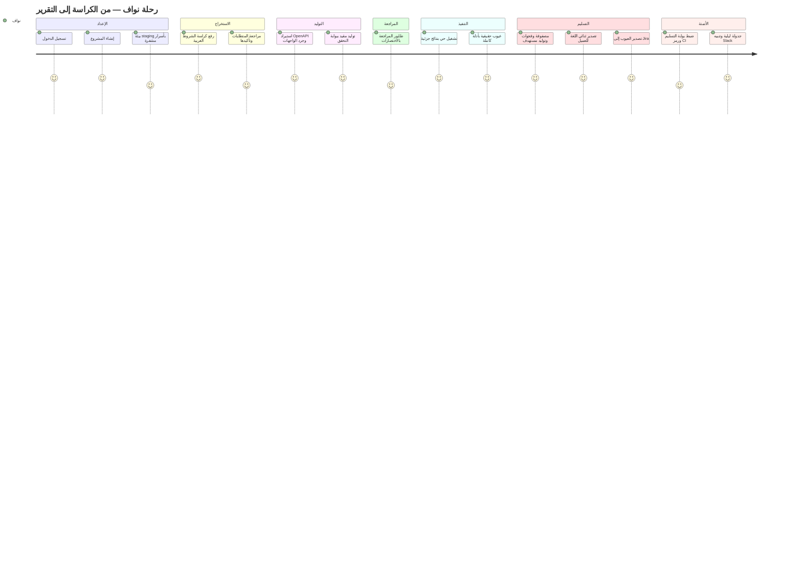

# رحلة نواف — من كراسة الشروط إلى تقرير التسليم

> **نواف** — قائد جودة في بيت برمجيات (60 موظفاً) ينفّذ مشروعاً حكومياً: منصة طلبات رقمية.
> وصلته كراسة شروط عربية بعشرات الصفحات، ومواصفة OpenAPI من فريق التطوير، وموعد تسليم لا يرحم.
> المطلوب تعاقدياً: مصفوفة تتبّع تُثبت أن كل متطلب اختُبر فعلاً — والهدف: من إنشاء المشروع إلى أول
> تشغيل فعلي في **≤ 15 دقيقة** (NFR-USE-02، UC-01).

كل محطة أدناه تصف: **ماذا يرى نواف** (حسب `frontend/FRONTEND_CONTRACT.md`)، **ماذا يحدث خلف الكواليس** (حسب `backend/API_CONTRACT.md`)، والمتطلبات الوظيفية المغطاة.

---

## المحطة 1 — تسجيل الدخول (~30 ثانية)

**ماذا يرى:** شاشة دخول داكنة بهوية Traceo — شعار متدرّج، خط IBM Plex Sans Arabic، واجهة عربية RTL افتراضياً مع مبدّل لغة AR/EN في الترويسة.

**خلف الكواليس:** `POST /v1/auth/login` — التحقق بـ Argon2id، إصدار JWT صالح 12 ساعة، وقيد **حدث مصادقة** في سجل التدقيق append-only.

**FR:** FR-USR-01, FR-USR-06 · **NFR:** NFR-SEC-07, NFR-USE-03

## المحطة 2 — إنشاء المشروع (~30 ثانية)

**ماذا يرى:** قائمة المشاريع، زر إنشاء، نموذج باسم المشروع "منصة الطلبات — الحكومية" ولغته (العربية — تقود اتجاه التحليل والتصدير معاً). ثم لوحة المشروع بقشرة تنقّل جانبية (يمين الشاشة في RTL): نظرة عامة، المتطلبات، الواجهات، التوليد، المراجعة، التشغيلات، مصفوفة التتبّع، البيئات.

**خلف الكواليس:** `POST /v1/projects` — المشروع يُربط بمنظمة نواف حصراً؛ كل استعلام لاحق مفلتر بـ `organisation_id` من الجلسة (لا من أي مُعامل عميل).

**FR:** FR-PRJ-01, FR-USR-02/04

## المحطة 3 — إعداد بيئة staging (~90 ثانية)

**ماذا يرى:** شاشة البيئات: اسم `staging`، عنوان أساس، اختيار نظام المصادقة (API key / Basic / Bearer / OAuth2 CC)، حقل السر. بعد الحفظ يظهر السر **مقنَّعاً ولا يُعرض كاملاً مرة أخرى أبداً**. زر "فحص الاتصال" يعيد نجاحاً أخضر: الوصول والمصادقة يعملان — دون كشف السر في أي رسالة.

**خلف الكواليس:** `POST /v1/projects/{id}/environments` — السر يُشفَّر تشفيراً مغلّفاً (envelope) قبل الحفظ ويُعاد `auth_config_masked: true` فقط؛ ثم `POST .../environments/{eid}/check` عبر httpx. تغيير البيئة يُقيَّد في سجل التدقيق.

**FR:** FR-PRJ-02/03/04/06 · **NFR:** NFR-SEC-02/03

## المحطة 4 — رفع كراسة الشروط (~2 دقيقة)

**ماذا يرى:** صفحة المتطلبات: منطقة سحب وإفلات بحد متقطّع يتوهج بالكهرماني عند التمرير. يسحب ملف الكراسة العربية (PDF/DOCX/Markdown حتى 50MB) — يبدأ شريط تقدّم فوري، والواجهة لا تتجمد: العملية خلفية بالكامل.

**خلف الكواليس:** `POST /v1/projects/{id}/documents` يعيد `202 {job_id, document_id}`؛ الواجهة تستطلع `GET /v1/jobs/{id}` كل ثانية. المسار: استخراج نص حتمي (PyMuPDF/python-docx) ← تقسيم حتمي بالبنود المرقّمة والعناوين (عربي + إنجليزي، تطبيع الأرقام الهندية ٠-٩) ← استدعاء LLM مقيّد بمخطط لكل مقطع ← متطلبات بحالة `extracted` مع نص المصدر ودرجة الثقة.

**FR:** FR-REQ-01/02/03/10 · **NFR:** NFR-PERF-02/06

## المحطة 5 — مراجعة المتطلبات المستخرجة وتأكيدها (~2 دقيقة)

**ماذا يرى:** جدول المتطلبات: معرّف mono كهرماني، الوصف، **شريط ثقة** لكل متطلب — الأقل ثقة مرتّب أولاً ليبدأ به. نص المصدر الأصلي بجانب كل متطلب للتحقق دون فتح الكراسة. يحرّر صياغتين غامضتين عبر Modal، يحذف متطلباً مكرراً، ثم يضغط **"اعتماد الكل"**.

**خلف الكواليس:** `GET /v1/projects/{id}/requirements` (الأقل ثقة أولاً)، `PATCH /v1/requirements/{rid}` للتحرير، `POST .../requirements/confirm_all` للتأكيد الجماعي. المتطلب غير المؤكد **لا يدخل التوليد ولا نسبة التغطية** — سلطة المراجعة البشرية تبدأ هنا.

**FR:** FR-REQ-04/05/07/08

## المحطة 6 — استيراد OpenAPI (~1 دقيقة)

**ماذا يرى:** صفحة الواجهات: يلصق رابط مواصفة فريق التطوير. يظهر فوراً **جرد الواجهات**: شارة METHOD ملوّنة بطيف الألوان، المسار، الملخص، عدد المُعاملات — مع لوحة **تحذيرات** لعمليتين تعذّر حلّ مراجعهما (سُجّلتا واستُبعدتا دون إفشال الاستيراد). يستبعد بمفتاح تبديل واجهات الدفع لأنها خارج نطاق العقد.

**خلف الكواليس:** `POST /v1/projects/{id}/api-specs` — تحليل **حتمي بلا أي نموذج لغوي**: تحقق بنيوي، حلّ `$ref` داخلي، تطبيع Swagger 2.0، تسطيح كل عملية بقيودها (min/max/pattern/enum — وقود تحليل القيم الحدّية). حارس SSRF على الجلب. ثم `PATCH /v1/endpoints/{eid}` للاستبعاد.

**FR:** FR-DSC-01/02/03/04/05/07

## المحطة 7 — التوليد (~90 ثانية)

**ماذا يرى:** شاشة التوليد: اختيار المتطلبات (المؤكدة فقط)، محدد عمق بأزرار حبّية — smoke / **standard** / exhaustive — ولوحة كهرمانية: *"التوليد مقيّد بالواجهات المكتشفة فقط — كل حالة تمر عبر بوابة التحقق قبل الحفظ"*. بعد التقدّم تظهر النتيجة: **47 مولَّدة، 3 محذوفة عند البوابة** (بعدّاد mono بلون الخطأ)، ومتطلب واحد **متعذّر ربطه** بسببه — لا حالة تخمينية له.

**خلف الكواليس:** `POST /v1/projects/{id}/generate` → 202. لكل متطلب: ترشيح مرشحين معجمياً ← اختيار النموذج من **قائمة مغلقة بفهارس فقط** ← اشتقاق حتمي للتقنيات (تجزئة مكافئة، قيم حدّية min/min+1/max−1/max، حالات سلبية، جداول قرار) ← **بوابة التأسيس**: أي خطوة تشير إلى واجهة/مُعامل/حقل غائب عن الجرد = حذف الحالة كاملة، لا إصلاح ولا عرض. كل حالة تحفظ model + prompt_version وروابط متطلباتها.

**FR:** FR-GEN-01…13 (وخاصة FR-GEN-06 البوابة وFR-GEN-13 المتعذّر ربطه)

## المحطة 8 — طابور المراجعة (~2.5 دقيقة)

**ماذا يرى:** الشاشة الرئيسية للمنتج: قائمة مفلترة يساراً، وتفصيل الحالة المختارة — **نص المتطلب المرتبط في لوحة بحد كهرماني بجانب الحالة نفسها**، خطوات mono، كتل JSON غائرة، قائمة التوكيدات. يراجع بلوحة المفاتيح: `a` اعتماد، `r` رفض، `j/k` تنقّل — دون مغادرة الشاشة أو فقدان الفلاتر. يرفض حالتين سطحيتين بسبب مصنّف (`shallow`) + ملاحظة، ويعتمد الباقي (بعضه جماعياً).

**خلف الكواليس:** `GET /v1/projects/{id}/test-cases`، `POST /v1/test-cases/{id}/approve` (يسجل approved_by/at + قيد تدقيق)، `POST .../reject {reason_code, reason_text}` — أسباب الرفض تبني مجموعة تقييم لجودة التوليد — و`POST /v1/test-cases/bulk` للجماعي.

**FR:** FR-REV-01/02/03/04/05/06 · **NFR:** NFR-USE-05

## المحطة 9 — التشغيل (~90 ثانية)

**ماذا يرى:** بطاقة إطلاق: اختيار بيئة staging، عدد الحالات المعتمدة، زر التشغيل. أثناء التنفيذ: **عدادات حية تتحدث كل 1.5 ثانية** — نجح/فشل/خطأ ترتفع تدريجياً مع شريط تقدّم. المصادقة حدثت **مرة واحدة** لكل التشغيل؛ لو فشلت لتوقف كل شيء بتشخيص واحد واضح بدل 45 فشلاً زائفاً.

**خلف الكواليس:** `POST /v1/projects/{id}/runs` → `202 {job_id, run_id}`. مصادقة واحدة (التوكن في الذاكرة فقط)، تنفيذ متوازٍ بحد تزامن للبيئة، خطوات مرتّبة توقف الحالة عند أول توكيد فاشل، استيفاء المتغيرات `{{var}}` وسلسلة الاستخراج بين الخطوات، تمييز failed عن errored، وأدلة كل خطوة (طلب محجوب الأسرار / استجابة مقتطعة / زمن / نتائج التوكيدات) **تتدفق إلى القاعدة أولاً بأول**.

**FR:** FR-EXE-01…11 · **NFR:** NFR-PERF-04, NFR-REL-02/06

## المحطة 10 — الإخفاقات كتقارير عيوب (~30 ثانية)

**ماذا يرى:** تقرير التشغيل: خمس بطاقات إحصاء، وتبويب **الإخفاقات**: بطاقات أكورديون بمعرّف mono بأسلوب BUG، وعند التوسيع — **تقرير عيب جاهز**: المتطلب المُتحقق منه، خطوات إعادة الإنتاج، الطلب المرسل، **المتوقع مقابل الفعلي**. يكتشف نواف عيبين حقيقيين: النظام يقبل رقم جوال بـ 11 خانة، ويلغي طلباً في حالة `dispatched` كان يجب أن يرفضه بـ 409.

**خلف الكواليس:** `GET /v1/runs/{id}/results` و`GET /v1/runs/{id}/report` — النتائج غير قابلة للتعديل ومرتبطة بإصدار الحالة المنفَّذ بالضبط.

**FR:** FR-RPT-01/02/03, FR-EXE-07

## المحطة 11 — المصفوفة والفجوات (~30 ثانية)

**ماذا يرى:** مصفوفة التتبّع: نسبة التغطية، صف لكل متطلب بحالاته المرتبطة ونقاط حالتها وآخر نتيجة، وشارة حالة (ناجح/فاشل/غير مغطى…). أسفلها **قائمة الفجوات**: المتطلب متعذّر الربط من المحطة 7 بسببه، وزر **"توليد مستهدف"** ينقله لشاشة التوليد مع تحديد المتطلب مسبقاً — يؤلف له نواف حالة يدوياً ويغلق الفجوة.

**خلف الكواليس:** `GET /v1/projects/{id}/traceability` — التغطية = المتطلبات المؤكدة ذات حالة معتمدة واحدة على الأقل ÷ كل المؤكد (Stale/Draft/Rejected لا تُحتسب). التأليف اليدوي عبر `POST /v1/projects/{id}/test-cases` بروابط متطلبات إلزامية.

**FR:** FR-TRC-01/02/03/05, FR-GEN-13, FR-REV-07 (UC-04)

## المحطة 12 — تصدير التسليم (~30 ثانية)

**ماذا يرى:** قائمة لغة بجانب زر التصدير — **عربي / إنجليزي / ثنائي اللغة**. يختار «ثنائي اللغة» فينزل **matrix.xlsx** بست أوراق (المتطلبات / الحالات / المصفوفة / **الفجوات** / **الإخفاقات** / آخر النتائج)، عناوينها بالعربية والإنجليزية معاً، وفي تذييل كل صفحة رقم التشغيل والبيئة والفرع ووقت التصدير. و**report.html** يفتح تقريراً قابلاً للطباعة بالخيار نفسه.

الأهمية عملية: الجهة الحكومية تريد المرفق بالعربية، وفريق التطوير يقرأ بالإنجليزية — ملف واحد يخدم الاثنين بدل تصديرين لا يتطابقان.

**خلف الكواليس:** `GET /v1/projects/{id}/exports/matrix.xlsx?lang=both` (openpyxl، `rightToLeft` للأوراق) و`GET /v1/runs/{id}/report.html?lang=both` — كلاهما يمر عبر مسار حجب الأسرار نفسه: لا مسار برمجي يوصل سراً إلى تصدير.

**FR:** FR-RPT-04/05/07 · FR-071 · **NFR:** NFR-SEC-03, NFR-USE-03

---

## المحطة 13 — تسليم العيوب إلى Jira (~30 ثانية)

**ماذا يرى:** داخل كل بطاقة إخفاق زر **«تصدير إلى Jira»**. ضغطة واحدة تفتح تذكرة تحمل خطوات إعادة الإنتاج مرقّمة، والطلب والرد حرفياً (بعد حجب الأسرار)، والمتوقع مقابل الفعلي، وشدّة مشتقة من أولوية المتطلب. الضغط ثانياً على العيب نفسه **يحدّث التذكرة ذاتها** ولا يفتح نسخة مكررة — والزر يعرض مفتاحها ورابطها.

**خلف الكواليس:** `POST /v1/runs/{rid}/results/{id}/export` — الازدواجية محسومة بمفتاح (التكامل، التشغيل، الحالة) في جدول `defect_exports`.

**FR:** FR-070 · **BR:** BR-09

---

## المحطة 14 — البوابة في خط الأنابيب (إعداد لمرة واحدة)

**ماذا يرى:** في شاشة **التكاملات** يضبط نواف سياسة البوابة — أدنى تغطية 80%، صفر إخفاقات جديدة، المنع عند متطلب عالي الأولوية — وينسخ خطوة CI الجاهزة. ومن **الإعدادات ← رموز الوصول** يصدر رمزاً يظهر **مرة واحدة**.

من تلك اللحظة يفشل خط الأنابيب من تلقاء نفسه عند الانحدار، **ويطبع رقم المتطلب** الذي تسبّب في الفشل — لا رقماً مجرداً يحتاج تفسيراً. ويضيف نواف جدولة `0 2 * * *` بتوقيت السعودية ليصله تنبيه Slack كل صباح.

**خلف الكواليس:** `PUT /v1/projects/{id}/gate` ثم `POST /v1/projects/{id}/ci/runs` و`GET /v1/runs/{id}/gate` الذي يعيد `exit_code`. الانحدار يُقاس مقابل آخر تشغيل مكتمل **على الفرع نفسه**.

**FR:** FR-060, FR-061, FR-062, FR-072 · **BR:** BR-06

---

## الجدول الزمني — الهدف ≤ 15 دقيقة (NFR-USE-02)

| # | المحطة | الزمن التقريبي | تراكمي |
|---|---|---|---|
| 1 | تسجيل الدخول | 0.5 د | 0.5 |
| 2 | إنشاء المشروع | 0.5 د | 1.0 |
| 3 | إعداد بيئة staging | 1.5 د | 2.5 |
| 4 | رفع كراسة الشروط + الاستخراج | 2.0 د | 4.5 |
| 5 | مراجعة المتطلبات وتأكيدها | 2.0 د | 6.5 |
| 6 | استيراد OpenAPI | 1.0 د | 7.5 |
| 7 | التوليد + بوابة التحقق | 1.5 د | 9.0 |
| 8 | طابور المراجعة والاعتماد | 2.5 د | 11.5 |
| 9 | التشغيل | 1.5 د | 13.0 |
| 10 | قراءة الإخفاقات | 0.5 د | 13.5 |
| 11 | المصفوفة والفجوات | 0.5 د | 14.0 |
| 12 | تصدير Excel / HTML (ثنائي اللغة) | 0.5 د | **14.5 د ✓** |

المحطتان 13 و14 تقعان خارج مسار الـ15 دقيقة: الأولى إجراء لحظي بعد قراءة الإخفاق، والثانية إعداد لمرة واحدة يجعل كل تشغيل لاحق يجري دون نواف أصلاً.

---

## خريطة الرحلة

## لحظات القيمة — Value Moments

| اللحظة | متى تقع | لماذا تهم |
|---|---|---|
| **أول متطلب مستخرَج** | المحطة 4 (~الدقيقة 4) | الكراسة العربية تحولت لبيانات منظمة دون إعادة كتابة سطر واحد — لحظة "هذا يفهم العربية فعلاً" |
| **أول حالة معتمدة** | المحطة 8 (~الدقيقة 10) | نواف — الذي "لا يثق بحالات مولَّدة" — اعتمد حالة بعد أن رأى متطلبها ومصدرها وتوكيداتها؛ الثقة كسبناها لا افترضناها |
| **أول فجوة مكتشفة** | المحطتان 7 و11 | المنصة قالت "لا أستطيع" بدل أن تخترع — متطلب متعذّر ربطه ظهر بسببه في قائمة الفجوات، وأُغلق بتوليد مستهدف |
| **أول تقرير مُصدَّر** | المحطة 12 (~الدقيقة 14.5) | مصفوفة تتبّع RTL جاهزة للتسليم الحكومي — العمل الذي كان يستهلك عطلة نهاية أسبوع صار ناتجاً جانبياً لصباح واحد |
| **أول بناء تفشله البوابة** | بعد المحطة 14 | انحدار أُوقف قبل أن يصل بيئة العميل، ورسالة الفشل سمّت المتطلب — الجودة صارت شرطاً في خط الأنابيب لا مراجعة بعدية |
| **أول صباح لا يفتح فيه نواف Traceo** | اليوم التالي | الجدولة الليلية شغّلت الحزمة وأرسلت الملخّص — المنتج يعمل حين لا أحد ينظر، وهذا ما يحوّله من أداة إلى بنية تحتية |

---

*انظر أيضاً: [المعمارية](ARCHITECTURE.md) · [عرض المستثمرين](PITCH_INVESTORS_AR.html) — مشروع TADQEEQ · سري.*
