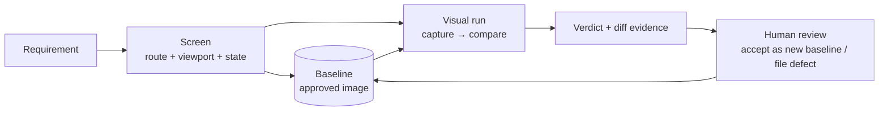

# Visual UI testing without AI — colour-analysis plan

> Design plan for a seventh Traceo engine: catching UI regressions by **decomposing screenshot colour**, deterministically, with no model in the loop.
>
> Status: V0 landed — `backend/app/modules/visual.py` (comparator, verified against the CIE's published CIEDE2000 vectors) and `backend/app/modules/design.py` (design conformance). §11 is the design-vs-implementation track; everything else is still proposal.

## Why colour, and why no AI

Traceo's guarantee is that a finding is *derivable*: the same input produces the same verdict, offline, and every identifier in a generated artefact came from a document the user supplied. A vision model breaks all three — it is non-deterministic, needs the network, and cannot cite why it flagged a pixel.

Colour comparison keeps the guarantee. A screenshot is a matrix of numbers; a regression is an arithmetic difference between two matrices. The verdict is reproducible on any machine, explainable down to the pixel, and the evidence (the diff image) *is* the argument.

The engine answers one question: **did this screen change in a way a human would notice, and where?** It does not answer "is this screen good", which is a design judgement no pixel comparison can make.

---

## 1. Where it fits

A seventh engine beside the existing six, reusing the run machinery rather than inventing a parallel one.



The shape mirrors the API side exactly, and that is the point: a **screen** is to visual testing what an **endpoint** is to API testing — the grounded unit that a case must reference. A visual case whose screen is not in the inventory is discarded, the same way a test case referencing an undiscovered endpoint is discarded today (BO-07).

**Human gate preserved.** A capture never becomes a baseline on its own. A new baseline is an approval, recorded with who approved it and when — otherwise a regression silently becomes the new normal, which is the classic way visual suites rot into noise.

---

## 2. The screen inventory (discovery, no AI)

The same fidelity ladder the endpoint inventory uses:

| Source | How the screen is discovered | Fidelity |
|---|---|---|
| `route` | Declared by the user or read from the app's route manifest (Next.js `app/**/page.tsx`, a router config, a sitemap) | highest |
| `crawl` | A headless crawl from a seed URL following in-origin links, deduplicated by templated path | medium |
| `manual` | Added by hand for a state a crawl cannot reach (a modal, an error state) | lowest |

A screen is the tuple **(path, viewport, state)** — `/projects/{id}` at 1280×720 logged in as `qa_lead` is a different screen from the same path at 390×844 as `viewer`. This is what makes the inventory finite and greppable instead of "every possible pixel arrangement".

---

## 3. The comparison algorithm

Four stages, each cheap, each explainable. Everything below is integer or float arithmetic on arrays — no dependency heavier than an image decoder.

### 3.1 Normalise before comparing

Comparison is meaningless if the two images disagree on anything but content:

- **Fixed viewport and device pixel ratio**, recorded on the baseline and enforced on capture; a mismatch is a configuration error, not a diff.
- **Disable animation and caret blink** (`prefers-reduced-motion`, `animation-duration: 0`), and wait for fonts and network idle before the shot. Most visual-suite flakiness is a screenshot taken mid-transition, not a real difference.
- **Freeze time-dependent content** through masks (§3.4) rather than hoping it matches.

### 3.2 Perceptual colour distance, not RGB equality

Comparing raw RGB triples flags differences no human can see and misses some they can. Convert both images to **CIE Lab** and measure with **ΔE (CIEDE2000)**, the standard model of how different two colours *look*:

```
sRGB → linear RGB → CIE XYZ (D65) → CIE Lab → ΔE₀₀(pixel_base, pixel_new)
```

The thresholds are then meaningful rather than arbitrary:

| ΔE₀₀ | Meaning | Default policy |
|---|---|---|
| < 1.0 | Imperceptible to the human eye | ignore |
| 1–2 | Visible only side by side | ignore (tunable) |
| 2–5 | Noticeable at a glance | count as a differing pixel |
| > 5 | Obvious | count, and weight it in severity |

Anti-aliasing is the main false-positive source: text edges legitimately shift by a subpixel between renders. A pixel is treated as anti-aliasing noise — and skipped — when it differs but **at least two of its eight neighbours** are close matches and its own ΔE is under a small edge threshold. This is the standard trick that makes text-heavy pages usable in a visual suite.

### 3.3 Three complementary measures

One number is never enough; report all three, and let the gate use them together.

1. **Pixel ratio** — differing pixels ÷ compared pixels. Answers *how much* changed. Cheap, and the basis of the primary threshold.
2. **Cluster analysis** — connected-component labelling over the difference mask, producing bounding boxes. Answers *where*, and separates one moved button (one dense cluster) from a global colour shift (thousands of scattered pixels). A small dense cluster is far more likely to be a real regression than the same pixel count spread thinly.
3. **Colour histogram distance** — a 3-D Lab histogram per image, compared with earth-mover's or χ² distance. Catches a *palette* change: a theme token altered site-wide moves the histogram sharply while the layout is untouched, and it survives a one-pixel layout shift that would make a per-pixel diff useless.

The third measure is what the user asked for — "developing" the image's colours — and it is the one that answers questions per-pixel diffing cannot: *did the brand palette drift? did contrast collapse? did dark mode leak into light mode?*

### 3.4 Ignore regions, declared not guessed

Timestamps, avatars, charts of live data and randomised ids change legitimately. Each screen carries a list of **masks** — CSS selectors resolved to boxes at capture time, or literal rectangles — which are filled with a flat colour in both images before comparison and excluded from the denominator.

Selectors, not coordinates, wherever possible: a rectangle silently stops covering the thing it was meant to cover the moment the layout moves, and then the suite is green for the wrong reason.

### 3.5 Bonus: accessibility contrast, free of charge

The Lab conversion is already done, so the engine can compute **WCAG contrast ratios** for text regions on the same pass and fail a screen whose contrast fell below AA. This is deterministic, needs no model, and reuses the `a11y` delta-baseline policy the Playwright suite already applies to the product itself.

---

## 4. Verdicts and severity

Deterministic mapping from measurements to an outcome, so the same capture always yields the same verdict:

| Verdict | Rule |
|---|---|
| `passed` | pixel ratio ≤ threshold, no cluster exceeds its area limit, histogram distance ≤ limit |
| `failed` | any threshold exceeded |
| `errored` | capture failed — page did not load, viewport mismatch, baseline missing |
| `new` | no baseline yet: recorded, never auto-approved, and reported as a gap |

Severity ranks the *review queue*, it does not decide the verdict: a large dense cluster in the upper third of the page (where primary actions live) outranks a thin scattered difference at the footer.

---

## 5. Data model

Four tables, following the existing conventions (org-scoped, append-only audit, states copied verbatim into `data-state` badges):

| Table | Purpose | States |
|---|---|---|
| `Screen` | The grounded unit: path, viewport, actor role, masks, source | `active \| excluded` |
| `VisualBaseline` | Approved image + its capture metadata; versioned, never overwritten | `approved \| superseded` |
| `VisualCapture` | One shot taken during a run | — |
| `VisualResult` | Verdict + measurements + diff-image key | `passed \| failed \| errored \| new` |

Images live in the existing storage directory, addressed by content hash so an unchanged screen costs nothing to re-record. Retention mirrors the artefact policy already in the architecture doc: baselines forever, captures and diffs 14 days.

---

## 6. API surface

No new concepts on the wire — the same async `202 {job_id}` pattern as every other long operation:

```
GET    /v1/projects/{id}/screens                 discovered screen inventory
POST   /v1/projects/{id}/screens                 add a screen manually
PATCH  /v1/screens/{id}                          masks, viewport, exclusion
POST   /v1/projects/{id}/screens/discover        202 — crawl or read the route manifest
GET    /v1/screens/{id}/baseline                 current approved baseline
POST   /v1/screens/{id}/baseline                 approve a capture as the baseline (audited)
POST   /v1/projects/{id}/visual-runs             202 — capture + compare
GET    /v1/visual-runs/{id}                      counts + state
GET    /v1/visual-runs/{id}/results              per-screen verdicts + measurements
GET    /v1/visual-results/{id}/diff.png          the diff image (evidence)
```

Go parity is mandatory, as for every route. The comparison itself is pure arithmetic and ports cleanly; the **capture** is the one piece that needs a browser, which is why §8 keeps it behind a boundary.

---

## 7. UI

One new page in the Analysis group, plus a review surface:

- **Screens** — the inventory, with each screen's baseline thumbnail, viewport, masks and last verdict.
- **Visual run report** — the standard three-pane diff: baseline, current, and the diff overlay with clusters boxed; the measurements beside it (pixel ratio, largest cluster, histogram distance, contrast findings).
- **Review action** — *Accept as new baseline* (audited) or *File defect*, mirroring the approve/reject pair the test-case review already uses.

Testids follow the existing convention: `screens-page-root`, `screens-row`, `screens-row-verdict-badge` carrying `data-state`, `visual-result-accept-baseline-button`, and so on.

---

## 8. The browser problem, stated honestly

Everything above is deterministic arithmetic **except capture**, which needs a real browser, and that collides with the air-gapped constraint (NFR-D1) the same way the traffic-capture feature does.

Three options, in order of preference:

1. **Bake a pinned browser into the deployment image.** Predictable, offline, and the same approach the CI images already take. Cost: image size.
2. **Accept uploaded screenshots.** The engine compares whatever it is given, and capture becomes the client's problem — a CI job, a mobile harness, a manual upload. Zero browser dependency, and it makes the engine usable for native apps too.
3. **A capture sidecar service** the operator runs separately, reachable over the internal network.

**Recommended: ship (2) first.** The comparison engine is the whole value; capture is plumbing that every team already has. Shipping the comparator alone means a customer can point their existing Playwright/Cypress screenshots at Traceo on day one, and it keeps the core deterministic and dependency-free. Add (1) as a convenience once the comparator has earned its keep.

---

## 9. Rollout

| Phase | Deliverable | Depends on |
|---|---|---|
| **V0 — comparator** | Lab/ΔE₀₀ diff, anti-aliasing suppression, masks, three measures, diff-image output. Pure functions with a golden-image test set covering: identical, imperceptible shift, moved element, palette change, layout reflow. | nothing |
| **V1 — data + API** | Screen inventory, baselines, visual runs, results; upload-a-screenshot capture path; Go parity. | V0 |
| **V2 — UI** | Screens page, three-pane diff report, accept-baseline flow. | V1 |
| **V3 — capture** | Bundled headless browser, route-manifest discovery and crawl, viewport matrix. | V1 |
| **V4 — gates** | Visual gate in the CI endpoint (`/gate`), contrast findings folded into the a11y policy, severity-ranked review queue. | V2 |

V0 is where the engineering risk is, and it is testable without any of the rest: a directory of image pairs and their expected verdicts.

---

## 10. What this will not do

Stated plainly so nobody expects it later:

- It cannot tell you a design is **wrong** — only that it **changed**. The judgement stays human, which is the same division of labour the rest of the product uses.
- It cannot survive genuinely dynamic content without masks. A screen full of live data needs its masks declared, or it will be noise.
- A **one-pixel layout shift** moves everything below it. Per-pixel comparison reports that honestly as a large diff; the cluster analysis and the histogram are what keep it interpretable instead of just alarming.
- Cross-browser and cross-OS rendering differ enough that a baseline is only valid for the platform that produced it. Baselines are therefore keyed by platform, and comparing across platforms is refused rather than fudged.

---

## 11. Design vs implementation — "give it a Figma export and get 100%"

The obvious build is: export the frame as PNG, screenshot the page at the same size, diff the pixels, report a match percentage. **That number can never reach 100%, and chasing it is the wrong goal.** The two images come out of different rasterizers — Figma's renderer and the browser's — and they disagree about subpixel coverage on every antialiased edge, about font hinting, and about gamma in gradients.

The size of that disagreement is measured, not assumed. `tests/test_design.py::test_rasterizers_disagree_on_identical_intent` takes one black-on-white edge whose *design is identical* and renders it the way two engines would:

| | differing pixels |
|---|---|
| exact comparison | **25%** |
| perceptual, ΔE₀₀ ≤ 2 | 12.5% |

A page is mostly edges. This is why every design-diff tool reports "94% match" on a pixel-perfect implementation: the score is dominated by rasterisation noise, and the 6% that would matter is indistinguishable from it. A tool whose false-positive floor is 6% cannot make a claim about the remaining 6%.

### The move: compare what the design *specifies*, not what it *rendered*

A design does not specify pixel coverage. It specifies **colours, boxes, and spacing** — and those survive rasterisation unchanged, because a flat fill is the same bytes in both engines. Extracting them from a lossless PNG is integer arithmetic, so it is exact and reproducible; comparing them is set and interval arithmetic, where "exact" is a claim with content.

Four layers, each exact in its own domain, implemented in `backend/app/modules/design.py`:

| Layer | Question | Exactness |
|---|---|---|
| **L1 Palette** | Is the design's `#FF6B00` actually in the build? In what proportion? | **Exact.** Every distinct colour and its pixel count; nothing quantised, clustered or sampled. `tolerance=0` demands the exact byte triple. |
| **L2 Geometry** | Is the card at the same x/y with the same width/height? | **Exact at `box_tolerance=0`** — same pixel, same size. Recovered as connected components of flat colour, which antialiasing cannot move. |
| **L3 Rhythm** | Do the gridlines and gaps match the design's spacing scale? | **Exact.** Edge-projection profiles give integer gridline positions; gaps are integer subtraction. |
| **L4 Pixels** | Anything left over, inside flat regions only. | Exact, but only meaningful where no glyph is rendered. |

The proof that this is the right cut is a test that fails one way and passes the other: soften a button's edges by one pixel, exactly as a different renderer would. The pixel comparison reports 32 changed pixels — a failure. The structural comparison reports `box_score == 1.0` and `colour_score == 1.0` — a match. Same input, and only one of the two answers is about the design.

### Where the 100% actually lives

- **100% of measurement.** Reproducible to the bit, offline, on any machine. Proven, not asserted: 34/34 of the CIE's published ΔE₀₀ vectors, and comparison output asserted byte-identical across repeated runs.
- **100% of recall in exact mode.** Nothing can hide a change: a one-unit channel difference — ΔE₀₀ 0.64, below the threshold at which a human can see anything — still fails. Antialiasing suppression is *disabled* at tolerance 0 by construction, so no heuristic can swallow a real difference.
- **Not 100%: "is this a defect".** That is a judgement about intent, and no method reaches it — a model would only be guessing with more confidence. The reviewer decides; the engine's job is to hand them an exact, located, explained difference.

### Raising the ceiling further: use the Figma *file*, not only the image

An image is a rendering of the design, and a rendering has already thrown information away. The Figma REST API and the Figma MCP server expose the design as **data**: per-node `x, y, width, height`, exact fill hexes, `fontFamily`, `fontSize`, `fontWeight`, `letterSpacing`, `lineHeight`, corner radii, effects. The browser exposes the same facts through `getBoundingClientRect()` and `getComputedStyle()`.

Comparing those is **number to number**, so typography — the one thing the image track cannot verify, because glyph rasterisation is exactly where the two engines diverge — becomes exact too:

```
design.node("Primary button").fill        == getComputedStyle(el).backgroundColor
design.node("Primary button").fontSize    == getComputedStyle(el).fontSize
design.node("Primary button").height      == el.getBoundingClientRect().height
```

The mapping from design node to DOM element is the one thing that must be stated rather than inferred — a `data-design-node` attribute, or a name convention. That is a small, honest annotation cost, and it is the difference between "94% of pixels agree" and "every specified property of every named component is verified, and here is the list".

### Recommended shape

1. **Ship L1–L3 on images** (done: `design.py`). Works with nothing but two PNGs at the same viewport, which is what a designer can hand over today.
2. **Add the token track** where the Figma file is available. It is strictly more accurate and covers typography; use it for named components and keep L1–L3 for everything else.
3. **Never report a single "match %"**. Report four numbers with their thresholds, because one number invites the false precision this whole section exists to avoid.

### Capture protocol (this is what makes L2 exact)

Exactness at `box_tolerance=0` is only achievable if both sides are captured under the same conditions. These are requirements, not suggestions — `conform()` refuses mismatched geometry rather than resampling, because resampling invents the pixels every later number is derived from:

- Export the Figma frame at **1×**, and screenshot at **deviceScaleFactor 1**, at the frame's exact width and height.
- **Ship the design's fonts** with the app (WOFF2). A fallback font changes every text box's width, and then L2 is measuring font substitution, not layout.
- Disable animation, wait for fonts and network idle, and mask live content by selector.
- Compare like with like: one baseline per (design frame, viewport, platform). Baselines from different platforms are refused, not reconciled.
