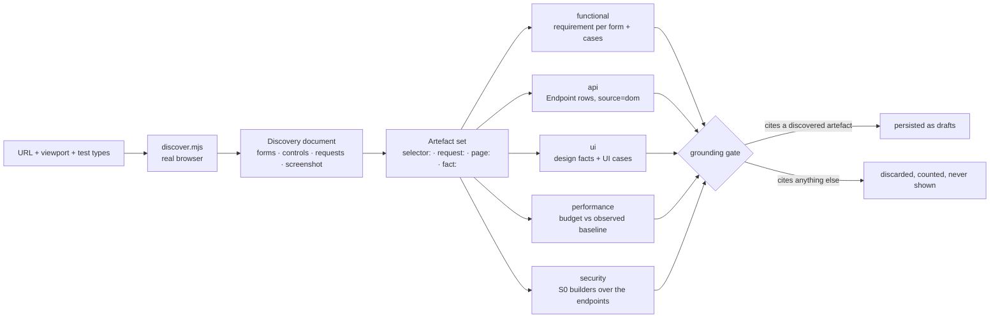

# Web targets — point Traceo at a URL

> Give Traceo a URL and pick test types. It renders the page in a real browser, records what is
> actually there, and writes requirements, endpoints and test cases from that record — nothing else.
>
> Status: shipped. Backend `backend/app/modules/webtarget.py` (Go parity: the same routes and job),
> sidecar `tools/web-discovery/discover.mjs`, UI `frontend/app/projects/[id]/target/page.tsx`,
> suites `e2e/tests/web-target.spec.ts` (one page) and `e2e/tests/web-target-crawl.spec.ts`
> (signed in, many pages).

## 1. Why this exists, and the measurement that shaped it

Every other importer in Traceo reads a **declared artefact**: an OpenAPI document, a Postman
collection, a HAR capture, a requirements document. A running web application has no such artefact.
The only statement of what it does is the application itself.

And for the class of target this feature was asked for, the server says nothing at all:

```
GET https://opensource-demo.orangehrmlive.com/web/index.php/auth/login
→ 3453 bytes, 0 <form>, 0 <input>, 0 <button>
```

Every field on that page is created by client JavaScript after hydration. **Server-side HTML parsing
discovers nothing**, so a browser is not an optimisation here — it is the feature. This is why the
discovery step is a Node/Playwright sidecar rather than an HTTP fetch plus a parser, and why a run
that reports zero forms on a SPA is treated as a bug in the wait strategy rather than as evidence
that the page is empty.

## 2. The shape of one discovery



The artefact set is the whole design. A case may cite **only** ids that appear in it:

| Artefact id | Comes from | Grounds |
|---|---|---|
| `selector:#username` | a form, a form field, a submit, a control | functional / UI-behaviour cases |
| `request:GET https://host/api/v2/orders/7` | a captured XHR/fetch | api and security cases |
| `page:https://host/login` | the final URL after redirects | performance cases |
| `fact:contrast:#6B6F7A_on_#1E2029` | `design.design_facts` over the screenshot | UI design cases |

A candidate that cites nothing, or cites something absent from the set, is **discarded and counted**
— never repaired, never persisted, never shown. This is BO-07 (the grounding gate) applied to a new
inventory, and it is the only reason to trust cases generated from a URL nobody wrote a spec for.

## 3. The five test types

The list is optional: omitting it runs exactly what the **project** declared it is for (`POST /v1/projects` `test_types`, editable on Overview), and naming a type the project excluded is refused with `422 test_type_not_in_project` rather than quietly dropped. A project that declared nothing is for all five. Every type that produces nothing
must say why — the job result carries `skipped: [{type, reason}]`, because a track that silently
produces nothing is indistinguishable from a track that is broken.

| Type | What it does with this URL | Persists |
|---|---|---|
| `functional` | one requirement per discovered **form**, naming the form, its fields and their `required` flags; cases for field presence, required-field enforcement, `maxlength` and `pattern` | `Requirement` (state `extracted`) + cases carrying the selectors **verbatim** |
| `api` | every captured **XHR/fetch** becomes an inventory operation; concrete ids are templated by the same function the HAR/Insomnia importers use (`/api/v2/orders/1042` → `/api/v2/orders/{id}`) | `Endpoint` rows with `source="dom"`, under the usual fidelity ladder `spec > traffic > dom > postman` |
| `ui` | design facts extracted from the screenshot (`design.design_facts`) → UI cases (`design.ui_cases`), each carrying its fact id | a design requirement + cases with technique `design` / `a11y` |
| `performance` | a stated page-load budget (`TRACEO_PAGE_LOAD_BUDGET_MS`, default 3000 ms) asserted against the **observed** `elapsed_ms` of the discovery render | a non-functional requirement + one case with technique `performance` |
| `security` | the S0 weakness builders over the endpoints discovered above, through the same catalogue, preconditions and grounding gate as `POST /security/generate` | cases with technique `security` and a `weakness_id` |

`api` is the one type whose product is **not** cases: it writes the endpoint inventory that the
`security` track (and every later generation run) stands on. Zero `api` cases with a non-empty
inventory is therefore a correct outcome, not a silent failure — `e2e/tests/web-target.spec.ts`
encodes exactly that exception and requires a stated reason from every other track.

## 4. Starting from the New Project dialog

The dialog takes an optional **Page URL**. Given one, creating the project
navigates to `/projects/{id}/target?url=…&start=1`, and that screen prefills the
field and starts the discovery itself — one place launches a job, so the error
handling, the progress and the result card stay in one implementation. The query
string is cleared before the start, so a refresh cannot launch a second run, and
nothing starts until the project has loaded: its declared test types are what the
request carries, and guessing them would send types a narrowed project refuses.

## 5. After the discovery: the autopilot

A crawl leaves its requirements in `extracted`. On a project with
`automation: "auto"` (the default) the discovery then runs the same chain the
document and spec paths run — confirm every extracted requirement
(`auto.requirements.confirm_all`, audit detail `source: "web_target"`), then the
generation trigger (`auto.generate`) over the confirmed set. Without it the URL
path would stop at the deterministic builders and the model-assisted cases would
never be produced.

It stops at **draft** cases. Approval and runs stay manual (BO-07), and
`automation: "manual"` skips the chain entirely.

## 6. The API surface

| Route | Capability | Returns |
|---|---|---|
| `POST /v1/projects/{id}/web-targets` | `import_spec` | `202 {job_id, target_id, test_types}` |
| `GET /v1/projects/{id}/web-targets` | `view` | `{"web_targets": [...]}` |
| `GET /v1/web-targets/{id}` | `view` | the target + its inventory summary + the design box |
| `GET /v1/web-targets/{id}/screenshot` | `view` | `image/png` |

Body: `{url, viewport?, test_types[], auth?, max_pages?}`.

- `auth: {username, password}` — optional, and **write-only**. It is stored encrypted and the
  payload answers `auth_configured: true|false`; nothing ever reads the pair back out.
- `max_pages` — 1…50, **default 25**. The default explores on purpose: somebody who hands Traceo a
  URL is asking about the product, not about one screen.

Refusals are typed and name what is legal:

| Code | Status | When |
|---|---|---|
| `invalid_url` | 422 | not an absolute `http`/`https` URL |
| `ssrf_blocked` / `unresolvable_host` | 422 | private, loopback, link-local, multicast, reserved or metadata address (unless `TRACEO_ALLOW_PRIVATE_TARGETS=1`) |
| `invalid_viewport` | 422 | not `WIDTHxHEIGHT` within 320x240–3840x4320; `errors` lists usable examples |
| `invalid_test_type` | 422 | an unknown type, or an empty list; `errors` carries **the legal list** |
| `test_type_not_in_project` | 422 | a type the project is not set up for; `errors` carries **what it IS set up for** |
| `invalid_max_pages` | 422 | a page budget outside 1…50; `errors` carries `["1","50"]` |
| `invalid_credentials` | 422 | `auth` with a blank username or a blank password — half a credential is a mistake worth naming, and the refusal never repeats what was sent |
| `forbidden` | 403 | the caller lacks `import_spec` (a viewer) |
| `no_screenshot` | 404 | the target has no stored screenshot |

`login_failed` is **not** in this table: it is a JOB failure, not a request refusal. The site is the
only thing that can reject a credential, and it is not asked until the browser is running.

Validation order is **url → viewport → test types → credentials → page budget**, which matters to
anything asserting a refusal: a body-shape refusal must be requested with a URL that passes the
guard.

The job result:

```json
{"target_id": "…", "title": "OrangeHRM",
 "forms": 1, "controls": 6, "requests": 13,
 "endpoints": 1, "requirements": 5,
 "cases_by_type": {"functional": 1, "api": 1, "ui": 77, "performance": 1, "security": 3},
 "skipped": [{"type": "…", "reason": "…"}],
 "discarded": 0, "duplicates": 0,
 "pages_visited": 4,
 "pages_skipped": [{"url": "…/logout", "reason": "forbidden_control"}],
 "login": {"succeeded": true, "strategy": "url_left_login"},
 "credentials_source": "user",
 "login_required": null}
```

Those are the measured numbers for the login page of the OrangeHRM demo at 1280x800 — both
backends produce them identically. `requirements` is one per discovered form plus **at most four**
more: the api track states that the observed endpoints must answer as they were seen to, the
security track that the same endpoints must be free of catalogued weaknesses, the ui track that the
screen conforms to its design facts, and the performance track that the page loads inside its
budget. A track selected but unable to stand on anything is reported in `skipped` with its reason
rather than silently producing nothing.

One row per `(project, url, viewport)`: pointing Traceo at the same page again **re-discovers** that
target instead of accumulating duplicates, which is what keeps the requirements and cases derived
from it stable. The row is created by the POST (status `pending`), so a job that dies still leaves
something on screen that explains itself — `status: "failed"` with the reason in `error`.

## 7. The browser requirement — and what happens without it

Discovery runs `node tools/web-discovery/discover.mjs --url <url> --out <dir>`. Both backends shell
out to the **same** script: parity is about the API surface and the persistence, not about porting a
crawler twice.

**Requirements:** Node 18+ and Playwright with the Chromium binary installed.

```bash
# the repo already has Playwright in e2e/ — point the backend at that install
npm --prefix e2e install
npx --prefix e2e playwright install chromium
```

| Setting | Env var | Default |
|---|---|---|
| Sidecar path | `TRACEO_WEB_DISCOVERY_SCRIPT` | `<repo>/tools/web-discovery/discover.mjs` |
| Node binary | `TRACEO_NODE_BIN` | `node` |
| Render timeout | `TRACEO_WEB_DISCOVERY_TIMEOUT_S` | `30` |
| Allow private/loopback targets | `TRACEO_ALLOW_PRIVATE_TARGETS` | `0` |
| Page-load budget (performance track) | `TRACEO_PAGE_LOAD_BUDGET_MS` | `3000` |
| Design analysis pixel budget | `TRACEO_DESIGN_MAX_PIXELS` | `1200000` |

**When the sidecar cannot run, the job FAILS — loudly.** Code `browser_discovery_unavailable`, with
a message naming Node and Playwright and how to install them. This is deliberate and it is the most
important error in the feature: an empty success would report "this page has nothing to test", which
is the single most misleading thing the product could say. Any of these conditions produces it: no
`node` on `PATH`, no `playwright` module, no Chromium binary, or a missing sidecar script.

## 8. The authenticated crawl — the one form that is ever submitted

Most of a product is behind its login. A discovery that only ever sees the logged-out page reports
on a shell, and its counts read as *"this application is nearly empty"* — which is worse than
failing, because it looks like an answer.

**Nobody has to tell Traceo that a page needs a sign-in.** There is no "needs login" flag in the
API and there must never be one: a visible form containing an `input[type=password]` **is** a login
page, and the crawl acts on that by itself. A page reached mid-crawl that redirects back to the
login page is a lost session — it re-authenticates once and continues.

Reaching what is behind the login costs exactly one submitted form. That is the only exception this
product makes to "discovery is read-only", and it is fenced by one rule, stated identically in
`tools/web-discovery/discover.mjs`, `backend/app/modules/webtarget.py`,
`e2e/helpers/local-web-target.ts` and here:

> The crawler submits **THE LOGIN FORM ONLY**, once, with the credentials the user supplied. It
> submits no other form, ever. It clicks no control whose accessible name or href matches
> logout / sign out / delete / remove / destroy / reset / deactivate / terminate. It stays on the
> login URL's origin. It follows links only.

Everything else is unchanged: the sidecar navigates, waits for network idle and fonts, disables
animation, reads the DOM and takes one full-page screenshot per page. It types nowhere but into the
two credential fields. Request **bodies** are never recorded — a page can POST credentials during
boot — only method, URL, resource type, status and whether a body existed.

### What is skipped, and why

| Skipped | Reason | Why it is a rule and not a preference |
|---|---|---|
| a link whose accessible name or href matches the forbidden list | `forbidden_control` | The crawl runs against **somebody else's running system**. "Log out" ends the session mid-crawl; "Delete", "Reset" and "Deactivate" destroy data that nobody agreed to lose. |
| a link to another origin | `cross_origin` | Credentials were given for one origin. Following a link off it turns a scoped crawl into an unscoped scan of the internet. |
| a non-`http(s)` scheme (`mailto:`, `tel:`, `javascript:`) | `unsupported_scheme` | Nothing there is a page. |
| anything that triggers a download | `download` | A file is not a page, and fetching one is a transfer nobody asked for. |
| a page beyond `max_pages` / `max_depth` | `budget_exhausted` | The budget is a **cap**, not a wish. What it left out is reported with this reason, so a short crawl is never mistaken for a small product. |

Every skipped URL is reported with its reason: `pages_skipped: [{url, reason}]`. A skip with no
reason is indistinguishable from a page the crawl failed to reach.

### Where the credentials come from — in this order

| Source | What it is | What may be said about it |
|---|---|---|
| `user` | What the operator supplied. | **A secret.** Sealed with `security.encrypt_secret`, write-only on the wire (the payload answers `auth_configured: true`), passed to the browser through the **child process environment** — never argv, where `ps` shows it to every user on the host. It appears in no payload, no log, no audit entry and no error message. |
| `page` | What the login screen **publishes about itself**. Demo and sandbox environments routinely print `Username : Admin` / `Password : admin123` next to the form. | **A fact about the page**, read off the rendered screen like every other artefact. It is therefore reportable, and it must be: a run that signed itself in with an account nobody handed it has to be auditable. |
| `null` | Neither. | Not a failure, and not a licence to crawl the logged-out product and call it the product. The public surface is reported for what it is, together with `login_required` and **the login form's own selectors** — the thing that would unlock the rest. |

The result carries `credentials_source: "user" | "page" | null`. Something read off a page and
something an operator typed are never conflated.

**A sign-in the site rejects fails the job** with `error_code: "login_failed"`, saying the
credentials were rejected — without saying *which* half was wrong (the same reason `identity.py`
answers a bad sign-in with one generic 401) and without containing either value. That applies to
`user` credentials, where the operator stated something that turned out to be wrong and has to hear
it. A page-published credential that turns out to be stale is the **page** being wrong, not the
operator, so the crawl degrades to the public surface and says so.

Success is never assumed. It is proved, and the run says which proof fired: the URL left the login
page, a sign-out control appeared, or the password field is gone. A crawl that cannot prove it
signed in does not crawl.

### SSRF, twice

The SSRF rule of the spec fetcher applies in `webtarget.validate_target_url` before the job is
queued, and inside the sidecar itself on the URL **and on every main-frame navigation**, so a public
URL cannot redirect the browser onto an internal host. A guard that lived only in the child would be
bypassed by every other caller of the module; a guard that lived only in the parent would be
bypassed by a redirect.

## 9. The design box

With `ui` selected, the stored target carries a `design` payload derived from the screenshot — the
same facts the UI cases assert, so what the screen shows and what the suite checks cannot drift:

- **palette** — each surface colour with the share of the screen it covers;
- **contrast** — every ink-on-surface pair with its measured ratio, its AA verdict, and the
  **passing colour** from `visual.nearest_accessible` (only L\* moves, so the suggestion is
  recognisably the designer's colour rather than a different one that happens to pass), plus
  `achievable: false` when even black or white cannot clear the bar — meaning the surface has to
  change, not the ink;
- **facts** — the full fact list with its statements, and the raster note saying how the analysed
  image was derived (cropped to the viewport, subsampled by an integer step above the pixel budget).

The UI renders this as `target-design-section`; colours are addressed on `data-colour` and contrast
rows on `data-fact-id` (the design fact id), never on rendered copy.

## 10. How this is verified

`e2e/tests/web-target.spec.ts` (`@critical @regression`) is **hermetic**: it serves its own page from
`e2e/test-data/web-target-page.html` on loopback (ports 8010–8030) and never touches the public
internet. That page builds its markup with DOM calls, so its served bytes contain no `form`, `input`
or `button` tag text at all — a discovery that reports a form is *proof* a browser rendered it,
which is the same property the OrangeHRM target has and the reason the feature exists.

The spec asserts the counts are internally consistent, that every persisted case cites a discovered
artefact (with a fabricated case run through the same matcher to prove the oracle can fail), that
concrete ids were templated, that the refusals are typed, that a viewer is refused — and, against
the target server's own request log, that **nothing was ever submitted or clicked**.

### The authenticated crawl — `e2e/tests/web-target-crawl.spec.ts`

The crawl is verified against a **second** hermetic fixture (`e2e/helpers/local-web-target.ts`
`startAuthenticatedWebTarget`, page `e2e/test-data/web-target-crawl-page.html`): a client-rendered
login page, a session cookie issued only on the correct credentials, four linked pages behind it
**each with its own form and its own field ids**, a "Log out" link, a "Reset password" link, a
"Delete this account permanently" button and an off-origin link — the forbidden controls on *every*
page, login included. One shell serves every route, so a plain GET of **any** page contains no
`form`, `input` or `button`: an inventory with four forms in it is proof that a browser rendered
four pages.

The fixture is the **safety oracle**, because every clause of the rule in §8 is a negative about the
outside world and a discovery report cannot be its own witness for a negative. The server records
every request with the session cookie it carried and the FIELD NAMES of anything submitted (never
the values — one of them is the password), and the spec asserts against that log:

- the login form was submitted **exactly once**, carrying both credential fields, and accepted;
- **no other form was ever submitted** — by body keys or by query keys, so a `GET`-method form
  cannot pass as a navigation;
- `/logout`, `/reset-password` and the Delete button's `DELETE /api/account` were **never**
  activated, and no non-`GET` request other than the single sign-in ever arrived;
- **every page behind the login was fetched with the session cookie** — the difference between
  crawling the application and crawling the login wall four times;
- with the credentials rejected: the job fails `login_failed`, the message contains neither half of
  the pair and does not say which of the two was wrong, nothing behind the login was requested, and
  no requirement or case was persisted;
- with nothing supplied and nothing published: nothing is submitted, nothing behind the login is
  requested, and the run reports `login_required` **with the login form's selectors**;
- the password appears in no payload — the 202, the target detail, the list, the job, the
  requirements and the cases are each searched literally, percent-encoded and base64'd;
- `max_pages` `0` and `51` are refused `422 invalid_max_pages` with `errors: ["1","50"]`, and a
  blank half of the pair `422 invalid_credentials`;
- every persisted case cites an artefact from a page the crawl **actually visited**, with a
  fabricated case (fabricated selector, fabricated fact, fabricated `page:` URL) run through the
  same matcher first to prove the oracle can fail;
- one requirement per form **per page**, with page-scoped ids: four forms on four pages must not
  collapse into one requirement because every page's first form is "form 1";
- the endpoint every page fetches is persisted **once**, not once per page.

Measured against the real sidecar on that fixture (`--max-pages 4`, credentials supplied): 4 pages
visited at depths 0/1/1/1, 1 form each, 18 requests reaching the server, **1** submission in total,
**0** forbidden activations, **0** requests behind the login without a session, and 3 links skipped
— `/logout` (`forbidden_control`, matched `logout`), `/reset-password` (`forbidden_control`, matched
`reset`) and `http://127.0.0.1:9/offsite` (`cross_origin`). With **nothing** supplied against the
same fixture started with `publishCredentials`, the sidecar read `Username : Admin` /
`Password : admin123` off the rendered page and signed in by itself: `credentials_source: "page"`,
4 pages visited, evidence recorded as `["Username : Admin", "Password : [redacted]"]`.

Two environment notes:

- loopback is exactly what the SSRF guard blocks, so the backend under test needs
  `TRACEO_ALLOW_PRIVATE_TARGETS=1` for the discovery path to be reachable. Without it the spec
  asserts the guard's typed refusal and skips the discovery battery with that reason stated;
- without Node/Playwright it asserts the `browser_discovery_unavailable` path instead — including
  that the failed target row keeps its reason and that nothing partial was persisted.

## 11. The honest limits

- **A rendered page is one state.** The crawl sees each page as it loads — not what happens after a
  tab switch, a modal, a filter or a form submission. Reaching those states means driving the
  application, and driving it means submitting forms, which the safety rule forbids everywhere
  except the login. **The login is the only door this product will open.** Whatever is reachable
  only by pressing "Search" or "Save" is not discovered, and no case is written about it.
- **The crawl is bounded, and the boundary is arbitrary.** 25 pages by default, 50 at most, depth
  first-come-first-served in breadth-first order. A large application is sampled, not covered.
  `pages_skipped` says what was left out and why, so a short crawl is never mistaken for a small
  product — but "not visited" is not "not there".
- **A page-published credential is a fact, not a promise.** Reading `Username : Admin` off a demo
  screen is grounding; the account still being valid is the page's claim, not Traceo's. When it is
  stale the crawl degrades to the public surface and says so, exactly as if nothing had been
  published.
- **The suite does not test session recovery.** The hermetic fixture keeps its session for the whole
  crawl, so "a page that bounces back to the login mid-crawl re-authenticates once and continues" is
  implemented and documented but not covered by an e2e assertion — a fixture that expired the
  session would make "the login form was submitted exactly once" untestable, which is the sharper
  property of the two.
- **A captured request is not a contract.** The endpoint inventory it produces sits below `spec` and
  `traffic` on the fidelity ladder for exactly that reason: it states what the page *did* call once,
  not what the API *promises*.
- **Path-B design facts cannot name things.** The screenshot proves an orange rectangle exists at
  (479,917); it cannot say the rectangle is the submit button. See
  `docs/DESIGN_AS_REQUIREMENT_SOURCE.md` §2.
- **Requirements from a URL still need a human.** Every extracted requirement lands in state
  `extracted`, exactly like a document-derived one. Mechanical extraction of a live page picks up
  scaffolding and placeholder copy just as mechanical extraction of a document does.
