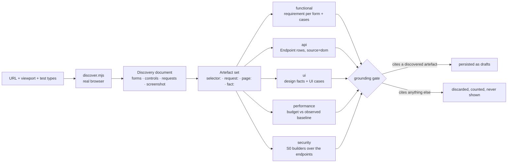

# Web targets — point Traceo at a URL

> Give Traceo a URL and pick test types. It renders the page in a real browser, records what is
> actually there, and writes requirements, endpoints and test cases from that record — nothing else.
>
> Status: shipped. Backend `backend/app/modules/webtarget.py` (Go parity: the same routes and job),
> sidecar `tools/web-discovery/discover.mjs`, UI `frontend/app/projects/[id]/target/page.tsx`,
> suite `e2e/tests/web-target.spec.ts`.

## 1. Why this exists, and the measurement that shaped it

Every other importer in Traceo reads a **declared artefact**: an OpenAPI document, a Postman
collection, a HAR capture, a requirements document. A running web application has no such artefact.
The only statement of what it does is the application itself.

And for the class of target this feature was asked for, the server says nothing at all:

```
GET https://opensource-demo.orangehrmlive.com/web/index.php/auth/login
→ 3453 bytes, 0 <form>, 0 <input>, 0 <button>
```

Every field on that page is created by client JavaScript after hydration. **Server-side HTML parsing
discovers nothing**, so a browser is not an optimisation here — it is the feature. This is why the
discovery step is a Node/Playwright sidecar rather than an HTTP fetch plus a parser, and why a run
that reports zero forms on a SPA is treated as a bug in the wait strategy rather than as evidence
that the page is empty.

## 2. The shape of one discovery



The artefact set is the whole design. A case may cite **only** ids that appear in it:

| Artefact id | Comes from | Grounds |
|---|---|---|
| `selector:#username` | a form, a form field, a submit, a control | functional / UI-behaviour cases |
| `request:GET https://host/api/v2/orders/7` | a captured XHR/fetch | api and security cases |
| `page:https://host/login` | the final URL after redirects | performance cases |
| `fact:contrast:#6B6F7A_on_#1E2029` | `design.design_facts` over the screenshot | UI design cases |

A candidate that cites nothing, or cites something absent from the set, is **discarded and counted**
— never repaired, never persisted, never shown. This is BO-07 (the grounding gate) applied to a new
inventory, and it is the only reason to trust cases generated from a URL nobody wrote a spec for.

## 3. The five test types

The list is optional: omitting it runs exactly what the **project** declared it is for (`POST /v1/projects` `test_types`, editable on Overview), and naming a type the project excluded is refused with `422 test_type_not_in_project` rather than quietly dropped. A project that declared nothing is for all five. Every type that produces nothing
must say why — the job result carries `skipped: [{type, reason}]`, because a track that silently
produces nothing is indistinguishable from a track that is broken.

| Type | What it does with this URL | Persists |
|---|---|---|
| `functional` | one requirement per discovered **form**, naming the form, its fields and their `required` flags; cases for field presence, required-field enforcement, `maxlength` and `pattern` | `Requirement` (state `extracted`) + cases carrying the selectors **verbatim** |
| `api` | every captured **XHR/fetch** becomes an inventory operation; concrete ids are templated by the same function the HAR/Insomnia importers use (`/api/v2/orders/1042` → `/api/v2/orders/{id}`) | `Endpoint` rows with `source="dom"`, under the usual fidelity ladder `spec > traffic > dom > postman` |
| `ui` | design facts extracted from the screenshot (`design.design_facts`) → UI cases (`design.ui_cases`), each carrying its fact id | a design requirement + cases with technique `design` / `a11y` |
| `performance` | a stated page-load budget (`TRACEO_PAGE_LOAD_BUDGET_MS`, default 3000 ms) asserted against the **observed** `elapsed_ms` of the discovery render | a non-functional requirement + one case with technique `performance` |
| `security` | the S0 weakness builders over the endpoints discovered above, through the same catalogue, preconditions and grounding gate as `POST /security/generate` | cases with technique `security` and a `weakness_id` |

`api` is the one type whose product is **not** cases: it writes the endpoint inventory that the
`security` track (and every later generation run) stands on. Zero `api` cases with a non-empty
inventory is therefore a correct outcome, not a silent failure — `e2e/tests/web-target.spec.ts`
encodes exactly that exception and requires a stated reason from every other track.

## 4. The API surface

| Route | Capability | Returns |
|---|---|---|
| `POST /v1/projects/{id}/web-targets` | `import_spec` | `202 {job_id, target_id, test_types}` |
| `GET /v1/projects/{id}/web-targets` | `view` | `{"web_targets": [...]}` |
| `GET /v1/web-targets/{id}` | `view` | the target + its inventory summary + the design box |
| `GET /v1/web-targets/{id}/screenshot` | `view` | `image/png` |

Body: `{url, viewport?, test_types[]}`. Refusals are typed and name what is legal:

| Code | Status | When |
|---|---|---|
| `invalid_url` | 422 | not an absolute `http`/`https` URL |
| `ssrf_blocked` / `unresolvable_host` | 422 | private, loopback, link-local, multicast, reserved or metadata address (unless `TRACEO_ALLOW_PRIVATE_TARGETS=1`) |
| `invalid_viewport` | 422 | not `WIDTHxHEIGHT` within 320x240–3840x4320; `errors` lists usable examples |
| `invalid_test_type` | 422 | an unknown type, or an empty list; `errors` carries **the legal list** |
| `test_type_not_in_project` | 422 | a type the project is not set up for; `errors` carries **what it IS set up for** |
| `forbidden` | 403 | the caller lacks `import_spec` (a viewer) |
| `no_screenshot` | 404 | the target has no stored screenshot |

Validation order is **url → viewport → test types**, which matters to anything asserting a refusal:
a body-shape refusal must be requested with a URL that passes the guard.

The job result:

```json
{"target_id": "…", "title": "OrangeHRM",
 "forms": 1, "controls": 6, "requests": 13,
 "endpoints": 1, "requirements": 5,
 "cases_by_type": {"functional": 1, "api": 1, "ui": 77, "performance": 1, "security": 3},
 "skipped": [{"type": "…", "reason": "…"}],
 "discarded": 0, "duplicates": 0}
```

Those are the measured numbers for the login page of the OrangeHRM demo at 1280x800 — both
backends produce them identically. `requirements` is one per discovered form plus **at most four**
more: the api track states that the observed endpoints must answer as they were seen to, the
security track that the same endpoints must be free of catalogued weaknesses, the ui track that the
screen conforms to its design facts, and the performance track that the page loads inside its
budget. A track selected but unable to stand on anything is reported in `skipped` with its reason
rather than silently producing nothing.

One row per `(project, url, viewport)`: pointing Traceo at the same page again **re-discovers** that
target instead of accumulating duplicates, which is what keeps the requirements and cases derived
from it stable. The row is created by the POST (status `pending`), so a job that dies still leaves
something on screen that explains itself — `status: "failed"` with the reason in `error`.

## 5. The browser requirement — and what happens without it

Discovery runs `node tools/web-discovery/discover.mjs --url <url> --out <dir>`. Both backends shell
out to the **same** script: parity is about the API surface and the persistence, not about porting a
crawler twice.

**Requirements:** Node 18+ and Playwright with the Chromium binary installed.

```bash
# the repo already has Playwright in e2e/ — point the backend at that install
npm --prefix e2e install
npx --prefix e2e playwright install chromium
```

| Setting | Env var | Default |
|---|---|---|
| Sidecar path | `TRACEO_WEB_DISCOVERY_SCRIPT` | `<repo>/tools/web-discovery/discover.mjs` |
| Node binary | `TRACEO_NODE_BIN` | `node` |
| Render timeout | `TRACEO_WEB_DISCOVERY_TIMEOUT_S` | `30` |
| Allow private/loopback targets | `TRACEO_ALLOW_PRIVATE_TARGETS` | `0` |
| Page-load budget (performance track) | `TRACEO_PAGE_LOAD_BUDGET_MS` | `3000` |
| Design analysis pixel budget | `TRACEO_DESIGN_MAX_PIXELS` | `1200000` |

**When the sidecar cannot run, the job FAILS — loudly.** Code `browser_discovery_unavailable`, with
a message naming Node and Playwright and how to install them. This is deliberate and it is the most
important error in the feature: an empty success would report "this page has nothing to test", which
is the single most misleading thing the product could say. Any of these conditions produces it: no
`node` on `PATH`, no `playwright` module, no Chromium binary, or a missing sidecar script.

## 6. Discovery is read-only

The sidecar navigates, waits for network idle and fonts, disables animation, reads the DOM and takes
one full-page screenshot. It **never** submits a form, clicks a control, types, or follows a link.
The only traffic the target receives is the traffic its own page load generates. Request **bodies**
are never recorded — a page can POST credentials during boot — only method, URL, resource type,
status and whether a body existed.

The SSRF rule of the spec fetcher applies here twice: in `webtarget.validate_target_url` before the
job is queued, and inside the sidecar itself on the URL **and on every main-frame navigation**, so a
public URL cannot redirect the browser onto an internal host. A guard that lived only in the child
would be bypassed by every other caller of the module; a guard that lived only in the parent would
be bypassed by a redirect.

## 7. The design box

With `ui` selected, the stored target carries a `design` payload derived from the screenshot — the
same facts the UI cases assert, so what the screen shows and what the suite checks cannot drift:

- **palette** — each surface colour with the share of the screen it covers;
- **contrast** — every ink-on-surface pair with its measured ratio, its AA verdict, and the
  **passing colour** from `visual.nearest_accessible` (only L\* moves, so the suggestion is
  recognisably the designer's colour rather than a different one that happens to pass), plus
  `achievable: false` when even black or white cannot clear the bar — meaning the surface has to
  change, not the ink;
- **facts** — the full fact list with its statements, and the raster note saying how the analysed
  image was derived (cropped to the viewport, subsampled by an integer step above the pixel budget).

The UI renders this as `target-design-section`; colours are addressed on `data-colour` and contrast
rows on `data-fact-id` (the design fact id), never on rendered copy.

## 8. How this is verified

`e2e/tests/web-target.spec.ts` (`@critical @regression`) is **hermetic**: it serves its own page from
`e2e/test-data/web-target-page.html` on loopback (ports 8010–8030) and never touches the public
internet. That page builds its markup with DOM calls, so its served bytes contain no `form`, `input`
or `button` tag text at all — a discovery that reports a form is *proof* a browser rendered it,
which is the same property the OrangeHRM target has and the reason the feature exists.

The spec asserts the counts are internally consistent, that every persisted case cites a discovered
artefact (with a fabricated case run through the same matcher to prove the oracle can fail), that
concrete ids were templated, that the refusals are typed, that a viewer is refused — and, against
the target server's own request log, that **nothing was ever submitted or clicked**.

Two environment notes:

- loopback is exactly what the SSRF guard blocks, so the backend under test needs
  `TRACEO_ALLOW_PRIVATE_TARGETS=1` for the discovery path to be reachable. Without it the spec
  asserts the guard's typed refusal and skips the discovery battery with that reason stated;
- without Node/Playwright it asserts the `browser_discovery_unavailable` path instead — including
  that the failed target row keeps its reason and that nothing partial was persisted.

## 9. The honest limits

- **A rendered page is one state.** Discovery sees the page as it loads, not what happens after a
  login, a tab switch or a modal. Multi-state discovery would require driving the application, and
  driving it means submitting forms — which this feature deliberately does not do.
- **A captured request is not a contract.** The endpoint inventory it produces sits below `spec` and
  `traffic` on the fidelity ladder for exactly that reason: it states what the page *did* call once,
  not what the API *promises*.
- **Path-B design facts cannot name things.** The screenshot proves an orange rectangle exists at
  (479,917); it cannot say the rectangle is the submit button. See
  `docs/DESIGN_AS_REQUIREMENT_SOURCE.md` §2.
- **Requirements from a URL still need a human.** Every extracted requirement lands in state
  `extracted`, exactly like a document-derived one. Mechanical extraction of a live page picks up
  scaffolding and placeholder copy just as mechanical extraction of a document does.
