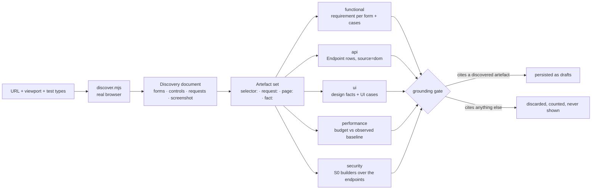
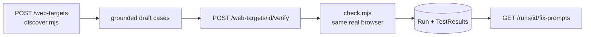

# Web targets — point Traceo at a URL

> Give Traceo a URL and pick test types. It renders the page in a real browser, records what is
> actually there, and writes requirements, endpoints and test cases from that record — nothing else.
>
> Then it **runs** them in that same browser and hands you a fix prompt for everything that failed
> (§6–7).
>
> Status: shipped. Backend `backend/app/modules/webtarget.py` (Go parity: the same routes and job),
> sidecar `tools/web-discovery/discover.mjs`, UI `frontend/app/projects/[id]/target/page.tsx`,
> suite `e2e/tests/web-target.spec.ts`.
>
> Verification + fix prompts: `backend/app/modules/webverify.py` and `fixprompt.py`, sidecar
> `tools/web-discovery/check.mjs`, suite `backend/tests/test_webverify.py`. **Python backend only** —
> see §8.

## 1. Why this exists, and the measurement that shaped it

Every other importer in Traceo reads a **declared artefact**: an OpenAPI document, a Postman
collection, a HAR capture, a requirements document. A running web application has no such artefact.
The only statement of what it does is the application itself.

And for the class of target this feature was asked for, the server says nothing at all:

```
GET https://opensource-demo.orangehrmlive.com/web/index.php/auth/login
→ 3453 bytes, 0 <form>, 0 <input>, 0 <button>
```

Every field on that page is created by client JavaScript after hydration. **Server-side HTML parsing
discovers nothing**, so a browser is not an optimisation here — it is the feature. This is why the
discovery step is a Node/Playwright sidecar rather than an HTTP fetch plus a parser, and why a run
that reports zero forms on a SPA is treated as a bug in the wait strategy rather than as evidence
that the page is empty.

## 2. The shape of one discovery



The artefact set is the whole design. A case may cite **only** ids that appear in it:

| Artefact id | Comes from | Grounds |
|---|---|---|
| `selector:#username` | a form, a form field, a submit, a control | functional / UI-behaviour cases |
| `request:GET https://host/api/v2/orders/7` | a captured XHR/fetch | api and security cases |
| `page:https://host/login` | the final URL after redirects | performance cases |
| `fact:contrast:#6B6F7A_on_#1E2029` | `design.design_facts` over the screenshot | UI design cases |

A candidate that cites nothing, or cites something absent from the set, is **discarded and counted**
— never repaired, never persisted, never shown. This is BO-07 (the grounding gate) applied to a new
inventory, and it is the only reason to trust cases generated from a URL nobody wrote a spec for.

## 3. The five test types

Each is optional; `functional` and `ui` are checked by default. Every type that produces nothing
must say why — the job result carries `skipped: [{type, reason}]`, because a track that silently
produces nothing is indistinguishable from a track that is broken.

| Type | What it does with this URL | Persists |
|---|---|---|
| `functional` | one requirement per discovered **form**, naming the form, its fields and their `required` flags; cases for field presence, required-field enforcement, `maxlength`, `pattern`, and **input validation** per §10 | `Requirement` (state `extracted`) + cases carrying the selectors **verbatim** |
| `api` | every captured **XHR/fetch** becomes an inventory operation; concrete ids are templated by the same function the HAR/Insomnia importers use (`/api/v2/orders/1042` → `/api/v2/orders/{id}`) | `Endpoint` rows with `source="dom"`, under the usual fidelity ladder `spec > traffic > dom > postman` |
| `ui` | design facts extracted from the screenshot (`design.design_facts`) → UI cases (`design.ui_cases`), each carrying its fact id | a design requirement + cases with technique `design` / `a11y` |
| `performance` | a stated page-load budget (`TRACEO_PAGE_LOAD_BUDGET_MS`, default 3000 ms) asserted against the **observed** `elapsed_ms` of the discovery render | a non-functional requirement + one case with technique `performance` |
| `security` | the S0 weakness builders over the endpoints discovered above, through the same catalogue, preconditions and grounding gate as `POST /security/generate` | cases with technique `security` and a `weakness_id` |

`api` is the one type whose product is **not** cases: it writes the endpoint inventory that the
`security` track (and every later generation run) stands on. Zero `api` cases with a non-empty
inventory is therefore a correct outcome, not a silent failure — `e2e/tests/web-target.spec.ts`
encodes exactly that exception and requires a stated reason from every other track.

## 4. The API surface

| Route | Capability | Returns |
|---|---|---|
| `POST /v1/projects/{id}/web-targets` | `import_spec` | `202 {job_id, target_id, test_types}` |
| `GET /v1/projects/{id}/web-targets` | `view` | `{"web_targets": [...]}` |
| `GET /v1/web-targets/{id}` | `view` | the target + its inventory summary + the design box |
| `GET /v1/web-targets/{id}/screenshot` | `view` | `image/png` |
| `POST /v1/web-targets/{id}/verify` | `trigger_run` | `202 {job_id, run_id, cases, environment_id}` |
| `GET /v1/runs/{id}/fix-prompts` | `view` | `{run_id, display_id, total, prompts: [...]}` |
| `POST /v1/projects/{id}/pipeline` | `trigger_run` | `202 {job_id, url, test_types, document_id}` — §9 |

Body: `{url, viewport?, test_types[]}`. Refusals are typed and name what is legal:

| Code | Status | When |
|---|---|---|
| `invalid_url` | 422 | not an absolute `http`/`https` URL |
| `ssrf_blocked` / `unresolvable_host` | 422 | private, loopback, link-local, multicast, reserved or metadata address (unless `TRACEO_ALLOW_PRIVATE_TARGETS=1`) |
| `invalid_viewport` | 422 | not `WIDTHxHEIGHT` within 320x240–3840x4320; `errors` lists usable examples |
| `invalid_test_type` | 422 | an unknown type, or an empty list; `errors` carries **the legal list** |
| `forbidden` | 403 | the caller lacks `import_spec` (a viewer) |
| `no_screenshot` | 404 | the target has no stored screenshot |

Validation order is **url → viewport → test types**, which matters to anything asserting a refusal:
a body-shape refusal must be requested with a URL that passes the guard.

The job result:

```json
{"target_id": "…", "title": "OrangeHRM",
 "forms": 1, "controls": 6, "requests": 13,
 "endpoints": 1, "requirements": 5,
 "cases_by_type": {"functional": 1, "api": 1, "ui": 77, "performance": 1, "security": 3},
 "skipped": [{"type": "…", "reason": "…"}],
 "discarded": 0, "duplicates": 0}
```

Those are the measured numbers for the login page of the OrangeHRM demo at 1280x800 — both
backends produce them identically. `requirements` is one per discovered form plus **at most four**
more: the api track states that the observed endpoints must answer as they were seen to, the
security track that the same endpoints must be free of catalogued weaknesses, the ui track that the
screen conforms to its design facts, and the performance track that the page loads inside its
budget. A track selected but unable to stand on anything is reported in `skipped` with its reason
rather than silently producing nothing.

One row per `(project, url, viewport)`: pointing Traceo at the same page again **re-discovers** that
target instead of accumulating duplicates, which is what keeps the requirements and cases derived
from it stable. The row is created by the POST (status `pending`), so a job that dies still leaves
something on screen that explains itself — `status: "failed"` with the reason in `error`.

## 5. The browser requirement — and what happens without it

Discovery runs `node tools/web-discovery/discover.mjs --url <url> --out <dir>`. Both backends shell
out to the **same** script: parity is about the API surface and the persistence, not about porting a
crawler twice.

**Requirements:** Node 18+ and Playwright with the Chromium binary installed.

```bash
# the repo already has Playwright in e2e/ — point the backend at that install
npm --prefix e2e install
npx --prefix e2e playwright install chromium
```

| Setting | Env var | Default |
|---|---|---|
| Sidecar path | `TRACEO_WEB_DISCOVERY_SCRIPT` | `<repo>/tools/web-discovery/discover.mjs` |
| Node binary | `TRACEO_NODE_BIN` | `node` |
| Render timeout | `TRACEO_WEB_DISCOVERY_TIMEOUT_S` | `30` |
| Allow private/loopback targets | `TRACEO_ALLOW_PRIVATE_TARGETS` | `0` |
| Page-load budget (performance track) | `TRACEO_PAGE_LOAD_BUDGET_MS` | `3000` |
| Design analysis pixel budget | `TRACEO_DESIGN_MAX_PIXELS` | `1200000` |

**When the sidecar cannot run, the job FAILS — loudly.** Code `browser_discovery_unavailable`, with
a message naming Node and Playwright and how to install them. This is deliberate and it is the most
important error in the feature: an empty success would report "this page has nothing to test", which
is the single most misleading thing the product could say. Any of these conditions produces it: no
`node` on `PATH`, no `playwright` module, no Chromium binary, or a missing sidecar script.

## 6. Discovery is read-only

The sidecar navigates, waits for network idle and fonts, disables animation, reads the DOM and takes
one full-page screenshot. It **never** submits a form, clicks a control, types, or follows a link.
The only traffic the target receives is the traffic its own page load generates. Request **bodies**
are never recorded — a page can POST credentials during boot — only method, URL, resource type,
status and whether a body existed.

The SSRF rule of the spec fetcher applies here twice: in `webtarget.validate_target_url` before the
job is queued, and inside the sidecar itself on the URL **and on every main-frame navigation**, so a
public URL cannot redirect the browser onto an internal host. A guard that lived only in the child
would be bypassed by every other caller of the module; a guard that lived only in the parent would
be bypassed by a redirect.

## 7. The design box

With `ui` selected, the stored target carries a `design` payload derived from the screenshot — the
same facts the UI cases assert, so what the screen shows and what the suite checks cannot drift:

- **palette** — each surface colour with the share of the screen it covers;
- **contrast** — every ink-on-surface pair with its measured ratio, its AA verdict, and the
  **passing colour** from `visual.nearest_accessible` (only L\* moves, so the suggestion is
  recognisably the designer's colour rather than a different one that happens to pass), plus
  `achievable: false` when even black or white cannot clear the bar — meaning the surface has to
  change, not the ink;
- **facts** — the full fact list with its statements, and the raster note saying how the analysed
  image was derived (cropped to the viewport, subsampled by an integer step above the pixel budget).

The UI renders this as `target-design-section`; colours are addressed on `data-colour` and contrast
rows on `data-fact-id` (the design fact id), never on rendered copy.

## 8. How this is verified

`e2e/tests/web-target.spec.ts` (`@critical @regression`) is **hermetic**: it serves its own page from
`e2e/test-data/web-target-page.html` on loopback (ports 8010–8030) and never touches the public
internet. That page builds its markup with DOM calls, so its served bytes contain no `form`, `input`
or `button` tag text at all — a discovery that reports a form is *proof* a browser rendered it,
which is the same property the OrangeHRM target has and the reason the feature exists.

The spec asserts the counts are internally consistent, that every persisted case cites a discovered
artefact (with a fabricated case run through the same matcher to prove the oracle can fail), that
concrete ids were templated, that the refusals are typed, that a viewer is refused — and, against
the target server's own request log, that **nothing was ever submitted or clicked**.

Two environment notes:

- loopback is exactly what the SSRF guard blocks, so the backend under test needs
  `TRACEO_ALLOW_PRIVATE_TARGETS=1` for the discovery path to be reachable. Without it the spec
  asserts the guard's typed refusal and skips the discovery battery with that reason stated;
- without Node/Playwright it asserts the `browser_discovery_unavailable` path instead — including
  that the failed target row keeps its reason and that nothing partial was persisted.

## 9. The honest limits

- **A rendered page is one state.** Discovery sees the page as it loads, not what happens after a
  login, a tab switch or a modal. Multi-state discovery would require driving the application, and
  driving it means submitting forms — which this feature deliberately does not do.
- **A captured request is not a contract.** The endpoint inventory it produces sits below `spec` and
  `traffic` on the fidelity ladder for exactly that reason: it states what the page *did* call once,
  not what the API *promises*.
- **Path-B design facts cannot name things.** The screenshot proves an orange rectangle exists at
  (479,917); it cannot say the rectangle is the submit button. See
  `docs/DESIGN_AS_REQUIREMENT_SOURCE.md` §2.
- **Requirements from a URL still need a human.** Every extracted requirement lands in state
  `extracted`, exactly like a document-derived one. Mechanical extraction of a live page picks up
  scaffolding and placeholder copy just as mechanical extraction of a document does.

---

## 6. Running what the scan produced

A scan writes cases. Until they are **executed** it has found nothing — and the cases it writes
cannot be executed by the HTTP run engine, because they do not assert HTTP. They assert what the
page does: `elements_present`, `validation_error`, `no_navigation`, `value_length_at_most`,
`pattern_enforced`, `page_load_ms`. The engine's evaluator ends in

```python
return True, None, True  # unknown assertion types are skipped, never failed
```

so routing them there produced a run in which **every scanned case reported `passed` and none of
them was checked**. A green badge over an unverified page is worse than no badge, so those cases get
the runner they were written for.



**`tools/web-discovery/check.mjs`** is the companion sidecar. `discover.mjs` reads a page without
touching it; `check.mjs` types into it and submits it. Same Playwright loader, same JSON emit
protocol, same SSRF policy — the guard now lives once in `ssrf.mjs` rather than being copied.

Each case is evaluated from a **fresh render**, so a case that typed into a field or submitted a
form cannot colour the next one's evidence. That costs roughly a second per case and is the reason
the run is not instant.

Three rules the implementation holds to:

* **A skipped check is never a pass.** Anything the runner cannot evaluate — design facts measured
  from a screenshot, an assertion type with no browser implementation — is recorded as `skipped`
  with a stated reason, and `skipped` is its own count in the run. Re-introducing the silent pass one
  level up would defeat the whole feature; `test_webverify.py` asserts `passed != 2` on a plan of
  1 pass / 1 fail / 1 skip.
* **Nothing is auto-approved.** A scan produces drafts and human review is the gate. A verification
  run executes the target's cases *whatever state they are in* and never changes that state: it
  answers "what would these find?", which is the question you have **before** you approve.
* **A missing result is `errored`, not a smaller total.** If the browser dies mid-plan the cases it
  never answered are recorded as errored, so the run's arithmetic cannot quietly shrink.

The environment a scanned run points at is **derived from the target's own origin**
(`http://host` from the final URL), created once and reused. A `Run` needs an environment and the
page already states its own; asking the user to type one in would be asking for something we know.

## 7. Fix prompts

Every failed or errored case carries a paste-ready repair brief, on
`GET /v1/runs/{id}/report` (`cases[].fix_prompt`, `null` on passing cases) and on the dedicated
`GET /v1/runs/{id}/fix-prompts`.

```
# Fix request — generated by Traceo · RUN-1003 · 7b01071d

What is broken  The form accepted an empty #email and submitted. A required field is not enforced.
Where           #email on http://localhost:8777/
Requirement     WEB-690cf929-F1 — "The 'login' form (#login) … Required: User, Email."
Severity        major
Expected        the form refuses submission while this required field is empty
Observed        submitted anyway and navigated to http://localhost:8777/done?username=traceo&email=…
Do              1) reject the submission while this field is empty, in the handler AND on the server
                2) show the user an error next to the field (aria-invalid + a message element)
Verify          re-run "Form: 'login' rejects submission with Email empty" — when it passes, this closes

Change the application, not the test: this case states a rule the product agreed to, so a passing
test must mean the rule now holds.
```

**No model is called.** `modules/fixprompt.py` assembles every line from rows that already exist —
the case, the requirement it traces to, the failure evidence the runner recorded. The same failure
yields the same text on every machine, which is what makes it quotable in a bug report, and it keeps
the offline property the mock provider gives the rest of the stack (NFR-D1).

**It never invents.** The `Do` lines are selected from a table keyed by the assertion that actually
failed — there is no free text describing a cause nobody observed. When the evidence does not say
something (no linked requirement, no recorded URL), the line is **omitted** rather than guessed.
This is the grounding gate's discipline (BO-07) applied to remediation.

The final line is not decoration. A suite whose failures invite relaxing the assertion stops meaning
anything; the prompt always asks for a change to the system under test.

**Secrets.** The text is built only from `failure_reason` and `evidence`, both of which the
execution engine wrote through `redact()`. Nothing in the generator reads an environment's auth
config, so a prompt cannot carry a credential the evidence did not already contain.

## 8. Known gaps

* **Python only.** `backend-go` implements the scan (`internal/modules/webtarget`) but not
  `/verify` or `/fix-prompts`. A stack on the Go profile scans and generates as before, and has no
  browser verification. Porting is one module plus the two routes; the sidecar is shared.
* **Design/a11y cases are reported `skipped`.** Their facts are measured from the discovery
  screenshot, not the live DOM, so `check.mjs` cannot re-derive them. Saying so is the correct
  outcome; claiming a pass would be a fabricated verification.
* **One page per target.** The runner checks the URL that was scanned. Multi-step journeys across
  pages are not modelled yet.

## 9. The whole process as one call

`POST /v1/projects/{id}/pipeline` composes every stage above into a single job, because the question
a user arrives with is *"here is my site, is it broken?"* — and answering it otherwise meant driving
five routes in the right order and knowing which to skip.

```
document? ─▶ parse ─┐
                    ├─▶ scan URL ─▶ generate? ─┬─▶ browser run ─┐
url + test types ───┘                          └─▶ HTTP run ────┴─▶ counts + fix prompts
```

Body: `{url, viewport?, test_types[], document_id?}`. The result carries `stages`, `runs`,
`counts` and `fix_prompts`.

`modules/pipeline.py` **calls the same job bodies the individual endpoints call** (`_run_ingest`,
`run_discovery_job`, `_run_generation`, `run_verify_job`, `_execute_run`), so there is one
implementation of each engine and the pipeline only decides order and what to do when a stage
produces nothing.

| Property | Why |
|---|---|
| The document is optional | With a BRD, findings are checked against what you *said* should happen; without one, against what the page declares about itself. A `required` attribute is a claim, and a form that ignores it is a defect either way. |
| Every stage reports `completed` / `skipped` / `reused` / `failed` **with a reason** | A stage that silently produces nothing is indistinguishable from one that is broken — the same rule the scan's `skipped[]` already followed. |
| Only cases this run produced are executed | The case set is snapshotted before the scan, so pointing the pipeline at one page does not re-run a project's existing 500 cases. |
| A document already parsed on upload is `reused` | `POST /documents` parses on arrival. Re-parsing would diff the same file to a row of zeros and read like an empty document. |
| A stage failure does not sink the run | An unreadable document still leaves the scan a real answer. |
| Nothing is approved | Same stance as §6 — approval stays a human act. |
| One pipeline per project at a time | Two would scan the same URL into the same target row and interleave their case sets (`409 pipeline_in_progress`). |

Progress is one bar: each stage gets a `_Stage` proxy that scales its own 0..1 into a slice of the
parent job, so the bar advances once through the whole process instead of resetting five times.

**UI.** This is what the Runs page drives (`frontend/app/projects/[id]/runs/page.tsx`): the three
steps of the design's *New run* screen — what should happen (optional document), your app (URL +
viewport), what we'll test (the five types) — then a live progress card, then the verdict with a
copy-able fix prompt per failure. The older "run approved cases against an environment" launcher is
still on the page below it; the two answer different questions, and only the wizard builds the cases
from the app itself.

**Reproducing it.** `demo/webpage/` is a page with two planted bugs (a required field nobody
enforces, a field that ignores its own `maxlength`) plus one XHR so the `api` and `security` tracks
have an endpoint to stand on. Served with `python3 -m http.server 8777 --directory demo/webpage`, a
five-type run over it yields **12 checks · 9 passed · 3 need fixing** and three fix prompts.

## 10. Input validation

The scan does not stop at "does this form have a `required` attribute". For every rule a field
**declares about itself**, it writes a case that types a concrete value and checks whether the page
stands by that rule.

The constraints were already being measured — `discover.mjs` reads `minlength`, `min`, `max` and
`step` off each element — and `_field()` was dropping them on the floor, so a field declaring
`min="18" max="120"` was tested for nothing but presence.

| Declared | Probe | Expects |
|---|---|---|
| `type=email\|url\|number\|date` | a value of the wrong shape, and one of the right shape | rejected / accepted |
| `minlength=N` | `N-1` characters | rejected |
| `maxlength=N` | exactly `N` characters | **accepted** — an off-by-one that refuses the longest legal value is a real defect |
| `min=N` | `N-1`, and `N` itself | rejected / accepted |
| `max=N` | `N+1` | rejected |
| `required` | a whitespace-only value | rejected |

**Every value is derived from the declaration.** A bare `<input type="text">` with no length, range
or pattern yields **no** validation case: it states no rule, so there is nothing to violate, and
asserting `rejects "abc"` would be testing our opinion rather than the product's. This is the
grounding gate (BO-07) applied to values instead of selectors — `test_webtarget.py` pins it.

Cases carry a technique so the matrix can tell them apart: `ep` for the equivalence probes, `bva`
for the boundary ones, `negative` for the rest.

### How a value is judged

`check.mjs` types the value into the real field and reads the browser's own constraint state
(`validity.*`, `checkValidity()`) plus anything the app rendered — `aria-invalid`, an
`aria-describedby` error node. Then:

* **must be rejected** → the form is also **submitted**. A page that flags a field but submits
  anyway has not enforced anything, and that gap is the defect worth finding.
* **must be accepted** → **never submitted**. Submitting a valid form on someone's site would create
  data, and this runner has no business doing that.
* **the field refused the characters outright** — `<input type="number">` will not hold `"abc"` —
  counts as rejection, not as "no objection raised". Reporting a working constraint as a failure is
  crying wolf, and a suite that cries wolf stops being read. Whitespace probes are exempt: a
  required field that silently drops spaces still has to say so.

### Measured

`demo/webpage/` declares `type=email`, `minlength=3 maxlength=12`, `min=18 max=120`, `maxlength=5`,
a `pattern` and two `required` fields. A `functional` run over it produces **20 checks** where the
pre-validation scan produced 7, and finds **5 real defects**: a required field never enforced, a
`maxlength` the page raises on first keystroke, a required field that accepts spaces, and a numeric
range stripped at runtime (below-min and above-max both accepted). The correct fields —
`nickname`'s lengths, `email`'s type, `phone`'s pattern, `age`'s valid values — pass.

## 11. Functionality

Everything in §10 asks *is this value refused?*. That is input validation — one field, one
interaction, no outcome. It never fills a form correctly and submits it, so it had never once
observed the feature **working**.

These cases ask the question a person actually arrives with: given a correct interaction, does the
expected thing happen?

| Family | Case | Needs a submit |
|---|---|---|
| Happy path | fill every field with a value the form itself declares valid, submit | yes |
| Error recovery | submit with a required field empty → refused → correct it → accepted, **and the other fields still hold what was typed** | yes |
| Submit gate | a required checkbox must block submission while unticked | refused only |
| Conditional visibility | choosing the same select option must show the same fields, every time | no |
| Defaults | the page loads with the values discovery recorded | no |
| Navigation | every discovered link resolves — no 4xx/5xx | no |

Error recovery is the one that earns its keep. "The rejection wiped the form and I had to type it
all again" ships constantly, and no constraint check can see it.

### Submission safety

Submitting a valid form **creates data**. So by default the outbound request is intercepted in the
browser and aborted: the case asserts the method, URL and payload that *would* have been sent, and
nothing leaves. Measured against a real server, counting its own log:

```
allow_submit=false   outcome=passed   server saw 0 submission(s)
                     GET /thanks.html?email=traceo.check%40example.com&order=AB-123456&…
allow_submit=true    outcome=passed   server saw 1 submission(s)
```

The opt-in is a checkbox in the Runs wizard (`allow_submit`, default **off**) that travels
UI → `POST /projects/{id}/pipeline` → `run_verify_job` → the sidecar plan. A case that genuinely
needs a real submission and cannot have one is recorded `skipped` with that reason — never
`passed`.

### What is not written, and why

The discipline from §10 holds. A form is skipped rather than guessed at:

* a field with an arbitrary `pattern` cannot be filled with a value we can vouch for, so that form
  gets **no happy path** — a "correct" submission we cannot make correct would fail for our reason;
* a field discovery recorded as **hidden** is neither filled nor demanded to be visible — a
  conditionally-revealed field is *supposed* to be hidden on load, and `conditional_fields` is what
  covers it;
* a select with fewer than two real options has nothing to compare;
* a control with no recorded initial state gets no defaults case;
* only values that **verifiably took** are checked for having survived a rejection. A date input
  will not accept typed characters, and treating that as "filled" made the recovery check report it
  as *cleared by the page* a moment later — a false accusation of data loss.

### Measured

`demo/formsite`, `functional` track, before and after:

| Page | Before | After | Findings |
|---|---|---|---|
| Home | 11 | **15** | 0 |
| Support | 19 | **22** | 0 |
| Profile | 17 | **22** | 5 |
| Checkout | 32 | **35** | 6 |
| Sign up | 27 | **38** | 7 |

The two clean pages stayed clean, which is the result that matters most: the new families add
coverage without adding noise. Sign-up's happy path, error recovery, submit gate, conditional field,
defaults and links all **pass** — its terms gate and conditional "Which country?" field are
correctly built, and saying so is as much a result as a failure. Profile's error-recovery case
catches a form that resets itself on a refused submission, which nothing in §10 could see.

### Known gap

**Cross-field rules are not covered.** `demo/formsite/signup.html` never compares `password` with
`password2`, and no case here notices: every family above reasons about one field at a time or about
the form as a whole. Comparing two named fields needs a rule stating they relate, and the page does
not declare one — an HTML form has no way to say "these must match". That would have to come from a
requirements document, which is what the `generation` stage is for.
